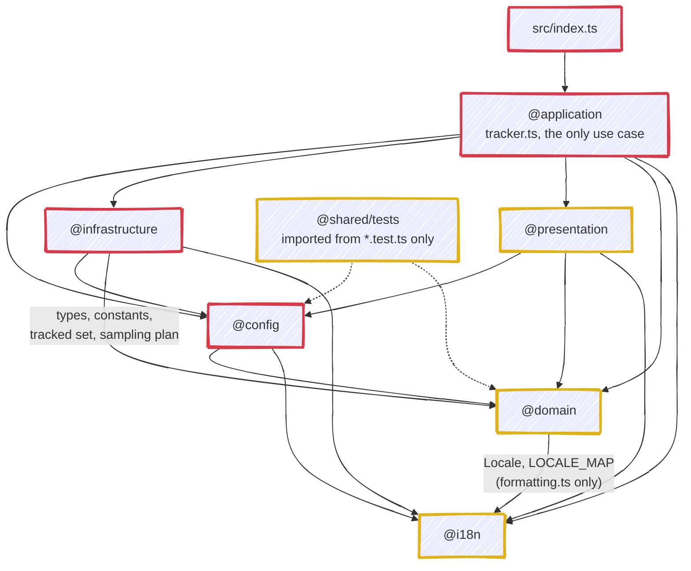

# Architecture

How the action is built, for contributors. What it does and how to configure it is the
[README](./README.md) and the user guides in [docs/wiki/](./docs/wiki/), in particular
[How It Works](./docs/wiki/How-It-Works.md) and [Technical Stack](./docs/wiki/Technical-Stack.md); this
document does not restate them. Conventions and the maintenance contract are [CLAUDE.md](./CLAUDE.md), the
domain vocabulary is [CONTEXT.md](./CONTEXT.md).

## 1. Layer map

The shape is Domain-Driven Design(ish) with a Functional Core, Imperative Shell pattern. The `(ish)` is
load-bearing: these are *layers* sharing one vocabulary, not DDD bounded contexts with languages of their
own. How much of the method is taken, and where it deliberately stops, is
[ADR 0004](./docs/adr/0004-layered-source-structure.md); the one question that cannot be answered once for
the whole tree, when a primitive earns a type of its own, is
[ADR 0022](./docs/adr/0022-a-concept-earns-a-type-when-it-crosses-a-boundary.md). The domain vocabulary itself lives in [CONTEXT.md](./CONTEXT.md).



Every arrow is an import a layer is allowed to make; anything not drawn is forbidden. **Gold is the
functional core**: no I/O, no network, no filesystem, and no clock beyond an injectable `now`. **Red is the
imperative shell**, and each red layer owns a different side effect: `@config` reads the action inputs and one
YAML file, `@infrastructure` owns everything outbound (REST, `git`, the filesystem, SMTP), `@application`
writes the Action log and the outputs, and [`src/index.ts`](./src/index.ts) starts the run. `@config` reading `node:fs` is the
detail most easily missed, and the rule it illustrates is stated once in
[CLAUDE.md](./CLAUDE.md#conventions): `@infrastructure` is the only layer that reaches the network, not the
only one that performs I/O.

| Layer | Alias | Responsibility | May import | Must not import |
| --- | --- | --- | --- | --- |
| `src/` entry | - | `index.ts` calls `trackStars()` at module load, un-awaited | `@application` | anything else |
| application | `@application/*` | Sequencing the single use case; composition root for Octokit | config, domain, i18n, infrastructure, presentation, `@actions/*`, `@octokit/plugin-retry` | nothing; it is the top |
| assets | `@assets/*` | Not a layer: the star mark the README embeds, no code | nothing; it imports nothing and nothing imports it | - |
| config | `@config/*` | Action inputs + `star-tracker.yml` -> a fully-populated `Config` | `@domain/types`, `@i18n`, `@actions/core`, `js-yaml`, `node:fs/path` | application, infrastructure, presentation |
| domain | `@domain/*` | Pure business core: the Tracked Set, comparison, snapshots, forecast, velocity, stargazer diffing and sampling, star-history reconstruction, formatting | `@i18n` only | everything else, incl. `@actions/*`, octokit, `node:fs` |
| i18n | `@i18n` | Translation bundles, `getTranslations`, `interpolate` | nothing (true leaf) | everything |
| infrastructure | `@infrastructure/*` | All I/O: octokit REST, `git` CLI, `fs`, nodemailer | config, domain (types, constants, and the pure deciders in `tracked-set` / `sampling`), i18n, `node:*`, `@actions/*`, `nodemailer` | application, presentation |
| presentation | `@presentation/*` | Pure rendering: data in, string out (markdown/HTML/SVG/CSV/badge) | `@config/types`, domain, i18n | infrastructure, `@actions/*`, `node:fs`, any network |
| shared | `@shared/*` | Cross-cutting non-layer code; today only `shared/tests` fixture factories | `@config/defaults` (value import), `@config/types` and `@domain/*` (type-only) | used from `*.test.ts` only |

This table is the **normative statement of the layer boundaries**, and `docs/docs-consistency.test.ts` reads
it as data: the *May import* column of each row is parsed for the layer names it mentions, and every
cross-layer import in `src/**/*.ts` must appear there. A layer may always import itself, and it must do so
relatively, so a cross-layer relative path is its own failure. The pure layers carry a second rule the table
states in prose and the test states as a list: no `node:*`, no `@actions/*`, no `@octokit/*`, no `nodemailer`
and no `js-yaml` under `domain/`, `presentation/` or `i18n/`. The diagram is the table's picture, and anything
the table forbids is forbidden however convenient.

**A colocated test may import whatever its own layer may**, plus `@shared/tests`, which is that folder's only
consumer. It may not reach further, and the one place that does is named in the test rather than waved
through: [`src/config/action-inputs.test.ts`](./src/config/action-inputs.test.ts) reads `DEFAULT_SMTP_PORT`
from `@infrastructure/notification/email` to assert `action.yml`'s `smtp-port` description against the
constant that actually implements it. It asserts against the manifest rather than against a module, the two
values it compares genuinely live in two layers, and duplicating the constant into `config` to satisfy the
arrow would put the same number in two places, which is the thing the assertion exists to prevent. Adding a
second such crossing means adding a line to `TEST_LAYER_CROSSINGS` and a paragraph here saying why. The codebase-wide conventions those boundaries sit inside
(aliases, named params, no comments, purity) are stated once in [CLAUDE.md](./CLAUDE.md#conventions), and
what each layer actually guarantees is that layer's own `CLAUDE.md`, linked in [§6](#6-where-things-live).
The decision to layer the tree this way is [ADR 0004](./docs/adr/0004-layered-source-structure.md).

## 2. A run, end to end

The numbers below are this table's own, in the order `trackStars` executes the calls. [`src/application/tracker.ts`](./src/application/tracker.ts)
carries no comments, so there are no step markers in the source to match them against.

| # | Call | Layer | Notes |
| --- | --- | --- | --- |
| 1 | `trackStars()` from `src/index.ts` | entry | Un-awaited; `trackStars` never rejects |
| 2 | `loadConfig()` | config | Precedence: action input -> config file -> `DEFAULTS`. Only unknown `visibility` and an invalid `data-branch` throw |
| 3 | `core.getInput('github-token' / 'github-api-url')`, `github.getOctokit(token, baseUrl?, retry)` | application | The only place an Octokit instance is built; `@octokit/plugin-retry` attached here. The input wins over the `GITHUB_API_URL` env var, which is how GHES runners are auto-detected; with both empty, `getOctokit` receives `undefined` rather than an empty `baseUrl` |
| 4 | `getRepos({ octokit, config })` | infrastructure/github | Paginates and maps, then narrows via `resolveTrackedSet` (`@domain/tracked-set`) and logs the counts it reports; result sorted by `full_name`. Fetch failure is fatal |
| 5 | empty result -> `renderEmptyRun`, `writeHtmlReport`, `setOutputs()` over an empty Summary, then `return` | application | Returns **before** `withDataBranch`, so no worktree, no commit, no email. The HTML report is still written, so a downstream step can rely on `report-html-path` on every run |
| 6 | `withDataBranch({ dataBranch, readOnly, token, run })` | infrastructure/persistence | Opens the worktree via `initializeDataBranch`, hands the body a `DataBranch`, and runs `cleanup` in `finally`. `dataDir` never escapes the module |
| 7 | `branch.readHistory()` | infrastructure/persistence | Normalizes a non-array `snapshots` to `[]` while everything else survives. Invalid JSON, JSON that is not an object, and an unreadable format version all throw rather than resetting ([ADR 0021](./docs/adr/0021-an-unreadable-stored-history-fails-the-run.md)) |
| 8 | `measureRun({ trackedSet, storedHistory, comparisonWindow, maxHistory, notificationThreshold, notificationMode })` | domain/measurement | The whole measurement in one call: resolves the Baseline, compares, snapshots, appends, and decides whether the threshold was reached. See [ADR 0013](./docs/adr/0013-a-run-is-measured-in-one-place.md) |
| 9 | `measurement.droppedSnapshots > 0` -> prune warning | application | The domain reports the count; only the shell can log it |
| 10 | `fetchAllStargazers({ octokit, repos, config })` | infrastructure/github | Only when `includeCharts \|\| trackStargazers`. Per-repo failures degrade to `core.warning` |
| 11 | `branch.readStargazers()` -> `diffStargazers` -> `buildStargazerMap(...)` | persistence + domain | Only when `trackStargazers`. The map is handed to `publish`, not written here |
| 12 | `topRepositories({ repos: results.repos, limit: config.topRepos })` | domain/comparison | The single definition of Top Repositories; `@presentation/report-model` calls the same function for the Report |
| 13 | `resolveChartHistories({ config, storedHistory: updatedHistory, repos, repoStargazers })` | presentation/charts | Owns both altitudes and the instant: reconstructs via `@domain/star-history` (capped at 365 buckets) and resolves each result against the stored history, where reconstruction wins at >= 2 snapshots. It exposes three accessors: `.aggregate` for the Tracked Set, `.forRepo(name)` for one Repository *with* the stored-history fallback, and `.reconstructedForRepo(name)` for the reconstruction alone, returning `null` rather than falling back |
| 14 | `computeForecast({ history, topRepoNames, historyForRepo })` | domain/forecast | `null` below 3 snapshots; always 2 methods x 4 weekly points. `historyForRepo` is `.reconstructedForRepo`, deliberately *not* `.forRepo`: a fabricated fallback ramp would be projected as if it were real growth |
| 15 | `renderRun({ config, results, previousTimestamp, chartHistories, storedHistory, stargazerDiff, forecastData })` | presentation | The layer's single entry point: markdown, HTML, CSV, badge and every chart file in one `RenderedRun`. It builds the `ReportModel` once, derives the chart history from `chartHistories` and the Top Repositories from that model, so no caller can hand the reports the wrong `History` or chart a different set than it links ([ADR 0016](./docs/adr/0016-the-report-renderers-read-config-themselves.md)) |
| 16 | `notificationIsDue({ changed, thresholdReached })` | domain/notification | Gates the send. The same predicate is what `settleNotification` computes internally, so the rule cannot go stale in one place and not the other |
| 17 | `getEmailConfig(locale)` + `sendEmail({ emailConfig, subject, htmlBody })` | infrastructure/notification | Sent when `emailConfig && (notify \|\| sendOnNoChanges)`. The outcome becomes one `Delivery`: `SENT`, `FAILED` (a throw, or a `false` return) or `NOT_ATTEMPTED`. **Runs before persistence**, see [ADR 0011](./docs/adr/0011-the-notification-baseline-advances-only-on-delivery.md) |
| 18 | `settleNotification({ changed, thresholdReached, delivery, history, totalStars })` | domain/notification | Returns `shouldNotify`, `notificationSent` and `historyToPersist` as one outcome; calls `recordNotification` only when the baseline may advance |
| 19 | `writeHtmlReport({ htmlReport })` | infrastructure/persistence | Writes to `RUNNER_TEMP`, falling back to the working directory, so the file is off the Data Branch and outlives the run. Deliberately **before** `publish`: a failing write must not end a run that has already committed and pushed |
| 20 | `branch.publish({ history, stargazerMap, report, badge, csv, charts, commitMessage })` | infrastructure/persistence | Writes every data-branch artefact, prunes the `charts/*.svg` this run did not produce, then commits and pushes, unless `readOnly`, where the write happens and the push does not |
| 21 | `setOutputs(...)` | application | Eleven outputs, exactly matching the `outputs:` block of [`action.yml`](./action.yml) |

Failure policy: everything is wrapped in one `try/catch` that ends in `core.setFailed('Star Tracker failed: <msg>')` plus `core.debug(stack)`. Email is the only inner failure that is deliberately non-fatal.

## 3. The data branch

State has to survive between runs of a stateless Action. Artifacts expire and are not browsable; an external database would need credentials and hosting. A git branch in the same repository is free, versioned, diffable and directly linkable (raw URLs make the badge and charts embeddable in a README). The decision is [ADR 0001](./docs/adr/0001-star-data-lives-on-a-dedicated-data-branch.md).

`initializeDataBranch` (`@infrastructure/git/worktree`) sets the `github-actions[bot]` identity, then probes the remote with `git ls-remote --heads origin <dataBranch>` and treats **empty output** as "branch absent". `--exit-code` is deliberately not passed: it would turn a network, DNS or auth failure into a false "branch absent", and the run would then build an orphan and try to push it over the real branch. From the probe:

- **branch exists**: fetches and `git worktree add <dataDir> origin/<dataBranch>`, leaving a detached HEAD (which is why `commitAndPush` pushes `HEAD:<dataBranch>`);
- **branch missing, writable**: creates an *orphan* branch (`worktree add --detach`, `checkout --orphan`, `rm -rf .`, `commit --allow-empty`) so the data history shares no ancestry with the code history;
- **branch missing, read-only**: throws.

`dataDir` is always derived as `` `.${dataBranch}` ``, never hardcoded. On-disk layout (filenames owned by `@infrastructure/persistence/storage`):

```
.<data-branch>/
  README.md              stars-data.json        stars-data.csv
  stars-badge.svg        stargazers.json
  charts/
    star-history.svg  comparison.svg  forecast.svg  <owner>-<repo>.svg
```

`read-only: true` runs everything (fetch, compare, render, all outputs, email) but skips `commitAndPush`, so a second workflow such as a weekly digest using `compare-against` can share a data branch without appending snapshots or racing the writer. There are **two guards, both inside `@infrastructure`**: `initializeDataBranch` refuses to bring an absent Data Branch into existence, and `publish` writes every artefact into the worktree and then returns before `commitAndPush`. `tracker.ts` passes `readOnly` into `withDataBranch` and never branches on it itself.

## 4. Outputs

| Artefact | Rendered by | Written / emitted by |
| --- | --- | --- |
| `README.md` (markdown report) | `@presentation/markdown` `generateMarkdownReport` | `writeArtefact` (persistence) |
| HTML report | `@presentation/html` `generateHtmlReport` | `writeHtmlReport` -> `$RUNNER_TEMP \|\| cwd`, **not** committed |
| `stars-data.csv` | `@presentation/csv` `generateCsvReport` | `writeArtefact` |
| `stars-data.json` | `@domain/snapshot` `addSnapshot` | `writeHistory` |
| `stargazers.json` | `@domain/stargazers` `buildStargazerMap` | `writeStargazers` |
| [`stars-badge.svg`](./examples/stars-badge.svg) | `@presentation/badge` `generateBadge` | `writeArtefact` |
| `charts/*.svg` | `@presentation/charts` -> `@presentation/svg-chart` | `writeChart` |
| Email chart images | `@presentation/chart` (quickchart.io URLs, no SVG) | embedded by [`html.ts`](./src/presentation/html.ts) |
| Email | `@presentation/html` body | `@infrastructure/notification/email` `sendEmail` |
| Action outputs (11) | - | `setOutputs` in `tracker.ts` |

The eleven action outputs, alphabetically as `action.yml` declares them: `lost-stars`, `new-stargazers`, `new-stars`, `notification-sent`, `report`, `report-csv`, `report-html`, `report-html-path`, `should-notify`, `stars-changed`, `total-stars`. Their values, and the difference between `should-notify` (the decision) and `notification-sent` (delivery), are in [src/application/CLAUDE.md](./src/application/CLAUDE.md).

## 5. Build & release

The scripts, Biome settings and git hooks are listed once in [CLAUDE.md](./CLAUDE.md#commands); this section covers what happens to the bundle and the release, which lives nowhere else.

- **Bundling.** [`esbuild.config.ts`](./esbuild.config.ts) (run via `tsx`) bundles `src/index.ts` into [`dist/index.js`](./dist/index.js), `platform: node`, `target: node24`, `format: cjs`, `sourcemap: true`, with the alias map derived from [`tsconfig.json`](./tsconfig.json). `dist/` is **committed** because GitHub runs a JS action straight from the repository at the referenced ref: there is no install step, so the bundle must be in the tree ([ADR 0003](./docs/adr/0003-commit-the-bundled-dist-directory.md)).
- **Node version.** Three pins move together and only two of them are asserted: `engines.node` and `packageManager` in [`package.json`](./package.json), plus [`.nvmrc`](./.nvmrc), which is what every job in [`ci.yml`](./.github/workflows/ci.yml) actually installs through `node-version-file`. `docs/docs-consistency.test.ts` asserts that `.nvmrc` and `engines.node` agree, so moving one without the other fails the build.
- **Release.** [`.releaserc.json`](./.releaserc.json): semantic-release on `main` with commit-analyzer, release-notes-generator, changelog, npm (`npmPublish: false`), git (commits `package.json`, [`pnpm-lock.yaml`](./pnpm-lock.yaml), [`CHANGELOG.md`](./CHANGELOG.md) and `dist/`) and github plugins. The `release` job in `ci.yml` needs `check`, which is `pnpm verify` on the same sha, and rebuilds the bundle in its own checkout before it runs.

[`.github/workflows/`](./.github/workflows):

| Workflow | Purpose |
| --- | --- |
| `ci.yml` | On push/PR to `main`: a `Check` job that installs and runs `pnpm verify` (which ends in `pnpm build`), then the Codecov upload, which runs even when `check` fails so threshold failures still report; on a push to `main` a `release` job then needs `check`, rebuilds the bundle in its own checkout, runs `semantic-release` and moves the major-version tag. The release used to live in a `release.yml` of its own that re-ran `verify`, so every push to `main` verified twice, and it answered `workflow_dispatch`, which let a dispatch cut a release; both are gone with the file. `ci.yml` used to close with a staleness check that failed any pull request touching bundled sources without touching `dist/`. That check is gone too: the release job rebuilds the bundle immediately before `semantic-release` commits it, meaning a published version can never carry a bundle built from other sources and the check never stood between a stale `dist/` and a user ([ADR 0003](./docs/adr/0003-commit-the-bundled-dist-directory.md)). A `release-tags` ruleset forbids deleting or moving any `v*` tag; the `v1` step still moves the major tag because it pushes with the owner's `PAT`, which passes the admin bypass |
| [`zizmor.yml`](./.github/workflows/zizmor.yml) | zizmor static analysis of the workflow files themselves |
| [`dependency-review.yml`](./.github/workflows/dependency-review.yml) | Fails a PR that introduces a dependency with a known vulnerability |
| [`commit-message.yml`](./.github/workflows/commit-message.yml) | Runs commitlint on the **pull request title**. `main` takes squash merges and the repository is set to `PR_TITLE`, so that title, not the branch's commits, is the message that lands and the one semantic-release reads. The `commit-msg` hook validates commits the squash then discards, so this is the only guard on the string that ships |
| [`dependabot-auto-merge.yml`](./.github/workflows/dependabot-auto-merge.yml) | Auto-approves and squash-merges Dependabot patch/minor/dev/indirect updates |
| [`sync-wiki.yml`](./.github/workflows/sync-wiki.yml) | Publishes [`docs/wiki/`](./docs/wiki) to the repository's GitHub Wiki with `rsync --delete`, so the wiki is generated and direct edits to it are overwritten |

## 6. Where things live

Three axes, three kinds of document. [CONTEXT.md](./CONTEXT.md) is the domain glossary: what the words
**mean**. The `CLAUDE.md` files, one at the root and one per layer, are **structure**.
[docs/adr/](./docs/adr/) is **why**:

| ADR | Decision |
| --- | --- |
| [0001](./docs/adr/0001-star-data-lives-on-a-dedicated-data-branch.md) | Star data lives on a dedicated data branch |
| [0002](./docs/adr/0002-require-a-personal-access-token.md) | A PAT is required rather than `GITHUB_TOKEN` |
| [0003](./docs/adr/0003-commit-the-bundled-dist-directory.md) | The bundled `dist/` is committed |
| [0004](./docs/adr/0004-layered-source-structure.md) | Layered source structure with a pure core |
| [0005](./docs/adr/0005-charts-are-reconstructed-from-stargazer-timestamps.md) | Charts are reconstructed from stargazer timestamps |
| [0006](./docs/adr/0006-hand-rendered-svg-charts.md) | SVG charts are hand-rendered, not library-drawn |
| [0007](./docs/adr/0007-bridge-unreachable-history-with-a-ramp.md) | Unreachable history is bridged with a ramp |
| [0008](./docs/adr/0008-sampled-repositories-are-excluded-from-stargazer-diffing.md) | Sampled repositories are excluded from stargazer diffing |
| [0009](./docs/adr/0009-agpl-3-0-only-licence.md) | AGPL-3.0-only licence |
| [0010](./docs/adr/0010-quickchart-renders-the-email-charts.md) | QuickChart renders the email charts |
| [0011](./docs/adr/0011-the-notification-baseline-advances-only-on-delivery.md) | The notification baseline advances only on delivery |
| [0012](./docs/adr/0012-unreadable-stargazer-lists-keep-their-previous-logins.md) | Unreadable stargazer lists keep their previous logins |
| [0013](./docs/adr/0013-a-run-is-measured-in-one-place.md) | A Run is measured in one place |
| [0014](./docs/adr/0014-charts-are-built-as-a-spec-and-rendered-by-adapters.md) | Charts are built as a spec and rendered by adapters |
| [0015](./docs/adr/0015-the-stored-history-declares-its-format-version.md) | The Stored History declares its format version |
| [0016](./docs/adr/0016-the-report-renderers-read-config-themselves.md) | The Report renderers read `Config` themselves |
| [0017](./docs/adr/0017-velocity-and-forecast-read-unparseable-timestamps-differently.md) | Velocity and Forecast read unparseable timestamps differently |
| [0018](./docs/adr/0018-loadconfig-reads-the-ambient-action-inputs.md) | `loadConfig` reads the ambient action inputs |
| [0019](./docs/adr/0019-the-stargazer-map-retains-untracked-repositories.md) | The Stargazer map retains repositories that leave the Tracked Set |
| [0020](./docs/adr/0020-overridable-inputs-declare-an-empty-default.md) | Overridable inputs declare an empty default |
| [0021](./docs/adr/0021-an-unreadable-stored-history-fails-the-run.md) | An unreadable Stored History fails the Run |
| [0022](./docs/adr/0022-a-concept-earns-a-type-when-it-crosses-a-boundary.md) | A concept earns a type when it crosses a boundary |

Every one of them follows [0000, the template](./docs/adr/0000-adr-template.md), and a new ADR starts by
copying that file. The shape the docs test asserts is spelled out in
[CLAUDE.md's maintenance contract](./CLAUDE.md#maintenance-contract).

**The per-layer guides and what each covers are the table in [CLAUDE.md](./CLAUDE.md#structure--aliases).**
That file is loaded into every agent session, so the list lives there and is not repeated here. Root
[`CLAUDE.md`](./CLAUDE.md) itself is the ninth document: commands, alias wiring, conventions and the
maintenance contract.

One guide per layer, no deeper: the four `infrastructure/` adapters and `shared/tests` are sections inside their parent's guide rather than files of their own, because a guide in a subdirectory only reaches the agent once it reads a file in that exact folder.

## 7. Extending it

| Task | Files to touch |
| --- | --- |
| **Add an action input** | `action.yml` (declare it, `default: ''` so the config file can win, and state the real default in the description prose, see [ADR 0020](./docs/adr/0020-overridable-inputs-declare-an-empty-default.md)); [`src/config/types.ts`](./src/config/types.ts) (`Config` field); [`src/config/defaults.ts`](./src/config/defaults.ts) (`DEFAULTS` entry, which also makes the snake_case/kebab-case config-file key work automatically); [`src/config/loader.ts`](./src/config/loader.ts) (**one row in `FIELD_SOURCES`**, naming the input parser and the file parser; the action input name is derived from the key); consume it in the relevant layer; update [`src/config/action-inputs.test.ts`](./src/config/action-inputs.test.ts) and `README.md`/`docs/wiki`. |
| **Add a locale** | Add the JSON bundle under [`src/i18n/`](./src/i18n); add it to `LOCALE_MAP` and to the `TRANSLATIONS: Record<Locale, Translations>` map (a missing key is a type error, an extra key is not). `LOCALES` is derived from `LOCALE_MAP` with `Object.keys`, so it needs no edit. Extend the `locale` description in `action.yml` and the locale tables in the wiki. |
| **Add a report format** | New pure renderer in [`src/presentation/`](./src/presentation) (data in, string out, no I/O) reading `buildReportModel` rather than re-deriving sections, plus a colocated test; one field on `RenderedRun` and one line in `renderRun` ([`run.ts`](./src/presentation/run.ts)); an `Artefact` entry and filename in `@infrastructure/persistence/storage`, plus a field on `PublishedArtefacts`; add an output to `action.yml` and `setOutputs` if it should be exposed. |
| **Add a chart option** | Input plumbing as above; thread it through the `style` object in [`src/presentation/charts.ts`](./src/presentation/charts.ts). If it changes **what** is plotted it belongs on the matching `ChartRequest` variant or on `ChartSpec` in [`src/presentation/chart-spec.ts`](./src/presentation/chart-spec.ts) and both adapters read it; if it only changes **how**, implement it in [`src/presentation/svg-chart.ts`](./src/presentation/svg-chart.ts) (all SVG primitives live behind the private `renderSvg`) and mirror it in [`src/presentation/chart.ts`](./src/presentation/chart.ts) if email charts should honour it ([ADR 0014](./docs/adr/0014-charts-are-built-as-a-spec-and-rendered-by-adapters.md)); add a sample SVG under `examples/`. |
| **Add a chart kind** | One variant on `ChartRequest` and one `case` in `buildChartSpec` (`src/presentation/chart-spec.ts`), plus the spec builder itself. Neither adapter changes, because `renderSvgChart` and `chartImageUrl` take any request. Then emit it from `buildChartFiles` (`charts.ts`) and/or `html.ts`, and add a filename to `CHART_FILES`. |

## 8. Known inconsistencies

None outstanding.

When one is found, record it here with the evidence that proves it, and delete the entry in the commit that
fixes it. An entry that has quietly become false is worse than no list at all.
