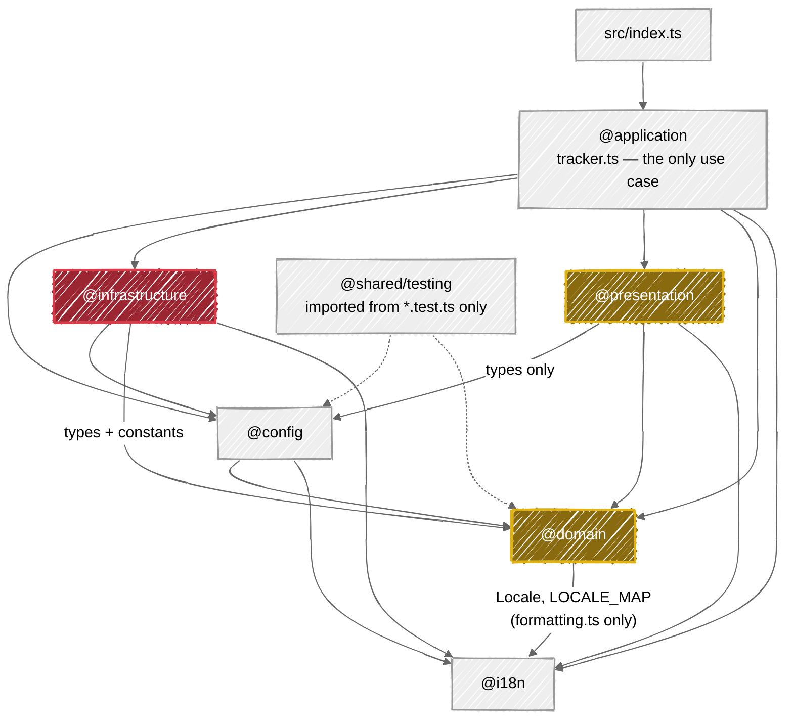

# Architecture

How the action is built, for contributors. What it does and how to configure it is the
[README](./README.md) and the user guides in [docs/wiki/](./docs/wiki/) — in particular
[How It Works](./docs/wiki/How-It-Works.md) and [Technical Stack](./docs/wiki/Technical-Stack.md); this
document does not restate them. Conventions and the maintenance contract are [CLAUDE.md](./CLAUDE.md), the
domain vocabulary is [CONTEXT.md](./CONTEXT.md).

## 1. Layer map

The shape is **Domain-Driven Design<sub>(ish)</sub>** with a **Functional Core, Imperative Shell** pattern —
the project's own term, and the `(ish)` is load-bearing: these are *layers* sharing one vocabulary, not DDD
bounded contexts with languages of their own. The domain vocabulary itself lives in [CONTEXT.md](./CONTEXT.md).



Every arrow is an import a layer is allowed to make; anything not drawn is forbidden. Gold = pure (no I/O),
red = the I/O boundary.

| Layer | Alias | Responsibility | May import | Must not import |
| --- | --- | --- | --- | --- |
| `src/` entry | - | `index.ts` calls `trackStars()` at module load, un-awaited | `@application` | anything else |
| application | `@application/*` | Sequencing the single use case; composition root for Octokit | config, domain, i18n, infrastructure, presentation, `@actions/*`, `@octokit/plugin-retry` | nothing forbidden — it is the top |
| config | `@config/*` | Action inputs + `star-tracker.yml` -> a fully-populated `Config` | `@domain/types`, `@i18n`, `@actions/core`, `js-yaml`, `node:fs/path` | application, infrastructure, presentation |
| domain | `@domain/*` | Pure business core: comparison, snapshots, forecast, velocity, stargazer diffing, star-history reconstruction, formatting | `@i18n` only | everything else, incl. `@actions/*`, octokit, `node:fs` |
| i18n | `@i18n` | Translation bundles, `getTranslations`, `interpolate` | nothing (true leaf) | everything |
| infrastructure | `@infrastructure/*` | All I/O: octokit REST, `git` CLI, `fs`, nodemailer | config, domain (types/constants), i18n, `node:*`, `@actions/*`, `nodemailer` | application, presentation |
| presentation | `@presentation/*` | Pure rendering: data in, string out (markdown/HTML/SVG/CSV/badge) | `@config/types`, domain, i18n | infrastructure, `@actions/*`, `node:fs`, any network |
| shared | `@shared/*` | Cross-cutting non-layer code; today only `shared/testing` fixture factories | `@config/defaults` (value import), `@config/types` and `@domain/*` (type-only) | used from `*.test.ts` only |

Two hard rules govern this diagram: **domain and presentation are pure** (every I/O call in the tree lives under `src/infrastructure/`), and **cross-layer imports always go through path aliases while same-layer imports stay relative**.

The table above is the normative statement of the layer boundaries — the diagram is its picture, and anything the table forbids is forbidden however convenient. The codebase-wide conventions those boundaries sit inside (aliases, named params, no comments, purity) are stated once in [CLAUDE.md](./CLAUDE.md#conventions), and what each layer actually guarantees is that layer's own `CLAUDE.md`, linked in [§6](#6-where-things-live).

## 2. A run, end to end

All step numbers refer to `src/application/tracker.ts`.

| # | Call | Layer | Notes |
| --- | --- | --- | --- |
| 1 | `trackStars()` from `src/index.ts` | entry | Un-awaited; `trackStars` never rejects |
| 2 | `loadConfig()` | config | Precedence: action input -> config file -> `DEFAULTS`. Only unknown `visibility` and an invalid `data-branch` throw |
| 3 | `core.getInput('github-token' / 'github-api-url')`, `github.getOctokit(token, baseUrl?, retry)` | application | The only place an Octokit instance is built; `@octokit/plugin-retry` attached here |
| 4 | `getRepos({ octokit, config })` | infrastructure/github | Paginates, filters, maps; result sorted by `full_name`. Fetch failure is fatal |
| 5 | empty result -> `setEmptyOutputs()` and `return` | application | Returns **before** `withDataDir`, so no worktree, no commit, no email |
| 6 | `withDataDir` -> `initializeDataBranch({ dataBranch, readOnly })` | infrastructure/git | Returns `dataDir` = `.${dataBranch}`; `cleanup(dataDir)` runs in `finally` |
| 7 | `readHistory(dataDir)` | infrastructure/persistence | Normalizes to `{ ...raw, snapshots: Array.isArray(raw.snapshots) ? raw.snapshots : [] }` — a non-array `snapshots` becomes `[]`, everything else survives; invalid JSON throws rather than resetting |
| 8 | `getBaselineSnapshot({ history, compareAgainst })` | domain/snapshot | `last-run` or the newest snapshot at least 24h/7d/30d old (6h cron-jitter tolerance), else oldest parseable |
| 9 | `compareStars({ currentRepos, previousSnapshot })` | domain/comparison | New repos get delta 0; removed repos are excluded from `totalStars` but counted in `lostStars` |
| 10 | `fetchAllStargazers({ octokit, repos, config })` | infrastructure/github | Only when `includeCharts \|\| trackStargazers`. Per-repo failures degrade to `core.warning` |
| 11 | `readStargazers` -> `diffStargazers` -> `writeStargazers(buildStargazerMap(...))` | persistence + domain | Only when `trackStargazers` |
| 12 | `createSnapshot` -> prune warning -> `addSnapshot({ history, snapshot, maxHistory })` | domain | Returns a new object; preserves `starsAtLastNotification` |
| 13 | `topRepoNames` = copy of `results.repos`, drop `isRemoved`, sort desc by `current`, `slice(0, topRepos)` | application | Local, no helper |
| 14 | `buildStarHistory({ repoStargazers, repos, maxPoints, now: chartNow })` | domain/star-history | Reconstructs a dense monotonic history from `starred_at`; capped at 365 buckets |
| 15 | `resolveChartHistory({ candidate, fallback: updatedHistory })` | presentation/charts | Reconstruction wins when it has >= 2 snapshots, otherwise the stored history |
| 16 | `computeForecast({ history, topRepoNames })` | domain/forecast | `null` below 3 snapshots; always 2 methods x 4 weekly points |
| 17 | `generateMarkdownReport(reportParams)` / `generateHtmlReport(reportParams)` / `generateCsvReport(results)` / `generateBadge({ totalStars, locale })` | presentation | Markdown and HTML share one `reportParams` object |
| 18 | `shouldNotify({ totalStars, starsAtLastNotification, threshold, mode })` | domain/notification | Reads the **pre-append** `storedHistory.starsAtLastNotification`, so the threshold accumulates across runs |
| 19 | `getEmailConfig(locale)` + `sendEmail({ emailConfig, subject, htmlBody })` | infrastructure/notification | Sent when `emailConfig && (notify \|\| sendOnNoChanges)`; failures downgrade to `core.warning` and clear `notificationDelivered`. **Runs before persistence** — see [ADR 0011](./docs/adr/0011-the-notification-baseline-advances-only-on-delivery.md) |
| 20 | `updatedHistory.starsAtLastNotification = summary.totalStars` | application | Only when `notificationDelivered`, i.e. a send succeeded or no SMTP transport is configured at all |
| 21 | `writeHistory` / `writeReport` / `writeBadge` / `writeCsv` | infrastructure/persistence | Written into `dataDir` |
| 22 | `buildChartFiles({ config, history, fallbackHistory, forecastData, topRepoNames, repoTotals, repoStargazers, now: chartNow })` -> `writeChart` per file, then `pruneCharts({ dataDir, keep })` | presentation + persistence | One `chartNow` `Date` is shared with step 14. Pruning deletes `charts/*.svg` this run did not produce, so a repo leaving `top-repos` does not strand its chart |
| 23 | `commitAndPush({ dataDir, dataBranch, message, token })` | infrastructure/persistence | Skipped entirely when `config.readOnly` |
| 24 | `setOutputs(...)` | application | Eleven outputs, exactly matching the `outputs:` block of `action.yml` |

Failure policy: everything is wrapped in one `try/catch` that ends in `core.setFailed('Star Tracker failed: <msg>')` plus `core.debug(stack)`. Email is the only inner failure that is deliberately non-fatal.

## 3. The data branch

State has to survive between runs of a stateless Action. Artifacts expire and are not browsable; an external database would need credentials and hosting. A git branch in the same repository is free, versioned, diffable and directly linkable (raw URLs make the badge and charts embeddable in a README).

`initializeDataBranch` (`@infrastructure/git/worktree`) sets the `github-actions[bot]` identity, probes the remote with `git ls-remote --exit-code --heads`, and then either:

- **branch exists** — fetches and `git worktree add <dataDir> origin/<dataBranch>`, leaving a detached HEAD (which is why `commitAndPush` pushes `HEAD:<dataBranch>`);
- **branch missing, writable** — creates an *orphan* branch (`worktree add --detach`, `checkout --orphan`, `rm -rf .`, `commit --allow-empty`) so the data history shares no ancestry with the code history;
- **branch missing, read-only** — throws.

`dataDir` is always derived as `` `.${dataBranch}` ``, never hardcoded. On-disk layout (filenames owned by `@infrastructure/persistence/storage`):

```
.<data-branch>/
  README.md              stars-data.json        stars-data.csv
  stars-badge.svg        stargazers.json
  charts/
    star-history.svg  comparison.svg  forecast.svg  <owner>-<repo>.svg
```

`read-only: true` runs everything — fetch, compare, render, all outputs, email — but skips `commitAndPush`, so a second workflow (e.g. a weekly digest using `compare-against`) can share a data branch without appending snapshots or racing the writer. The read-only guard lives in `tracker.ts`, not in the persistence layer.

## 4. Outputs

| Artefact | Rendered by | Written / emitted by |
| --- | --- | --- |
| `README.md` (markdown report) | `@presentation/markdown` `generateMarkdownReport` | `writeReport` (persistence) |
| HTML report | `@presentation/html` `generateHtmlReport` | `writeHtmlReport` -> `$RUNNER_TEMP \|\| cwd`, **not** committed |
| `stars-data.csv` | `@presentation/csv` `generateCsvReport` | `writeCsv` |
| `stars-data.json` | `@domain/snapshot` `addSnapshot` | `writeHistory` |
| `stargazers.json` | `@domain/stargazers` `buildStargazerMap` | `writeStargazers` |
| `stars-badge.svg` | `@presentation/badge` `generateBadge` | `writeBadge` |
| `charts/*.svg` | `@presentation/charts` -> `@presentation/svg-chart` | `writeChart` |
| Email chart images | `@presentation/chart` (quickchart.io URLs, no SVG) | embedded by `html.ts` |
| Email | `@presentation/html` body | `@infrastructure/notification/email` `sendEmail` |
| Action outputs (11) | - | `setOutputs` in `tracker.ts` |

The eleven action outputs: `report`, `report-html`, `report-html-path`, `report-csv`, `total-stars`, `stars-changed`, `new-stars`, `lost-stars`, `should-notify`, `notification-sent`, `new-stargazers`. Their values, and the difference between `should-notify` (the decision) and `notification-sent` (whether mail went out), are in [src/application/CLAUDE.md](./src/application/CLAUDE.md).

## 5. Build & release

- **Bundling.** `esbuild.config.ts` (run via `tsx`) bundles `src/index.ts` -> `dist/index.js`, `platform: node`, `target: node24`, `format: cjs`, `sourcemap: true`, with the alias map derived from `tsconfig.json`. `dist/` is **committed** because GitHub runs a JS action straight from the repository at the referenced ref — there is no install step, so the bundle must be in the tree.
- **Scripts** (`package.json`): `lint` = `biome check --no-errors-on-unmatched .`; `format` = `lint --write`; `typecheck` = `tsc --noEmit`; `test` / `test:coverage` = Vitest (v8 coverage, 85% threshold on lines/functions/branches/statements); `check` = lint + typecheck + test:coverage; `validate` = check + build. `pnpm run validate` is what the release job runs; `ci.yml` runs the same work as separate `check` / `test:coverage` / `build` steps.
- **Biome** (`biome.json`) is linter and formatter: 100-col, 2-space, LF, single quotes, semicolons, trailing commas; recommended rule preset. `.gitattributes` pins `* text=auto eol=lf`.
- **Git hooks.** Husky: `pre-commit` -> `lint-staged` (`biome check --write` on `*.{ts,json}`), `commit-msg` -> `commitlint` (`@commitlint/config-conventional`), `pre-push` -> `typecheck && test:changed && build`.
- **Release.** `.releaserc.json`: semantic-release on `main` with commit-analyzer, release-notes-generator, changelog, npm (`npmPublish: false`), git (commits `package.json`, `pnpm-lock.yaml`, `CHANGELOG.md` and `dist/`) and github plugins.

`.github/workflows/`:

| Workflow | Purpose |
| --- | --- |
| `ci.yml` | On push/PR to `main`: install, `pnpm run check`, coverage, Codecov upload, build |
| `release.yml` | On push to `main`: `pnpm run validate` then `semantic-release`, plus a major-version tag update |
| `codeql.yml` | CodeQL analysis of `javascript-typescript` and `actions`, weekly + on push/PR |
| `zizmor.yml` | zizmor static analysis of the workflow files themselves |
| `dependabot-auto-merge.yml` | Auto-approves and squash-merges Dependabot patch/minor/dev/indirect updates |
| `renovate-auto-approve.yml` | Auto-approves Renovate PRs labelled patch/minor/pin/lock-maintenance |
| `sync-wiki.yml` | Publishes `docs/wiki/` to the repository's GitHub Wiki |

## 6. Where things live

Three axes, three kinds of document. [CONTEXT.md](./CONTEXT.md) is the domain glossary — what the words
**mean**. The `CLAUDE.md` files below — one at the root, one per layer — are **structure**. [docs/adr/](./docs/adr/) is **why**:

| ADR | Decision |
| --- | --- |
| [0001](./docs/adr/0001-star-data-lives-on-a-dedicated-data-branch.md) | Star data lives on a dedicated data branch |
| [0002](./docs/adr/0002-require-a-personal-access-token.md) | A PAT is required rather than `GITHUB_TOKEN` |
| [0003](./docs/adr/0003-commit-the-bundled-dist-directory.md) | The bundled `dist/` is committed |
| [0004](./docs/adr/0004-layered-source-structure.md) | Domain-Driven Design(ish) layering with a pure core |
| [0005](./docs/adr/0005-charts-are-reconstructed-from-stargazer-timestamps.md) | Charts are reconstructed from stargazer timestamps |
| [0006](./docs/adr/0006-hand-rendered-svg-charts.md) | SVG charts are hand-rendered, not library-drawn |
| [0007](./docs/adr/0007-bridge-unreachable-history-with-a-ramp.md) | Unreachable history is bridged with a ramp |
| [0008](./docs/adr/0008-sampled-repositories-are-excluded-from-stargazer-diffing.md) | Sampled repositories are excluded from stargazer diffing |
| [0009](./docs/adr/0009-agpl-3-0-only-licence.md) | AGPL-3.0-only licence |
| [0010](./docs/adr/0010-quickchart-renders-the-email-charts.md) | QuickChart renders the email charts |
| [0011](./docs/adr/0011-the-notification-baseline-advances-only-on-delivery.md) | The notification baseline advances only on delivery |
| [0012](./docs/adr/0012-unreadable-stargazer-lists-keep-their-previous-logins.md) | Unreadable stargazer lists keep their previous logins |

Every one of them follows [0000, the template](./docs/adr/0000-adr-template.md) — `# N. Title`, a date, a
status, then *Context*, *Decision*, *Consequences*. A new ADR starts by copying that file, not by writing
one from scratch.

| Document | Covers |
| --- | --- |
| [CLAUDE.md](./CLAUDE.md) | Commands, alias wiring, conventions, the maintenance contract — loaded into every agent session |
| [src/application/CLAUDE.md](src/application/CLAUDE.md) | `trackStars()` invariants, the output contract, failure policy |
| [src/config/CLAUDE.md](src/config/CLAUDE.md) | Input + YAML precedence, what throws vs warns, parser vocabularies |
| [src/domain/CLAUDE.md](src/domain/CLAUDE.md) | Comparison semantics, snapshots, forecast/velocity maths, star-history |
| [src/i18n/CLAUDE.md](src/i18n/CLAUDE.md) | Bundles, placeholder rules, adding a locale |
| [src/infrastructure/CLAUDE.md](src/infrastructure/CLAUDE.md) | All four adapters: octokit, git worktree, persistence, SMTP |
| [src/presentation/CLAUDE.md](src/presentation/CLAUDE.md) | Renderers, the chart trio, escaping and injection rules |
| [src/shared/CLAUDE.md](src/shared/CLAUDE.md) | Fixture factories and why this folder stays almost empty |

One guide per layer, no deeper: the four `infrastructure/` adapters and `shared/testing` are sections inside their parent's guide rather than files of their own, because a guide in a subdirectory only reaches the agent once it reads a file in that exact folder.

## 7. Extending it

| Task | Files to touch |
| --- | --- |
| **Add an action input** | `action.yml` (declare it, `default: ''` so the config file can win); `src/config/types.ts` (`Config` field); `src/config/defaults.ts` (`DEFAULTS` entry — this also makes the snake_case/kebab-case config-file key work automatically); `src/config/loader.ts` (read + coerce, using an existing parser from `parsers.ts`); consume it in the relevant layer; update `src/config/action-inputs.test.ts` and `README.md`/`docs/wiki`. |
| **Add a locale** | Add the JSON bundle under `src/i18n/`; register it in `LOCALES`, `LOCALE_MAP` and the `TRANSLATIONS: Record<Locale, Translations>` map (a missing key is a type error, an extra key is not); extend the `locale` description in `action.yml`. |
| **Add a report format** | New pure renderer in `src/presentation/` (data in, string out, no I/O) + colocated test; a `write<Format>` helper and filename in `@infrastructure/persistence/storage`; call both from `tracker.ts`; add an output to `action.yml` + `setOutputs`/`setEmptyOutputs` if it should be exposed. |
| **Add a chart option** | Input plumbing as above; thread it through the `style` object in `src/presentation/charts.ts`; implement it in `src/presentation/svg-chart.ts` (all SVG primitives live behind the private `renderSvg`); mirror it in `src/presentation/chart.ts` if email charts should honour it; add a sample SVG under `examples/`. |

## 8. Known inconsistencies

None outstanding. Every mismatch this document previously listed has been resolved in the source; the
history of what they were and why each was fixed is in the `fix:` commits and in `docs/adr/`.

When one is found again, record it here with the file:line that proves it, and delete the entry once the
code changes — an entry that has quietly become false is worse than no list at all.
