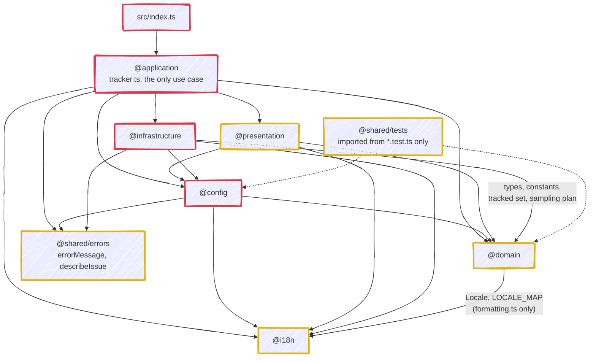

# Architecture

How the action is built, for contributors. What it does and how to configure it is the
[README](./README.md) and the user guides in [docs/wiki/](./docs/wiki/), in particular
[How It Works](../../wiki/How-It-Works) and [Technical Stack](../../wiki/Technical-Stack); this
document does not restate them. The maintenance contract is [AGENTS.md](./AGENTS.md), how code is written is
[CODING_STANDARDS.md](./CODING_STANDARDS.md), and the domain vocabulary is [CONTEXT.md](./CONTEXT.md).

## 1. Layer map

The shape is Domain-Driven Design(ish) with a Functional Core, Imperative Shell pattern. The `(ish)` is
there for a reason: these are *layers* sharing one vocabulary, not DDD bounded contexts with languages of
their own. How much of the method is taken, and where it deliberately stops, is
[ADR 0004](./docs/adr/0004-layered-source-structure.md); the one question that cannot be answered once for
the whole tree, when a primitive earns a type of its own, is
[ADR 0022](./docs/adr/0022-a-concept-earns-a-type-when-it-crosses-a-boundary.md). The domain vocabulary itself lives in [CONTEXT.md](./CONTEXT.md).


```mermaid
---
config:
  look: handDrawn
  layout: dagre
---
flowchart TD
    idx["src/index.ts"] --> app["@application<br/>tracker.ts, the only use case"]

    app --> cfg["@config"]
    app --> infra["@infrastructure"]
    app --> pres["@presentation"]
    app --> dom["@domain"]
    app --> i18n["@i18n"]

    cfg --> dom
    cfg --> i18n
    pres --> cfg
    pres --> dom
    pres --> i18n
    infra --> cfg
    infra -->|types, constants,<br/>tracked set, sampling plan| dom
    infra --> i18n
    dom -->|"Locale, LOCALE_MAP<br/>(formatting.ts only)"| i18n

    app --> err["@shared/errors<br/>errorMessage, describeIssue"]
    cfg --> err
    infra --> err

    test["@shared/tests<br/>imported from *.test.ts only"] -.-> cfg
    test -.-> dom

    classDef pure stroke:#dfb317,stroke-width:3px
    classDef shell stroke:#d73a49,stroke-width:3px
    class dom,pres,i18n,test,err pure
    class idx,app,cfg,infra shell
```

Every arrow is an import a layer is allowed to make; anything not drawn is forbidden. **Gold is the
functional core**: no I/O, no network, no filesystem, and no clock beyond an injectable `now`. **Red is the
imperative shell**, and each red layer owns a different side effect: `@config` reads the action inputs and one
YAML file, `@infrastructure` owns everything outbound (REST, `git`, the files the Run writes, SMTP), `@application`
sets the outputs and the failed status, and [`src/index.ts`](./src/index.ts) starts the run; every shell layer writes to
the Action log. `@config` reading `node:fs` is the detail most easily missed: `@infrastructure` is the only layer
that reaches the network, not the only one that performs I/O.

| Layer | Alias | Responsibility | May import | Must not import |
| --- | --- | --- | --- | --- |
| `src/` entry | - | `index.ts` calls `trackStars()` at module load, un-awaited | `@application` | anything else |
| application | `@application/*` | Sequencing the single use case; composition root for Octokit | config, domain, i18n, infrastructure, presentation, shared, `@actions/*`, `@octokit/plugin-retry`, `zod/mini` | nothing; it is the top |
| assets | `@assets/*` | Not a layer: the star mark the README embeds, no code | nothing; it imports nothing and nothing imports it | - |
| config | `@config/*` | Action inputs + `star-tracker.yml` -> a fully-populated `Config` | `@domain/types`, `@i18n`, `@shared/errors`, `@actions/core`, `js-yaml`, `zod/mini`, `node:fs/path` | application, infrastructure, presentation |
| domain | `@domain/*` | Pure business core: the Tracked Set, comparison, snapshots, forecast, velocity, stargazer diffing and sampling, star-history reconstruction, formatting | `@i18n` only | everything else, incl. `@actions/*`, octokit, `node:fs` |
| i18n | `@i18n` | Translation bundles, `getTranslations`, `interpolate` | nothing (true leaf) | everything |
| infrastructure | `@infrastructure/*` | The Run's outbound side effects: octokit REST, the `git` CLI, the files the Run writes, nodemailer | config, domain (types, constants, and the pure deciders in `tracked-set` / `sampling`), i18n, `@shared/errors`, `node:*`, `@actions/*`, `nodemailer`, `zod/mini` | application, presentation |
| presentation | `@presentation/*` | Pure rendering: data in, string out (markdown/HTML/SVG/CSV/badge) | `@config/types`, domain, i18n | infrastructure, `@actions/*`, `node:fs`, any network |
| shared | `@shared/*` | Cross-cutting non-layer code: `errors.ts`, plus the `shared/tests` fixture factories | `@config/defaults` (value import), `@config/types` and `@domain/*` (type-only), `zod/mini` | application, infrastructure, presentation |

This table is the **normative statement of the layer boundaries**, and `docs/docs-consistency.test.ts` reads
it as data: the *May import* column of each row is parsed for the layer names it mentions, and every
cross-layer import in `src/**/*.ts` must appear there. A layer may always import itself, and it must do so
relatively, so a cross-layer relative path is its own failure. The pure layers carry a further rule the table
states in prose and the test states as a list: no `node:*`, no `@actions/*`, no `@octokit/*`, no `nodemailer`,
no `js-yaml` and no `zod` under `domain/`, `presentation/` or `i18n/`. The diagram draws what the table states.
If the table forbids an import, no amount of convenience makes it allowed.

A colocated test may import whatever its own layer may, plus anything under `@shared`: the fixture factories
in `shared/tests` have no consumer outside a `*.test.ts`, and `shared/errors` is already named by every row
that reaches for it. It may not reach further, and the one place that does is named in the test rather than
waved through: [`src/config/action-inputs.test.ts`](./src/config/action-inputs.test.ts) reads
`DEFAULT_SMTP_PORT` from `@infrastructure/notification/email` to check `action.yml`'s `smtp-port` description
against the constant that implements it. It asserts against the manifest rather than against a module, the
two values it compares really do live in two layers, and copying the constant into `config` to satisfy the
arrow would put the same number in two places, which is what the assertion exists to catch. Another crossing
like it needs a line in `TEST_LAYER_CROSSINGS` and a paragraph here saying why.

How code is written inside those boundaries is [CODING_STANDARDS.md](./CODING_STANDARDS.md), which opens with what
`pnpm test:docs` and the other tools enforce of it; what each layer does is in that layer's own `AGENTS.md`,
linked in [§6](#6-where-things-live), and the decision to layer the tree this way is
[ADR 0004](./docs/adr/0004-layered-source-structure.md).

## 2. A run, end to end

The numbers below are this table's own, in the order `trackStars` executes the calls. [`src/application/tracker.ts`](./src/application/tracker.ts)
carries no comments, so there are no step markers in the source to match them against.

| # | Call | Layer | Notes |
| --- | --- | --- | --- |
| 1 | `trackStars()` from `src/index.ts` | entry | Un-awaited; `trackStars` never rejects |
| 2 | `loadConfig()` | config | Precedence: action input -> config file -> `DEFAULTS`. Only an unknown `visibility`, an invalid `data-branch` and a config file that exists but cannot be read throw |
| 3 | `core.getInput('github-token' / 'github-api-url')`, `github.getOctokit(token, baseUrl?, retry)` | application | The only place an Octokit instance is built; `@octokit/plugin-retry` attached here. The input wins over the `GITHUB_API_URL` env var, which is how GHES runners are auto-detected; with both empty, `getOctokit` receives `undefined` rather than an empty `baseUrl`. A non-empty value that is not an absolute `https` URL throws before Octokit is built, so the token never travels in clear text |
| 4 | `getRepos({ octokit, config })` | infrastructure/github | Paginates and maps, then narrows via `resolveTrackedSet` (`@domain/tracked-set`) and logs the counts it reports; result sorted by `full_name`. Fetch failure is fatal, and so is a repository row that does not match `GitHubRepoSchema` |
| 5 | empty result -> `renderEmptyRun`, `writeHtmlReport`, `setOutputs()` over an empty Summary, then `return` | application | Returns **before** `withDataBranch`, so no worktree, no commit, no email. The HTML report is still written, so a downstream step can rely on `report-html-path` on every run |
| 6 | `withDataBranch({ dataBranch, readOnly, token, run })` | infrastructure/persistence | Opens the worktree via `initializeDataBranch`, hands the body a `DataBranch`, and runs `cleanup` in `finally`. `dataDir` never leaves `@infrastructure` |
| 7 | `branch.readHistory()` | infrastructure/persistence | Normalizes an absent `snapshots` to `[]` while everything else survives. Invalid JSON, JSON that is not an object, a `snapshots` key that is not an array, an unreadable format version, and a Snapshot, one of its repository entries or a `starsAtLastNotification` of the wrong shape all throw rather than resetting ([ADR 0021](./docs/adr/0021-an-unreadable-stored-history-fails-the-run.md)) |
| 8 | `measureRun({ trackedSet, storedHistory, comparisonWindow, maxHistory, notificationThreshold, notificationMode })` | domain/measurement | The whole measurement in one call: resolves the Baseline Snapshot, compares, snapshots, appends, and decides whether the threshold was reached. See [ADR 0013](./docs/adr/0013-a-run-is-measured-in-one-place.md) |
| 9 | `measurement.droppedSnapshots > 0` -> prune warning | application | The domain reports the count; only the shell can log it |
| 10 | `fetchAllStargazers({ octokit, repos, config })` | infrastructure/github | Only when `includeCharts \|\| trackStargazers`. Per-repo failures degrade to `core.warning` |
| 11 | `branch.readStargazers()` -> `diffStargazers` -> `buildStargazerMap(...)` | persistence + domain | Only when `trackStargazers`. The map is handed to `publish`, not written here |
| 12 | `topRepositories({ repos: results.repos, limit: config.topRepos })` | domain/comparison | The single definition of Top Repositories; `@presentation/report-model` calls the same function for the Report |
| 13 | `resolveChartHistories({ config, storedHistory: updatedHistory, repos, repoStargazers })` | presentation/charts | Owns both scopes and the instant: reconstructs via `@domain/star-history` (capped at 365 buckets) and resolves each result against the stored history, where reconstruction wins at >= 2 snapshots. Its accessors are `.aggregate` for the Tracked Set, `.forRepo(name)` for one Repository *with* the stored-history fallback, and `.reconstructedForRepo(name)` for the reconstruction alone, returning `null` rather than falling back |
| 14 | `computeForecast({ history, topRepoNames, historyForRepo })` | domain/forecast | `null` below 3 snapshots; always 2 methods x 4 weekly points. Each Top Repository is fitted only to the Snapshots that hold it, of its own reconstruction or else of the aggregate, and gets no Forecast when fewer than 3 do. `historyForRepo` is `.reconstructedForRepo`, deliberately *not* `.forRepo`, whose Stored History fallback would be reported as the repository's own reconstruction |
| 15 | `renderRun({ config, results, baselineSnapshotTimestamp, chartHistories, storedHistory, stargazerDiff, forecastData })` | presentation | The layer's single entry point: markdown, HTML, CSV, badge and every chart file in one `RenderedRun`. It derives the chart history from `chartHistories`, takes the Top Repositories from `topRepositories`, draws the Charts and then builds the `ReportModel` once with the set it drew, so no caller can hand the Reports the wrong `History` or link a Chart no Run wrote ([ADR 0016](./docs/adr/0016-the-report-renderers-read-config-themselves.md)) |
| 16 | `notificationIsDue({ changed, thresholdReached })` | domain/notification | Gates the send. The same predicate is what `settleNotification` computes internally, so the rule cannot go stale in one place and not the other |
| 17 | `getEmailConfig(locale)` + `sendEmail({ emailConfig, subject, htmlBody })` | infrastructure/notification | Sent when `emailConfig && (notify \|\| sendOnNoChanges)`. The outcome becomes one `Delivery`: `SENT`, `FAILED` (a throw, or a `false` return) or `NOT_ATTEMPTED`. **Runs before persistence**, see [ADR 0011](./docs/adr/0011-the-notification-baseline-advances-only-on-delivery.md) |
| 18 | `settleNotification({ changed, thresholdReached, delivery, history, totalStars })` | domain/notification | Returns `shouldNotify`, `notificationSent` and `historyToPersist` as one outcome; calls `recordNotification` only when the Notification Baseline may advance |
| 19 | `writeHtmlReport(htmlReport)` | infrastructure/persistence | Writes to `RUNNER_TEMP`, falling back to the working directory, so the file is off the Data Branch and outlives the run. Deliberately **before** `publish`: a failing write must not end a run that has already committed and pushed |
| 20 | `branch.publish({ history, stargazerMap, report, badge, csv, charts, commitMessage })` | infrastructure/persistence | Writes every data-branch artefact, prunes the `charts/*.svg` this run did not produce, then commits and pushes, unless `readOnly`, where the write happens and the push does not |
| 21 | `setOutputs(...)` | application | Every output, exactly matching the `outputs:` block of [`action.yml`](./action.yml) |

Failure policy: everything is wrapped in one `try/catch` that ends in `core.setFailed('Star Tracker failed: <msg>')` plus `core.debug(stack)`. Two inner failures are deliberately non-fatal: a failed email warns, and one repository's failed Stargazer fetch becomes a `core.warning` while the Run continues with partial data.

## 3. The data branch

State has to survive between runs of a stateless Action. Artifacts expire and are not browsable; an external database would need credentials and hosting. A git branch in the same repository is free, versioned, diffable and directly linkable (raw URLs make the badge and charts embeddable in a README). The decision is [ADR 0001](./docs/adr/0001-star-data-lives-on-a-dedicated-data-branch.md).

`initializeDataBranch` (`@infrastructure/git/worktree`) sets the `github-actions[bot]` identity, then probes the remote with `git ls-remote --heads origin <dataBranch>` and treats **empty output** as "branch absent". `--exit-code` is deliberately not passed: it would turn a network, DNS or auth failure into a false "branch absent", and the run would then build an orphan and try to push it over the real branch. From the probe:

- **branch exists**: fetches and `git worktree add <dataDir> origin/<dataBranch>`, leaving a detached HEAD (which is why `commitAndPush` pushes `HEAD:<dataBranch>`);
- **branch missing, writable**: creates an *orphan* branch (`worktree add --detach`, `checkout --orphan`, `rm -rf .`, `commit --allow-empty`) so the data history shares no ancestry with the code history;
- **branch missing, read-only**: throws.

`dataDir` is always derived as `` `.${dataBranch}` ``, never hardcoded. On-disk layout (filenames owned by `@infrastructure/persistence/storage`):

```
.<data-branch>/
  README.md              stars-data.json        stars-data.csv
  stars-badge.svg        stargazers.json
  charts/
    star-history.svg  comparison.svg  forecast.svg  <owner>-<repo>.svg
    forecast-<owner>-<repo>.svg
```

`read-only: true` runs everything (fetch, compare, render, all outputs, email) but skips `commitAndPush`, so another workflow such as a weekly digest using `compare-against` can share a data branch without appending snapshots or racing the writer. The guards **all live inside `@infrastructure`**: `initializeDataBranch` refuses to bring an absent Data Branch into existence, and `publish` writes every artefact into the worktree and then returns before `commitAndPush`. `tracker.ts` passes `readOnly` into `withDataBranch` and never branches on it itself.

## 4. Outputs

| Artefact | Rendered by | Written / emitted by |
| --- | --- | --- |
| `README.md` (markdown report) | `@presentation/markdown` `generateMarkdownReport` | `writeArtefact` (persistence) |
| HTML report | `@presentation/html` `generateHtmlReport` | `writeHtmlReport` -> `$RUNNER_TEMP \|\| cwd`, **not** committed |
| `stars-data.csv` | `@presentation/csv` `generateCsvReport` | `writeArtefact` |
| `stars-data.json` | `@domain/snapshot` `addSnapshot` | `writeHistory` |
| `stargazers.json` | `@domain/stargazers` `buildStargazerMap` | `writeStargazers` |
| [`stars-badge.svg`](./docs/examples/stars-badge.svg) | `@presentation/badge` `generateBadge` | `writeArtefact` |
| `charts/*.svg` | `@presentation/charts` -> `@presentation/svg-chart` | `writeChart` |
| Email chart images | `@presentation/chart` (quickchart.io URLs, no SVG) | embedded by [`html.ts`](./src/presentation/html.ts) |
| Email | `@presentation/html` body | `@infrastructure/notification/email` `sendEmail` |
| Action outputs | - | `setOutputs` in `tracker.ts` |

The action outputs, alphabetically as `action.yml` declares them: `lost-stars`, `new-stargazers`, `new-stars`, `notification-sent`, `report`, `report-csv`, `report-html`, `report-html-path`, `should-notify`, `stars-changed`, `total-stars`. Their values, and the difference between `should-notify` (the decision) and `notification-sent` (delivery), are in [src/application/AGENTS.md](./src/application/AGENTS.md).

## 5. Build & release

The scripts and git hooks are listed once in [AGENTS.md](./AGENTS.md#commands) and Biome's settings are [`biome.json`](./biome.json); this section covers why the hooks stop where they do and what happens to the bundle and the release, which lives nowhere else.

- **Bundling.** [`esbuild.config.ts`](./esbuild.config.ts) (run via `tsx`) bundles `src/index.ts` into [`dist/index.js`](./dist/index.js), `platform: node`, `target: node24`, `format: cjs`, `sourcemap: true`, with the alias map derived from [`tsconfig.json`](./tsconfig.json). `dist/` is **committed** because GitHub runs a JS action straight from the repository at the referenced ref: there is no install step, so the bundle must be in the tree ([ADR 0003](./docs/adr/0003-commit-the-bundled-dist-directory.md)).
- **Hooks.** `pre-push` runs `verify:changed` rather than `verify`, because the coverage floor and a changed-only run cannot both hold: `vitest.config.mts` sets `coverage.include` over all of `src`, which makes v8 report a file no test loaded as zero, so any subset run drags the global average under the threshold and fails on a clean tree. Coverage is a CI concern: `ci.yml` runs the full `pnpm verify` on the pushed sha and the `release` job needs it, so a push whose coverage dropped cuts no release, and the slow whole-repository run stays out of the way of a push.
- **Node version.** The pins move together and only some of them are asserted: `engines.node` and `packageManager` in [`package.json`](./package.json), plus [`.nvmrc`](./.nvmrc), which is what every job in [`ci.yml`](./.github/workflows/ci.yml) actually installs through `node-version-file`. `docs/docs-consistency.test.ts` asserts that `.nvmrc` and `engines.node` agree, so moving one without the other fails the build.
- **Release.** [`.releaserc.json`](./.releaserc.json): semantic-release on `main` with commit-analyzer, release-notes-generator, changelog, npm (`npmPublish: false`), git (commits `package.json`, [`CHANGELOG.md`](./CHANGELOG.md) and `dist/`, the three a release rewrites) and github plugins. The `release` job in `ci.yml` needs `check`, which is `pnpm verify` on the same sha, and rebuilds the bundle in its own checkout before it runs. The git plugin's release commit, `chore(release): <version> [skip ci]`, is the one commit on `main` that commitlint never checks (the hook runs on a branch, the pull-request check reads the title), and its `[skip ci]` is load-bearing: without it, that push would start the run that cuts the next release. `pnpm-lock.yaml` stays off the plugin's `assets`, because pnpm's lockfile does not record the importer's own version, so the npm plugin's bump never touches it. `docs/docs-consistency.test.ts` asserts both. Both commit-parsing plugins, the analyser and the notes generator, carry `parserOpts` that add `!?` to the header pattern and a `breakingHeaderPattern`. Without them `@semantic-release/commit-analyzer` falls back to `conventional-changelog-angular`, whose `headerPattern` wants the colon straight after the scope, so a `feat(x)!:` commit is analysed with no type and the job ends green with nothing released, while `@commitlint/config-conventional` accepts the `!` and the title check passes. The `preset` route does not work here: `conventional-changelog-conventionalcommits` needs a newer `conventional-changelog-writer` than `@semantic-release/release-notes-generator` accepts, and the analyser resolves a preset by name from its own directory first, where pnpm's hoist exposes whichever copy commitlint installed. With `parserOpts`, `!` means major on any type, as a `BREAKING CHANGE:` footer does.

[`.github/workflows/`](./.github/workflows):

| Workflow | Purpose |
| --- | --- |
| `ci.yml` | On push/PR to `main`: a `Check` job that installs and runs `pnpm verify` (`verify:static`, which ends in `pnpm build`, then the coverage run), then the Codecov upload, which runs even when `check` fails so threshold failures still report. On a push to `main` a `release` job then needs `check`, fast-forwards onto `origin/main`, rebuilds the bundle in its own checkout, runs `semantic-release` and moves the major-version tag; nothing else cuts a release. A merge that lands while the job runs joins that release, because the fast-forward takes in every commit on `main` at that moment and the run those commits queued finds nothing left to publish; `main` rewritten under the run, or a merge in the seconds between the fast-forward and the push, stands the job down without a tag, and the run the newer head queued cuts the release. No pull-request check compares `dist/` with its sources: the release job rebuilds the bundle immediately before `semantic-release` commits it, so a published version never carries a bundle built from other sources ([ADR 0003](./docs/adr/0003-commit-the-bundled-dist-directory.md)). A `release-tags` ruleset forbids deleting or moving any `v*` tag; the *Update major version tag* step still moves it, deriving the major from the newest `v[0-9]*` tag rather than naming one, because it pushes with the owner's `PAT`, which passes the admin bypass |
| [`zizmor.yml`](./.github/workflows/zizmor.yml) | zizmor static analysis of the workflow files themselves |
| [`dependency-review.yml`](./.github/workflows/dependency-review.yml) | Fails a PR that introduces a dependency with a known vulnerability |
| [`commit-message.yml`](./.github/workflows/commit-message.yml) | Runs commitlint on the **pull request title**. `main` takes squash merges and the repository is set to `PR_TITLE`, so that title, not the branch's commits, is the message that lands and the one semantic-release reads. The `commit-msg` hook validates commits the squash then discards, so this is the only guard on the string that ships |
| [`dependabot-auto-merge.yml`](./.github/workflows/dependabot-auto-merge.yml) | Auto-approves and squash-merges Dependabot patch/minor/dev/indirect updates |
| [`sync-wiki.yml`](./.github/workflows/sync-wiki.yml) | Publishes [`docs/wiki/`](./docs/wiki) to the repository's GitHub Wiki with `rsync --delete`, so the wiki is generated and direct edits to it are overwritten |

## 6. Where things live

One kind of document per question. [CONTEXT.md](./CONTEXT.md) is the domain glossary: what the words
**mean**. The `AGENTS.md` files, one at the root and one per layer, are **structure**: what an implementation
needs while working. [CODING_STANDARDS.md](./CODING_STANDARDS.md) is **how code is written**, the file a review
holds a diff to. [docs/adr/](./docs/adr/) is **why**:

| ADR | Decision |
| --- | --- |
| [0001](./docs/adr/0001-star-data-lives-on-a-dedicated-data-branch.md) | Star data lives on a dedicated data branch |
| [0002](./docs/adr/0002-require-a-personal-access-token.md) | A PAT is required rather than `GITHUB_TOKEN` |
| [0003](./docs/adr/0003-commit-the-bundled-dist-directory.md) | The bundled `dist/` is committed |
| [0004](./docs/adr/0004-layered-source-structure.md) | Layered source structure with a pure core |
| [0005](./docs/adr/0005-charts-are-reconstructed-from-stargazer-timestamps.md) | Charts are reconstructed from stargazer timestamps |
| [0006](./docs/adr/0006-hand-rendered-svg-charts.md) | SVG charts are hand-rendered, not library-drawn |
| [0007](./docs/adr/0007-bridge-unreachable-history-with-a-ramp.md) | Unreachable history is bridged with a ramp |
| [0008](./docs/adr/0008-sampled-repositories-are-excluded-from-stargazer-diffing.md) | Sampled repositories are excluded from stargazer diffing |
| [0009](./docs/adr/0009-agpl-3-0-only-licence.md) | AGPL-3.0-only licence |
| [0010](./docs/adr/0010-quickchart-renders-the-email-charts.md) | QuickChart renders the email charts |
| [0011](./docs/adr/0011-the-notification-baseline-advances-only-on-delivery.md) | The notification baseline advances only on delivery |
| [0012](./docs/adr/0012-unreadable-stargazer-lists-keep-their-previous-logins.md) | Unreadable stargazer lists keep their previous logins |
| [0013](./docs/adr/0013-a-run-is-measured-in-one-place.md) | A Run is measured in one place |
| [0014](./docs/adr/0014-charts-are-built-as-a-spec-and-rendered-by-adapters.md) | Charts are built as a spec and rendered by adapters |
| [0015](./docs/adr/0015-the-stored-history-declares-its-format-version.md) | The Stored History declares its format version |
| [0016](./docs/adr/0016-the-report-renderers-read-config-themselves.md) | The Report renderers read `Config` themselves |
| [0017](./docs/adr/0017-velocity-and-forecast-read-unparseable-timestamps-differently.md) | Velocity and Forecast read unparseable timestamps differently |
| [0018](./docs/adr/0018-loadconfig-reads-the-ambient-action-inputs.md) | `loadConfig` reads the ambient action inputs |
| [0019](./docs/adr/0019-the-stargazer-map-retains-untracked-repositories.md) | The Stargazer map retains repositories that leave the Tracked Set |
| [0020](./docs/adr/0020-overridable-inputs-declare-an-empty-default.md) | Overridable inputs declare an empty default |
| [0021](./docs/adr/0021-an-unreadable-stored-history-fails-the-run.md) | An unreadable Stored History fails the Run |
| [0022](./docs/adr/0022-a-concept-earns-a-type-when-it-crosses-a-boundary.md) | A concept earns a type when it crosses a boundary |
| [0023](./docs/adr/0023-untrusted-input-is-validated-with-zod-mini.md) | Untrusted input is validated with `zod/mini` schemas |

Every one of them follows [0000, the template](./docs/adr/0000-adr-template.md), and a new ADR starts by
copying that file. `pnpm test:docs` holds every ADR to the template's shape and fails on one that no document
but this index links to; what to update for a change is
[AGENTS.md's maintenance contract](./AGENTS.md#maintenance-contract).

The per-layer guides and what each covers are the table in [AGENTS.md](./AGENTS.md#structure--aliases).
That file is loaded into every agent session, so the list lives there and is not repeated here. Root
[`AGENTS.md`](./AGENTS.md) itself is a document of its own: commands, alias wiring, the conventions an
implementation trips on, the maintenance contract and the gotchas that span layers.

One guide per layer, no deeper: the `infrastructure/` adapters and `shared/tests` are sections inside their parent's guide rather than files of their own, because a guide in a subdirectory only reaches the agent once it reads a file in that exact folder.

## 7. Extending it

| Task | Files to touch |
| --- | --- |
| **Add an action input** | `action.yml` (declare it, `default: ''` so the config file can win, and state the real default in the description prose, see [ADR 0020](./docs/adr/0020-overridable-inputs-declare-an-empty-default.md)); [`src/config/types.ts`](./src/config/types.ts) (`Config` field); [`src/config/defaults.ts`](./src/config/defaults.ts) (`DEFAULTS` entry, which also makes the snake_case/kebab-case config-file key work automatically); [`src/config/loader.ts`](./src/config/loader.ts) (**one row in `FIELD_SOURCES`**, naming the input parser and the file parser; the action input name is derived from the key); consume it in the relevant layer; update [`src/config/action-inputs.test.ts`](./src/config/action-inputs.test.ts) and `README.md`/`docs/wiki`. |
| **Add a locale** | Add the JSON bundle under [`src/i18n/`](./src/i18n); add it to `LOCALE_MAP` and to the `TRANSLATIONS: Record<Locale, Translations>` map (a missing key is a type error, an extra key is not). `LOCALES` is derived from `LOCALE_MAP` with `Object.keys`, so it needs no edit. Extend the `locale` description in `action.yml` and every document that lists the locales, which the wiki's [Internationalization](<./docs/wiki/Internationalization-(i18n).md#adding-a-new-locale>) page names. |
| **Add a report format** | New pure renderer in [`src/presentation/`](./src/presentation) (data in, string out, no I/O) reading `buildReportModel` rather than re-deriving sections, plus a colocated test; one field on `RenderedRun` and one line in `renderRun` ([`run.ts`](./src/presentation/run.ts)); an `Artefact` entry and filename in `@infrastructure/persistence/storage`, plus a field on `PublishedArtefacts` and a `writeArtefact` line in `publish` ([`data-branch.ts`](./src/infrastructure/persistence/data-branch.ts)); add an output to `action.yml` and `setOutputs` if it should be exposed. |
| **Add a chart option** | Input plumbing as above; thread it through the `style` object in [`src/presentation/charts.ts`](./src/presentation/charts.ts) and, when the email honours it too, through `emailChartStyle` in [`src/presentation/shared.ts`](./src/presentation/shared.ts), with a row in the shared-option table of [`run.test.ts`](./src/presentation/run.test.ts). If it changes **what** is plotted it belongs on the matching `ChartRequest` variant or on `ChartSpec` in [`src/presentation/chart-spec.ts`](./src/presentation/chart-spec.ts) and both adapters read it; if it only changes **how**, implement it in [`src/presentation/svg-chart.ts`](./src/presentation/svg-chart.ts) (all SVG primitives live behind the private `renderSvg`) and mirror it in [`src/presentation/chart.ts`](./src/presentation/chart.ts) if email charts should honour it ([ADR 0014](./docs/adr/0014-charts-are-built-as-a-spec-and-rendered-by-adapters.md)); add a sample SVG under `docs/examples/`. |
| **Add a chart kind** | One variant on `ChartRequest` and one `case` in `buildChartSpec` (`src/presentation/chart-spec.ts`), plus the spec builder itself. Neither adapter changes, because `renderSvgChart` and `chartImageUrl` take any request. Then emit it from `buildChartFiles` (`charts.ts`) and/or `html.ts`, and add a filename to `CHART_FILES`. |
