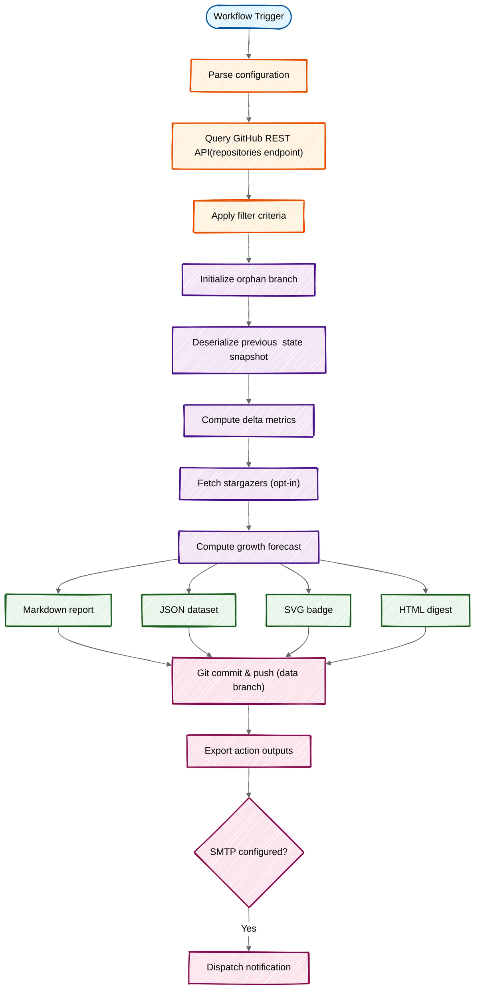

<div align="center">

# :star: GitHub Star Tracker

**Track star count changes across your repositories — automatically and get notified!**

[](https://github.com/fbuireu/github-star-tracker/actions/workflows/ci.yml)
[](https://codecov.io/gh/fbuireu/github-star-tracker)
[](https://www.gnu.org/licenses/agpl-3.0)

📚 **[Complete Documentation](../../wiki)** | 🚀 **[Getting Started](../../wiki/Getting-Started)** | 🔧 **[How It Works](../../wiki/How-It-Works)** | 🏗️ **[Technical Stack](../../wiki/Technical-Stack)** | ⚙️ **[Configuration](../../wiki/Configuration)** | 💡 **[Examples](../../wiki/Examples)** | 🐛 **[Troubleshooting](../../wiki/Troubleshooting)**

</div>

---

## Features

### 🚀 Tracking & Automation

- ✅ **Automated scheduling** — Daily, weekly, or on-demand runs
- 📈 **Historical tracking** — Up to 52 weeks of star data preserved
- 🎯 **Smart filters** — Track by visibility, exclude repos, minimum stars
- 👤 **Stargazer tracking** — See who starred your repos (opt-in)
- 🔮 **Growth forecast** — Predict star count trends for the next 4 weeks

### 📊 Reports & Visualizations

- 📊 **Interactive charts** — Star trends and per-repository comparisons
- 📧 **Email notifications** — Built-in SMTP or external action integration
- 🎨 **Multiple formats** — Markdown reports, HTML emails, SVG badges

### ⚙️ Developer Experience

- 🌍 **Multi-language** — English, Spanish, Catalan, Italian
- 🔧 **Flexible config** — File-based or action inputs
- 📤 **Action outputs** — Integrate with other workflow steps
- 🏷️ **Type-safe** — 100% TypeScript with strict mode

### 🔒 Quality & Security

- ✅ **95%+ test coverage** — +200 tests ensuring reliability
- 🔒 **Secure by design** — PATs with minimal scopes, no data leaks
- 📦 **Zero runtime deps** — Bundled action, fast execution
- 🔄 **CI/CD verified** — Every commit tested and validated

---

## Why Use This?

**Different from other star trackers:**

- 🏃 **GitHub Action native** — No external services, runs in your CI
- 📊 **Historical tracking** — Not just current count, see trends over time
- 🔔 **Smart notifications** — Email with configurable thresholds (every run, every N stars, or adaptive)
- 🎨 **Multiple outputs** — Data branch, badges, charts, action outputs
- 🔒 **Privacy-first** — Your data stays in your repo, no third parties

**Perfect for:**

- 📈 Open source maintainers tracking project growth
- 🎯 Marketing teams monitoring repository popularity
- 📊 Portfolio projects with automated reporting
- 🔍 Organizations monitoring multiple repositories

---

## Quick Start

### 1. Create a Personal Access Token

1. Go to **[GitHub Settings → Personal access tokens](https://github.com/settings/tokens)**
2. Generate **classic token** with `repo` or `public_repo` scope
3. Add to **repository secrets** as `STAR_TRACKER_TOKEN`

> [!NOTE]
> `STAR_TRACKER_TOKEN` must be a [Personal Access Token](https://github.com/settings/tokens) with `repo` or `public_repo` scope. The default `GITHUB_TOKEN` is not sufficient.
>
> 📖 **[Detailed PAT Guide](<../../wiki/Personal-Access-Token-(PAT)>)** — Step-by-step for classic & fine-grained tokens

---

### 2. Add the Workflow

Create `.github/workflows/star-tracker.yml`:

```yaml
name: Track Stars

on:
  schedule:
    - cron: '0 0 * * *' # Daily at midnight
  workflow_dispatch:

permissions:
  contents: write

jobs:
  track:
    runs-on: ubuntu-latest
    steps:
      - uses: fbuireu/github-star-tracker@v1
        with:
          github-token: ${{ secrets.STAR_TRACKER_TOKEN }}
```

---

### 3. Run and View

- **Manual run:** Go to **Actions** → **Track Stars** → **Run workflow**
- **View report:** Check the `star-tracker-data` branch in your repository

That's it! The action will track stars and generate reports automatically.

---

## Documentation

### 📚 [Complete Wiki](../../wiki)

| Guide                                                                 | Description                                      |
| --------------------------------------------------------------------- | ------------------------------------------------ |
| **[Home](../../wiki/Home)**                                           | Overview and quick navigation                    |
| **[Getting Started](../../wiki/Getting-Started)**                     | Complete setup guide from token to first run     |
| **[How It Works](../../wiki/How-It-Works)**                           | Deep dive into execution flow and architecture   |
| **[Technical Stack](../../wiki/Technical-Stack)**                     | Technologies, design decisions, and architecture |
| **[Personal Access Token](<../../wiki/Personal-Access-Token-(PAT)>)** | Detailed PAT creation (classic & fine-grained)   |
| **[Configuration](../../wiki/Configuration)**                         | All available options and settings               |
| **[API Reference](../../wiki/API-Reference)**                         | Complete inputs and outputs documentation        |
| **[Examples](../../wiki/Examples)**                                   | Real-world usage examples and workflows          |
| **[Star Trend Charts](../../wiki/Star-Trend-Charts)**                 | Interactive chart visualization setup            |
| **[Email Notifications](../../wiki/Email-Notifications)**             | Setup email alerts (built-in & external)         |
| **[Viewing Reports](../../wiki/Viewing-Reports)**                     | Multiple ways to access your data                |
| **[Data Management](../../wiki/Data-Management)**                     | How data is stored and managed                   |
| **[Internationalization](<../../wiki/Internationalization-(i18n)>)**  | Multi-language support and localization          |
| **[Known Limitations](../../wiki/Known-Limitations)**                 | Technical constraints and design trade-offs      |
| **[Troubleshooting](../../wiki/Troubleshooting)**                     | Common issues and solutions                      |

---

## How It Works



1. On each scheduled run, the action fetches star counts for your repos via the GitHub API
2. It reads the previous snapshot from `stars-data.json` on the **data branch**
3. Compares current vs. previous counts — computing per-repo deltas, new repos, and removed repos
4. Generates a **Markdown report** (committed as `README.md` on the data branch), an **SVG badge**, and an **HTML report** (available as an action output or sent via email)
5. Appends a new snapshot to the history and pushes everything to the data branch
6. Your `main` branch is never touched

---

## Supported Languages

- 🇬🇧 **English** (`en`)
- 🇪🇸 **Spanish** (`es`)
- 🇪🇸 **Catalan** (`ca`)
- 🇮🇹 **Italian** (`it`)

Set via `locale` input or config file. Reports, emails, and charts automatically use the selected language.

📖 **[Internationalization guide](<../../wiki/Internationalization-(i18n)>)**

---

## Quick Configuration

### Basic Example

```yaml
- uses: fbuireu/github-star-tracker@v1
  with:
    github-token: ${{ secrets.STAR_TRACKER_TOKEN }}
    visibility: 'public' # 'public', 'private', or 'all'
    locale: 'en' # Report language
    include-charts: true # Star trend charts
```

### With Email Notifications

```yaml
- uses: fbuireu/github-star-tracker@v1
  with:
    github-token: ${{ secrets.STAR_TRACKER_TOKEN }}
    smtp-host: smtp.gmail.com
    smtp-port: '587'
    smtp-username: ${{ secrets.EMAIL_FROM }}
    smtp-password: ${{ secrets.EMAIL_PASSWORD }}
    email-from: ${{ secrets.EMAIL_FROM }}
    email-to: ${{ secrets.EMAIL_TO }}
```

### Configuration File

Create `.github/star-tracker-config.json`:

```json
{
  "visibility": "public",
  "locale": "en",
  "includeCharts": true
}
```

📖 **[Complete configuration reference](../../wiki/Configuration)**

---

## Inputs & Outputs

### Required Inputs

| Input          | Description                          |
| -------------- | ------------------------------------ |
| `github-token` | Personal Access Token (**required**) |

### Core Configuration

| Input            | Default             | Description                                          |
| ---------------- | ------------------- | ---------------------------------------------------- |
| `visibility`     | `all`               | Repository visibility: `public`, `private`, or `all` |
| `locale`         | `en`                | Report language: `en`, `es`, `ca`, or `it`           |
| `include-charts` | `true`              | Enable star trend charts (true/false)                |
| `data-branch`    | `star-tracker-data` | Branch name for storing tracking data                |
| `max-history`    | `52`                | Maximum snapshots to keep in history (weeks)         |
| `track-stargazers` | `false`           | Track individual stargazers per repo (true/false)    |

### Filtering Options

| Input              | Default | Description                                        |
| ------------------ | ------- | -------------------------------------------------- |
| `include-archived` | `false` | Include archived repositories                      |
| `include-forks`    | `false` | Include forked repositories                        |
| `exclude-repos`    | —       | Comma-separated list of repos to exclude           |
| `only-repos`       | —       | Comma-separated list of repos to exclusively track |
| `min-stars`        | `0`     | Only track repos with at least N stars             |

### Email Configuration

| Input                | Default               | Description                                      |
| -------------------- | --------------------- | ------------------------------------------------ |
| `smtp-host`          | —                     | SMTP server hostname (enables email if provided) |
| `smtp-port`          | `587`                 | SMTP server port                                 |
| `smtp-username`      | —                     | SMTP authentication username                     |
| `smtp-password`      | —                     | SMTP authentication password                     |
| `email-to`           | —                     | Recipient email address                          |
| `email-from`         | `GitHub Star Tracker` | Sender name or email address                     |
| `send-on-no-changes`      | `false`               | Send email even when no changes detected                      |
| `notification-threshold`  | `0`                   | Notify threshold: `0` (every run), a number, or `auto`        |

📖 **[Full API reference](../../wiki/API-Reference)**

### Outputs

```yaml
- name: Track stars
  id: tracker
  uses: fbuireu/github-star-tracker@v1
  with:
    github-token: ${{ secrets.STAR_TRACKER_TOKEN }}

- name: Use outputs
  run: |
    echo "Total stars: ${{ steps.tracker.outputs.total-stars }}"
    echo "New stars: ${{ steps.tracker.outputs.new-stars }}"
```

Available: `report`, `report-html`, `total-stars`, `stars-changed`, `new-stars`, `lost-stars`, `should-notify`, `new-stargazers`

---

## Examples & Common Use-Cases

### Track Only Public Repositories

```yaml
- uses: fbuireu/github-star-tracker@v1
  with:
    github-token: ${{ secrets.STAR_TRACKER_TOKEN }}
    visibility: 'public'
```

### Filter by Minimum Stars

```yaml
- uses: fbuireu/github-star-tracker@v1
  with:
    github-token: ${{ secrets.STAR_TRACKER_TOKEN }}
    min-stars: '10'
    exclude-repos: 'archived-repo,test-project'
```

### Track Specific Repositories Only

```yaml
- uses: fbuireu/github-star-tracker@v1
  with:
    github-token: ${{ secrets.STAR_TRACKER_TOKEN }}
    only-repos: 'my-awesome-project,another-repo'
```

### Spanish Reports with Charts

```yaml
- uses: fbuireu/github-star-tracker@v1
  with:
    github-token: ${{ secrets.STAR_TRACKER_TOKEN }}
    locale: 'es'
    include-charts: true
```

### Notify Only After 10 Stars Change

```yaml
- uses: fbuireu/github-star-tracker@v1
  with:
    github-token: ${{ secrets.STAR_TRACKER_TOKEN }}
    notification-threshold: '10'
    smtp-host: smtp.gmail.com
    smtp-port: '587'
    smtp-username: ${{ secrets.EMAIL_FROM }}
    smtp-password: ${{ secrets.EMAIL_PASSWORD }}
    email-from: ${{ secrets.EMAIL_FROM }}
    email-to: ${{ secrets.EMAIL_TO }}
```

### Adaptive Notification Threshold

```yaml
- uses: fbuireu/github-star-tracker@v1
  with:
    github-token: ${{ secrets.STAR_TRACKER_TOKEN }}
    notification-threshold: 'auto' # Scales with total stars: 1/5/10/20
```

### External Notification with Threshold

```yaml
- name: Track stars
  id: tracker
  uses: fbuireu/github-star-tracker@v1
  with:
    github-token: ${{ secrets.STAR_TRACKER_TOKEN }}
    notification-threshold: '5'

- name: Send email when threshold reached
  if: steps.tracker.outputs.should-notify == 'true'
  uses: dawidd6/action-send-mail@v9
  with:
    server_address: smtp.gmail.com
    server_port: 587
    username: ${{ secrets.EMAIL_FROM }}
    password: ${{ secrets.EMAIL_PASSWORD }}
    subject: '⭐ Stars changed: ${{ steps.tracker.outputs.total-stars }} total'
    to: ${{ secrets.EMAIL_TO }}
    from: GitHub Star Tracker
    html_body: ${{ steps.tracker.outputs.report-html }}
```

### Complete Setup with All Features

```yaml
- uses: fbuireu/github-star-tracker@v1
  with:
    github-token: ${{ secrets.STAR_TRACKER_TOKEN }}
    visibility: 'public'
    include-archived: false
    include-forks: false
    min-stars: '5'
    locale: 'en'
    include-charts: true
    track-stargazers: true
    max-history: '52'
    smtp-host: smtp.gmail.com
    smtp-port: '587'
    smtp-username: ${{ secrets.EMAIL_FROM }}
    smtp-password: ${{ secrets.EMAIL_PASSWORD }}
    email-from: ${{ secrets.EMAIL_FROM }}
    email-to: ${{ secrets.EMAIL_TO }}
    send-on-no-changes: false
    notification-threshold: 'auto'
```

📖 **[More examples](../../wiki/Examples)**

---

## Performance

⚡ **Fast & Efficient**

- **Execution time:** ~2-30 seconds (depends on repo count)
- **API calls:** ~1-2 per 100 repositories (paginated efficiently)
- **Bundle size:** <1MB compiled action
- **Runtime:** Node.js 24+ (provided by GitHub Actions)
- **No checkout needed:** Runs standalone without cloning your repo

**Optimization tips:**

- Use `only-repos` to track specific repositories
- Set `min-stars` to filter low-activity repos
- Disable `include-charts` if not needed
- Use `visibility: 'public'` to reduce API calls

---

## Known Limitations

- **Stargazer API rate limits** — Fetching stargazers requires `ceil(stars / 100)` API calls per repo. Users with many high-star repos may approach the 5,000 requests/hour GitHub rate limit. Use `track-stargazers` only when needed.
- **Forecast accuracy** — Predictions are based on historical trends and assume growth patterns continue. Viral events, repo archival, or other discontinuities are not modeled.
- **Chart rendering** — Charts are static images generated via QuickChart.io (external service). No interactive zooming or tooltips.
- **Email client compatibility** — HTML reports use inline styles for maximum compatibility, but some email clients may render differently. `<details>` collapsible sections are only used in Markdown reports, not HTML emails.
- **Snapshot granularity** — Data is captured per-run (typically daily/weekly). Intra-day changes are not tracked.
- **GitHub token scope** — Requires a Personal Access Token (PAT); the default `GITHUB_TOKEN` provided by Actions is insufficient for listing repos across the account.

📖 **[Detailed limitations guide](../../wiki/Known-Limitations)** — Technical reasons, design trade-offs, and mitigation strategies

---

## Viewing Reports

### Data Branch (Primary)

View at: `https://github.com/YOUR_USER/YOUR_REPO/tree/star-tracker-data`

Contains:

- `README.md` — Full report with charts
- `stars-data.json` — Historical data
- `stars-badge.svg` — Star count badge

### Badge in README

```markdown

```

### Action Outputs

Access data in subsequent workflow steps for custom integrations.

📖 **[Complete viewing guide](../../wiki/Viewing-Reports)**

---

## Troubleshooting

### Common Issues

| Issue                     | Solution                               |
| ------------------------- | -------------------------------------- |
| "Bad credentials"         | Verify PAT is valid and not expired    |
| "Resource not accessible" | Using `GITHUB_TOKEN` instead of PAT    |
| Charts not appearing      | Wait for 2nd run to accumulate history |
| Email not received        | Check SMTP credentials and spam folder |

📖 **[Full troubleshooting guide](../../wiki/Troubleshooting)**

---

## Support & Contributing

- 🐛 **[Report bugs](../../issues/new?template=bug_report.yml)**
- 💡 **[Request features](../../issues/new?template=feature_request.yml)**
- 📖 **[Improve docs](../../issues/new?template=documentation.yml)**
- 🔒 **[Security issues](../../security/policy)**
- 🤝 **[Contributing guidelines](CONTRIBUTING.md)**

---

## Use of AI

This project uses AI assistance primarily for documentation purposes. AI tools (GitHub Copilot, Claude) were used to:

- Write and improve documentation (README, wiki pages, code comments)
- Generate boilerplate code and configuration files
- Assist with code reviews and suggestions

The core logic, architecture decisions, and implementation were developed by the maintainer. All AI-generated content has been reviewed and validated.

---

## License

[AGPL-3.0](LICENSE) © Made with 🤘🏼 by [Ferran Buireu](https://github.com/fbuireu)
