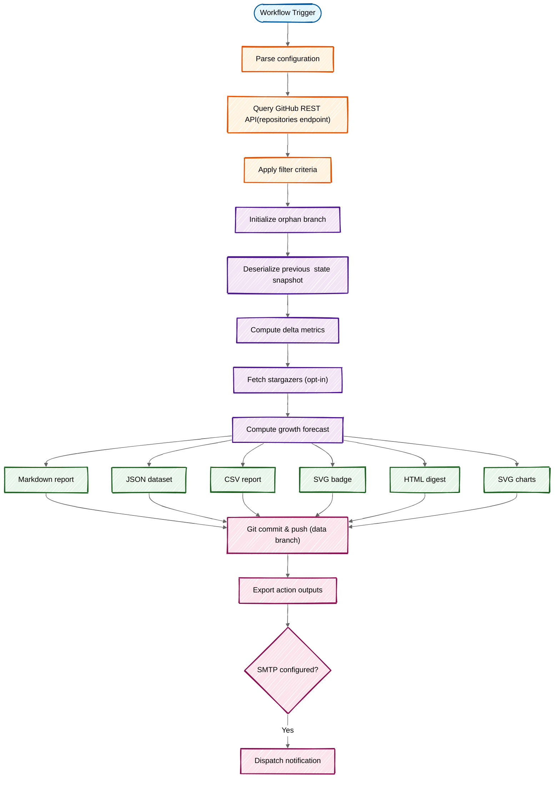

<div align="center">

# :star: GitHub Star Tracker

**A GitHub Action that tracks star counts across all your repositories on a schedule, generates visual reports with charts and badges, and sends notifications when changes are detected.**

[](https://github.com/fbuireu/github-star-tracker/actions/workflows/ci.yml)
[](https://codecov.io/gh/fbuireu/github-star-tracker)
[](https://www.gnu.org/licenses/agpl-3.0)

**[Documentation](../../wiki)** · **[Getting Started](../../wiki/Getting-Started)** · **[Configuration](../../wiki/Configuration)** · **[Examples](../../wiki/Examples)** · **[Troubleshooting](../../wiki/Troubleshooting)**

</div>

---

## What You Get

Every run, Star Tracker commits these artifacts to a dedicated data branch:

- **Animated SVG charts:** star history, per-repo trends, top repos comparison, and growth forecasts:

        

- **Shields.io-style badge:** embeddable star count that updates automatically:

        

- **Markdown & HTML reports:** summary tables, delta indicators, new/removed repos, stargazer details, and forecast tables.

- **CSV & JSON data:** machine-readable exports for dashboards, spreadsheets, or downstream pipelines.

---

## Features

- :chart_with_upwards_trend: **Animated SVG charts:** Star history, per-repo trends, comparisons, and growth forecasts
- :camera: **Historical snapshots:** Configurable retention (default: 52 runs) with JSON persistence
- :mag: **Smart filtering:** By visibility, ownership, min stars, regex exclusions, archived, forks
- :busts_in_silhouette: **Stargazer tracking:** See who starred your repos with avatars and dates
- :mailbox_with_mail: **Email notifications:** Built-in SMTP with fixed or adaptive thresholds
- :office: **GitHub Enterprise:** GHES support, auto-detected or explicit API URL
- :globe_with_meridians: **Multi-language:** English, Spanish, Catalan, Italian
- :bar_chart: **CSV export:** Machine-readable output for data pipelines
- :jigsaw: **Action outputs:** `total-stars`, `new-stars`, `new-stars`, `lost-stars`, `new-stargazers` (and much more) for workflow chaining
- :shield: **Zero runtime deps:** Bundled TypeScript action, 95%+ test coverage, 300+ tests

---

## Quick Start

### 1. Create a Personal Access Token

1. Go to **[GitHub Settings > Tokens](https://github.com/settings/tokens)**
2. Generate a **classic token** with `repo` or `public_repo` scope
3. Add it as a **repository secret** named `GITHUB_STAR_TRACKER_TOKEN`

> [!NOTE]
> The default `GITHUB_TOKEN` is not sufficient. See the **[PAT guide](<../../wiki/Personal-Access-Token-(PAT)>)** for details.

### 2. Add the Workflow

Create `.github/workflows/star-tracker.yml`:

```yaml
name: Track Stars

on:
  schedule:
    - cron: '0 0 * * *' # Daily at midnight
  workflow_dispatch:

permissions:
  contents: write

jobs:
  track:
    runs-on: ubuntu-latest
    steps:
      - uses: fbuireu/github-star-tracker@v1
        with:
          github-token: ${{ secrets.GITHUB_STAR_TRACKER_TOKEN }}
```

### 3. Run and View

- **Manual run:** Actions > Track Stars > Run workflow
- **View report:** Check the `star-tracker-data` branch in your repository

---

## Configuration

Set options directly in the workflow or via a YAML config file. See the **[Configuration guide](../../wiki/Configuration)** for full details.

```yaml
- uses: fbuireu/github-star-tracker@v1
  with:
    github-token: ${{ secrets.GITHUB_STAR_TRACKER_TOKEN }}
    visibility: 'public' # public | private | all | owned
    locale: 'es' # en | es | ca | it
    include-charts: true
    track-stargazers: true
    min-stars: '5'
    exclude-repos: 'test-repo,/^demo-.*/'
    notification-threshold: '0' # 0 | N | auto
```

<details>
<summary><strong>All Inputs</strong></summary>

| Input                    | Default               | Description                                                   |
| ------------------------ | --------------------- | ------------------------------------------------------------- |
| `github-token`           | —                     | **Required.** PAT with `repo` or `public_repo` scope          |
| `github-api-url`         | —                     | GitHub API base URL (for GHES). Auto-detected on GHES runners |
| `config-path`            | `star-tracker.yml`    | Path to YAML config file                                      |
| `visibility`             | `all`                 | `public`, `private`, `all`, or `owned`                        |
| `locale`                 | `en`                  | `en`, `es`, `ca`, or `it`                                     |
| `include-charts`         | `true`                | Generate star trend charts                                    |
| `data-branch`            | `star-tracker-data`   | Branch for tracking data                                      |
| `max-history`            | `52`                  | Max snapshots to keep                                         |
| `top-repos`              | `10`                  | Top repos in charts/forecasts                                 |
| `track-stargazers`       | `false`               | Track individual stargazers                                   |
| `include-archived`       | `false`               | Include archived repos                                        |
| `include-forks`          | `false`               | Include forked repos                                          |
| `exclude-repos`          | —                     | Names or regex to exclude                                     |
| `only-repos`             | —                     | Only track these repos                                        |
| `min-stars`              | `0`                   | Min stars to track                                            |
| `smtp-host`              | —                     | SMTP hostname (enables email)                                 |
| `smtp-port`              | `587`                 | SMTP port                                                     |
| `smtp-username`          | —                     | SMTP username                                                 |
| `smtp-password`          | —                     | SMTP password                                                 |
| `email-to`               | —                     | Recipient address                                             |
| `email-from`             | `GitHub Star Tracker` | Sender name                                                   |
| `send-on-no-changes`     | `false`               | Email even with no changes                                    |
| `notification-threshold` | `0`                   | `0` (every run), N (threshold), or `auto` (adaptive)          |

</details>

<details>
<summary><strong>Outputs</strong></summary>

| Output           | Description                         |
| ---------------- | ----------------------------------- |
| `total-stars`    | Total star count                    |
| `stars-changed`  | `true` / `false`                    |
| `new-stars`      | Stars gained                        |
| `lost-stars`     | Stars lost                          |
| `should-notify`  | Threshold reached: `true` / `false` |
| `new-stargazers` | New stargazers count                |
| `report`         | Full Markdown report                |
| `report-html`    | HTML report (for email)             |
| `report-csv`     | CSV report (for data pipelines)     |

</details>

**[API Reference](../../wiki/API-Reference):** Complete inputs, outputs, and data formats

---

## How It Works



**[How It Works](../../wiki/How-It-Works):** Full architecture and execution pipeline

---

## Embedding in Your README

### Star Badge

```markdown

```

### Star History Chart

```markdown

```

**[Viewing Reports](../../wiki/Viewing-Reports)**: All access methods (data branch, badges, outputs, email)

---

## Documentation

| Guide                                                                 | Description                               |
| --------------------------------------------------------------------- | ----------------------------------------- |
| **[Getting Started](../../wiki/Getting-Started)**                     | Setup from token to first run             |
| **[How It Works](../../wiki/How-It-Works)**                           | Execution flow and architecture           |
| **[Configuration](../../wiki/Configuration)**                         | All options and settings                  |
| **[API Reference](../../wiki/API-Reference)**                         | Inputs, outputs, and data formats         |
| **[Examples](../../wiki/Examples)**                                   | Real-world workflow configurations        |
| **[Star Trend Charts](../../wiki/Star-Trend-Charts)**                 | Chart types, embedding, and customization |
| **[Email Notifications](../../wiki/Email-Notifications)**             | Built-in SMTP and external action setup   |
| **[Viewing Reports](../../wiki/Viewing-Reports)**                     | Data branch, badges, outputs, raw data    |
| **[Data Management](../../wiki/Data-Management)**                     | Storage, rotation, and manual management  |
| **[Internationalization](<../../wiki/Internationalization-(i18n)>)**  | Multi-language support                    |
| **[Personal Access Token](<../../wiki/Personal-Access-Token-(PAT)>)** | Classic and fine-grained token setup      |
| **[Technical Stack](../../wiki/Technical-Stack)**                     | Technologies and design decisions         |
| **[Known Limitations](../../wiki/Known-Limitations)**                 | Constraints and workarounds               |
| **[Troubleshooting](../../wiki/Troubleshooting)**                     | Common issues and solutions               |

## Support & Contributing

- **[Report bugs](../../issues/new?template=bug_report.yml)**
- **[Request features](../../issues/new?template=feature_request.yml)**
- **[Contributing guidelines](CONTRIBUTING.md)**
- **[Security policy](../../security/policy)**

If you find this project useful, consider supporting its development:

<p align="center">
  <a href="https://github.com/sponsors/fbuireu">
    
  </a>
  <a href="https://www.buymeacoffee.com/ferranbuireu">
    
  </a>
</p>

---

## Use of AI

This project uses AI assistance primarily for documentation purposes. AI tools (GitHub Copilot, Claude) were used to:

- Write and improve documentation (README, wiki pages)
- Generate boilerplate code and configuration files
- Assist with code reviews and suggestions

The core logic, architecture decisions, and implementation were developed by the maintainer. All AI-generated content has been reviewed and validated.

---

<div align="center">

[AGPL-3.0](LICENSE) © Made with 🤘🏼 by [Ferran Buireu](https://github.com/fbuireu)

</div>
