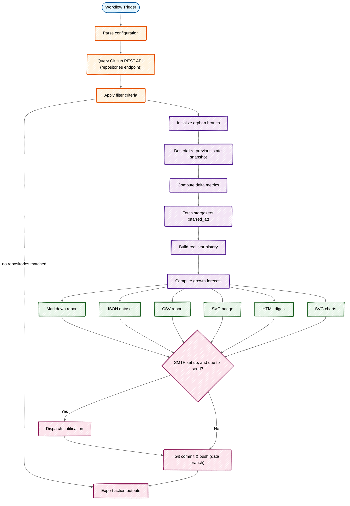

<div align="center">

 

# GitHub Star Tracker

**A GitHub Action that tracks star counts across all your repositories on a schedule, generates visual reports with charts and badges, and sends notifications when changes are detected.**

[](https://github.com/fbuireu/github-star-tracker/actions/workflows/ci.yml)
[](https://codecov.io/gh/fbuireu/github-star-tracker)
[](https://www.gnu.org/licenses/agpl-3.0)
[](https://www.producthunt.com/products/github-star-tracker)

**[Documentation](docs/wiki/Home.md)** · **[Getting Started](docs/wiki/Getting-Started.md)** · **[Configuration](docs/wiki/Configuration.md)** · **[Examples](docs/wiki/Examples.md)** · **[Troubleshooting](docs/wiki/Troubleshooting.md)**

</div>

> [!IMPORTANT]
> **Coming from Star History, Starchart.cc or similar? You're in the right place.**
>
> GitHub [announced](https://github.blog/changelog/2026-06-30-upcoming-access-restrictions-to-public-api-endpoints-and-ui-views/) that access to the stargazers API is being restricted to repository admins and collaborators. Tools that chart stars for repositories they don't own will start receiving empty responses or `403` errors.
>
> **GitHub Star Tracker keeps working.** It runs inside *your* workflow, with *your* token, against *your* repositories: exactly the access GitHub is keeping. Star counts, reports, badges, CSV and notifications are unaffected in every case.
>
> The one thing that depends on your *role* rather than your token's scopes is the stargazer endpoint, and it is what star-history charts and stargazer tracking are reconstructed from. If you track a repository you do not administer (an organization repo where you are a read-only member, or any repo reached through a fine-grained token with no explicit grant on its organization), those two fall back to the stored per-run snapshots. [Known Limitations](docs/wiki/Known-Limitations.md) has the detail.

---

## Table of Contents

- [What You Get](#what-you-get)
- [Features](#features)
- [Quick Start](#quick-start)
- [Configuration](#configuration)
- [How It Works](#how-it-works)
- [Embedding in Your README](#embedding-in-your-readme)
- [Documentation](#documentation)
- [Support & Contributing](#support--contributing)
- [Use of AI](#use-of-ai)

---

## What You Get

A writing run commits these artefacts to a dedicated data branch. Two runs commit nothing: a `read-only`
run, which renders and reports in full but never pushes, and any run whose output is byte-for-byte what the
branch already holds.

- **Animated SVG charts:** star history, per-repo trends, top repos comparison, and growth forecasts, with automatic dark/light mode support:

  
  
  

- **Shields.io-style badge:** embeddable star count that updates automatically:

  

- **Markdown report:** summary tables, delta indicators, every New Repository and Removed Repository since the baseline, stargazer details, and forecast tables.

- **CSV & JSON data:** machine-readable exports for dashboards, spreadsheets, or downstream pipelines.

The HTML report is the one thing that is *not* committed. It is written outside the data branch worktree for
the email body, and reaches you through the `report-html` and `report-html-path` outputs instead.

---

## Features

- **Animated SVG charts:** star history, per-repo trends, comparisons, and growth forecasts, with an optional Trend Line over the observed curve
- **Dark/light mode:** SVG charts auto-adapt to the viewer's color scheme via `prefers-color-scheme`
- **Historical snapshots:** configurable retention (default: 52 runs) with JSON persistence
- **Smart filtering:** by visibility, Owner, min stars, exact names or regex, archived, forks
- **Stargazer tracking:** see who starred your repos, with avatars and dates
- **Email notifications:** built-in SMTP, with a fixed or adaptive threshold and a Notification Mode that decides whether losses count
- **GitHub Enterprise:** GHES support, auto-detected or explicit API URL
- **Multi-language:** English, Spanish, Catalan, Italian
- **CSV export:** machine-readable output for data pipelines
- **Eleven action outputs** for workflow chaining: `lost-stars`, `new-stargazers`, `new-stars`, `notification-sent`, `report`, `report-csv`, `report-html`, `report-html-path`, `should-notify`, `stars-changed` and `total-stars`
- **No install step:** its five runtime dependencies are bundled into the committed `dist/`, so the runner clones and executes, with no `npm install` in your workflow ([ADR 0003](docs/adr/0003-commit-the-bundled-dist-directory.md))
- **Enforced coverage:** the build gate is 85% on lines, functions, branches and statements, over an extensive unit test suite
- **Future-proof:** unaffected by GitHub's 2026 stargazers API restrictions, since it uses your own credentials on your own repositories

---

## Quick Start

### 1. Create a Personal Access Token

1. Go to **[GitHub Settings > Tokens](https://github.com/settings/tokens)**
2. Generate a **classic token** with `repo` or `public_repo` scope, or a **fine-grained token** with `Contents: Read and write` on the repositories you want tracked
3. Add it as a **repository secret** named `STAR_TRACKER_TOKEN`

> [!NOTE]
> The default `GITHUB_TOKEN` is not sufficient. See the **[PAT guide](<docs/wiki/Personal-Access-Token-(PAT).md>)** for details, including why a fine-grained token can leave the stargazer sections empty.

### 2. Add the Workflow

Create `.github/workflows/star-tracker.yml`:

```yaml
name: Track Stars

on:
  schedule:
    - cron: '0 0 * * *' # Daily at midnight
  workflow_dispatch:

permissions:
  contents: write

jobs:
  track:
    runs-on: ubuntu-latest
    steps:
      - uses: actions/checkout@3d3c42e5aac5ba805825da76410c181273ba90b1 # v7.0.1
      - uses: fbuireu/github-star-tracker@v1
        with:
          github-token: ${{ secrets.STAR_TRACKER_TOKEN }}
```

### 3. Run and View

- **Manual run:** Actions > Track Stars > Run workflow
- **View report:** Check the `star-tracker-data` branch in your repository

---

## Configuration

Set options directly in the workflow or via a YAML config file. See the **[Configuration guide](docs/wiki/Configuration.md)** for full details.

```yaml
- uses: fbuireu/github-star-tracker@v1
  with:
    github-token: ${{ secrets.STAR_TRACKER_TOKEN }}
    visibility: 'public' # public | private | all | owned
    locale: 'es' # en | es | ca | it
    include-charts: true
    track-stargazers: true
    min-stars: '5'
    exclude-repos: 'test-repo,/^demo-.*/'
    compare-against: 'last-run' # last-run | 24h | 7d | 30d
    notification-threshold: '500' # 0 | N | auto
    notification-mode: 'gains' # net | gains
```

<details>
<summary><strong>All Inputs</strong></summary>

| Input                    | Default               | Description                                                   |
| ------------------------ | --------------------- | ------------------------------------------------------------- |
| `github-token`           | -                     | **Required.** PAT with `repo` or `public_repo` scope          |
| `chart-animation`        | `true`                | Animate SVG charts (`true`) or render them static (`false`) for email/static contexts |
| `chart-begin-at-zero`    | `false`               | Start the Y-axis at zero (`true`) or zoom into the data range (`false`) |
| `chart-curve`            | `monotone`            | Curve when smoothing: `monotone` (no overshoot, best for stars), `catmull-rom`, `cubic-bezier`, `rounded-step`. Email approximates non-monotone curves |
| `chart-custom-milestones` | -                   | Comma-separated star counts for the milestone reference lines, replacing the built-in defaults (e.g. `250, 750, 2500`). Requires `chart-milestones` |
| `chart-line-color`       | `#dfb317`             | Hex color of primary chart line/fill/points (not comparison). Accepts hex with or without a leading `#`  |
| `chart-line-width`       | `2.5`                 | Stroke width (px, >0) of data lines in all charts             |
| `chart-max-points`       | `30`                  | Curve granularity: points across the full span (capped at 365); `0` reconstructs at weekly resolution. Not a time window (see `chart-range`) |
| `chart-milestones`       | `true`                | Show milestone reference lines on the main star-history chart (`true`) or hide them (`false`) |
| `chart-range`            | `all`                 | Time window plotted: `30d`, `90d`, `1y` or `all` |
| `chart-show-points`      | `true`                | Draw a marker on each data point (`true`) or hide them for a cleaner dense line (`false`) |
| `chart-smoothing`        | `true`                | Smooth curve (`true`) or straight segments to show spikes; applies to email charts too |
| `chart-theme`            | `auto`                | Color theme for the SVG charts: `auto` (follows `prefers-color-scheme`), `light` or `dark` |
| `chart-trend-line`       | `false`               | Overlay a dashed moving-average trend line on the main chart |
| `chart-y-axis-side`      | `left`                | Y-axis labels side: `left` or `right`                         |
| `compare-against`        | `last-run`            | Snapshot used as comparison baseline: `last-run`, `24h`, `7d` or `30d`. If history is shorter than the window, the oldest stored snapshot is used and the report's date shows how far back it really goes |
| `config-path`            | `star-tracker.yml`    | Path to YAML config file                                      |
| `data-branch`            | `star-tracker-data`   | Branch for tracking data                                      |
| `email-from`             | localized             | Sender name or address; defaults to a localized sender name   |
| `email-theme`            | `auto`                | Color theme for the HTML email and its charts: `auto` (same as `chart-theme`), `light` or `dark`. Email charts are images, so a dark-mode reader needs this to resolve to `dark` |
| `email-to`               | -                     | Recipient address                                             |
| `exclude-orgs`           | -                     | Owners to exclude (exact name or `/regex/`)                   |
| `exclude-repos`          | -                     | Repos to exclude (exact name or `/regex/`)                    |
| `github-api-url`         | -                     | GitHub API base URL (for GHES). Auto-detected on GHES runners |
| `include-archived`       | `false`               | Include archived repos                                        |
| `include-charts`         | `true`                | Generate star trend charts                                    |
| `include-forks`          | `false`               | Include forked repos                                          |
| `locale`                 | `en`                  | `en`, `es`, `ca`, or `it`                                     |
| `max-history`            | `52`                  | Max snapshots to keep                                         |
| `min-stars`              | `0`                   | Min stars to track                                            |
| `notification-mode`      | `net`                 | How the threshold measures that change: `net` (absolute change, so a large drop also fires) or `gains` (upward movement only) |
| `notification-threshold` | `0`                   | `0` (every run with changes), N (accumulated change since the last notification), or `auto` (adaptive) |
| `only-orgs`              | -                     | Only track repos under these Owners (exact name or `/regex/`) |
| `only-repos`             | -                     | Only track these repos (exact name or `/regex/`)              |
| `read-only`              | `false`               | Make this a Read-Only Run: it still fetches, reports, sets outputs and emails, it just never commits or pushes. Use it for a second workflow that shares a data branch with the workflow that writes it |
| `send-on-no-changes`     | `false`               | Email even with no changes                                    |
| `smart-sampling`         | `false`               | Sample stargazer pages for high-star repos (avoids rate limits) |
| `smart-sampling-pages`   | `30`                  | Max evenly-spaced stargazer pages per sampled repo            |
| `smart-sampling-threshold` | `1500`              | Star count above which a repo is sampled                      |
| `smtp-host`              | -                     | SMTP hostname (enables email)                                 |
| `smtp-password`          | -                     | SMTP password                                                 |
| `smtp-port`              | `587`                 | SMTP port                                                     |
| `smtp-username`          | -                     | SMTP username                                                 |
| `top-repos`              | `10`                  | Top repos in charts/forecasts                                 |
| `track-stargazers`       | `false`               | Track individual stargazers                                   |
| `velocity-metrics`       | `false`               | Add a growth-velocity section (stars/day, % growth, days to next milestone) to the report |
| `visibility`             | `all`                 | `public`, `private`, `all`, or `owned`                        |

> [!IMPORTANT]
> `notification-threshold` decides **when** you get an email; `compare-against` decides **what period the report body covers**. The two are independent: the threshold accumulates from the Notification Baseline, while the report diffs against a stored snapshot. So a threshold that takes several runs to trip still produces a report covering only the `compare-against` window. Set them to match if you want the email body to span what the threshold accumulated.

See **[`notification-threshold`](docs/wiki/Configuration.md#notification-threshold)** for how the counter behaves on a fresh data branch, when you raise the value, and on a `read-only` run.

In the YAML config file, option keys may be written with either dashes or underscores (`include-charts` and `include_charts` are both accepted), so you can copy option names straight from this table without rewriting the separators.

</details>

<details>
<summary><strong>Outputs</strong></summary>

| Output             | Description                                                        |
| ------------------ | ----------------------------------------------------------------- |
| `lost-stars`       | Stars lost vs. the comparison baseline. Per run, not cumulative   |
| `new-stargazers`   | New stargazers vs. the stored stargazer list, which every writing run rewrites - not driven by `compare-against` |
| `new-stars`        | Stars gained vs. the comparison baseline. Per run, not cumulative |
| `notification-sent` | `true` / `false` - whether an email was actually delivered. `should-notify` is the decision; this is the outcome |
| `report`           | Full Markdown report                                              |
| `report-csv`       | CSV report (for data pipelines)                                  |
| `report-html`      | HTML report (for email)                                          |
| `report-html-path` | File path to the HTML report (for large reports / custom mailers) |
| `should-notify`    | `true` / `false` - the **cumulative** threshold signal, driven by `notification-threshold` and `notification-mode` (and requires an actual change) |
| `stars-changed`    | `true` / `false` - anything changed vs. the comparison baseline (per run) |
| `total-stars`      | Total star count                                                  |

To email on every N stars, use `notification-threshold: 'N'` with `notification-mode: 'gains'` and gate the step on `if: steps.tracker.outputs.should-notify == 'true'`. Gating on `new-stars >= N` would require N stars inside a single run, which on a daily schedule almost never happens.

</details>

**[API Reference](docs/wiki/API-Reference.md):** Complete inputs, outputs, and data formats

---

## How It Works


```mermaid
---
config:
  look: handDrawn
  theme: neutral
---
flowchart TD
    trigger(["Workflow Trigger"])
    config["Parse configuration"]
    fetch["Query GitHub REST API (repositories endpoint)"]
    filter["Apply filter criteria"]
    init["Initialize orphan branch"]
    read["Deserialize previous state snapshot"]
    compare["Compute delta metrics"]
    stargazers["Fetch stargazers (starred_at)"]
    history["Build real star history"]
    forecast["Compute growth forecast"]
    md["Markdown report"]
    json["JSON dataset"]
    csv["CSV report"]
    svg["SVG badge"]
    html["HTML digest"]
    charts["SVG charts"]
    commit["Git commit & push (data branch)"]
    setout["Export action outputs"]
    email{"SMTP set up, and due to send?"}
    send["Dispatch notification"]

    trigger --> config --> fetch --> filter
    filter -->|no repositories matched| setout
    filter --> init --> read --> compare
    compare --> stargazers --> history --> forecast
    forecast --> md & json & csv & svg & html & charts
    md & json & csv & svg & html & charts --> email
    email -->|Yes| send --> commit
    email -->|No| commit
    commit --> setout

    style trigger fill:#e1f5ff,stroke:#01579b,stroke-width:2px
    style config fill:#fff3e0,stroke:#e65100,stroke-width:2px
    style fetch fill:#fff3e0,stroke:#e65100,stroke-width:2px
    style filter fill:#fff3e0,stroke:#e65100,stroke-width:2px
    style init fill:#f3e5f5,stroke:#4a148c,stroke-width:2px
    style read fill:#f3e5f5,stroke:#4a148c,stroke-width:2px
    style compare fill:#f3e5f5,stroke:#4a148c,stroke-width:2px
    style stargazers fill:#f3e5f5,stroke:#4a148c,stroke-width:2px
    style history fill:#f3e5f5,stroke:#4a148c,stroke-width:2px
    style forecast fill:#f3e5f5,stroke:#4a148c,stroke-width:2px
    style md fill:#e8f5e9,stroke:#1b5e20,stroke-width:2px
    style json fill:#e8f5e9,stroke:#1b5e20,stroke-width:2px
    style csv fill:#e8f5e9,stroke:#1b5e20,stroke-width:2px
    style svg fill:#e8f5e9,stroke:#1b5e20,stroke-width:2px
    style html fill:#e8f5e9,stroke:#1b5e20,stroke-width:2px
    style charts fill:#e8f5e9,stroke:#1b5e20,stroke-width:2px
    style commit fill:#fce4ec,stroke:#880e4f,stroke-width:2px
    style setout fill:#fce4ec,stroke:#880e4f,stroke-width:2px
    style email fill:#fce4ec,stroke:#880e4f,stroke-width:2px
    style send fill:#fce4ec,stroke:#880e4f,stroke-width:2px
```

**[How It Works](docs/wiki/How-It-Works.md):** The full execution pipeline, phase by phase. **[Architecture](docs/wiki/Architecture.md):** the DDD<sub>(ish)</sub> layering, one ubiquitous language and a pure core, and how much of the tactical catalogue is taken

### How the charts read dates

The charts plot the **real historical curve**: every star is placed on the date it was actually given. Each stargazer carries a `starred_at` timestamp (GitHub's `application/vnd.github.star+json` media type), and the action reconstructs the cumulative star count over real time from those dates, so the timeline runs from a repo's very first star up to now, regardless of when you started running the action.

The per-run snapshots on the data branch are still kept for the report's delta tables and notifications ("how many stars changed against the comparison baseline", which `compare-against` selects), but the charts themselves no longer depend on them.

One caveat: GitHub caps the stargazers listing at roughly **40,000 per repo** (oldest first), so on a very large repo the most recent stars fall outside the Reachable Stargazers and the Covered Stars behind the curve stop short of the true total. The reachable portion is drawn accurately and the recent tail is bridged with a straight ramp up to the current total, so the early curve stays honest and the chart never goes flat at the end. Pair this with `smart-sampling` to keep the request cost bounded on big repos.

The line style is configurable via `chart-curve` (`monotone` by default, plus `catmull-rom`, `cubic-bezier` and `rounded-step`), along with theme, colors, milestones, point markers, the time window and more. See the **[examples gallery](examples/)** for a rendered comparison of every option.

---

## Embedding in Your README

### Star Badge

```markdown

```

### Star History Chart

```markdown

```

> [!TIP]
> SVG charts automatically adapt to dark and light mode. No extra configuration needed: they use `prefers-color-scheme` to match the viewer's theme.

**[Viewing Reports](docs/wiki/Viewing-Reports.md)**: All access methods (data branch, badges, outputs, email)

---

## Documentation

| Guide                                                                 | Description                               |
| --------------------------------------------------------------------- | ----------------------------------------- |
| **[Getting Started](docs/wiki/Getting-Started.md)**                          | Setup from token to first run             |
| **[How It Works](docs/wiki/How-It-Works.md)**                                | Execution flow, phase by phase            |
| **[Architecture](docs/wiki/Architecture.md)**                                | DDD(ish) layers, and where the DDD stops |
| **[Configuration](docs/wiki/Configuration.md)**                              | All options and settings                  |
| **[API Reference](docs/wiki/API-Reference.md)**                              | Inputs, outputs, and data formats         |
| **[Examples](docs/wiki/Examples.md)**                                        | Real-world workflow configurations        |
| **[Star Trend Charts](docs/wiki/Star-Trend-Charts.md)**                      | Chart types, embedding, and customization |
| **[Email Notifications](docs/wiki/Email-Notifications.md)**                  | Built-in SMTP and external action setup   |
| **[Viewing Reports](docs/wiki/Viewing-Reports.md)**                          | Data branch, badges, outputs, raw data    |
| **[Data Management](docs/wiki/Data-Management.md)**                          | Storage, rotation, and manual management  |
| **[Internationalization](<docs/wiki/Internationalization-(i18n).md>)**       | Multi-language support                    |
| **[Personal Access Token](<docs/wiki/Personal-Access-Token-(PAT).md>)**      | Classic and fine-grained token setup      |
| **[Technical Stack](docs/wiki/Technical-Stack.md)**                          | Technologies and design decisions         |
| **[Known Limitations](docs/wiki/Known-Limitations.md)**                      | Constraints and workarounds               |
| **[Troubleshooting](docs/wiki/Troubleshooting.md)**                          | Common issues and solutions               |

For *why* the action is built the way it is, one decision per file, see the
[architecture decision records](docs/adr/). They include the
[AGPL-3.0-only licence](docs/adr/0009-agpl-3-0-only-licence.md) and what it asks of anyone redistributing
or hosting a modified version.

---

## Support & Contributing

- **[Report bugs](../../issues/new?template=bug_report.yml)**
- **[Request features](../../issues/new?template=feature_request.yml)**
- **[Contributing guidelines](CONTRIBUTING.md)**
- **[Security policy](../../security/policy)**

If you find this project useful, consider supporting its development:

<p align="center">
  <a href="https://github.com/sponsors/fbuireu">
    
  </a>
  <a href="https://www.buymeacoffee.com/ferranbuireu">
    
  </a>
</p>

---

## Use of AI

This project uses AI assistance primarily for documentation purposes. AI tools (GitHub Copilot, Claude) were used to:

- Write and improve documentation (README, wiki pages)
- Generate boilerplate code and configuration files
- Assist with code reviews and suggestions

The core logic, architecture decisions, and implementation were developed by the maintainer. All AI-generated content has been reviewed and validated.

---

<div align="center">

[AGPL-3.0](LICENSE) © Made with 🤘🏼 by [Ferran Buireu](https://github.com/fbuireu)

</div>
