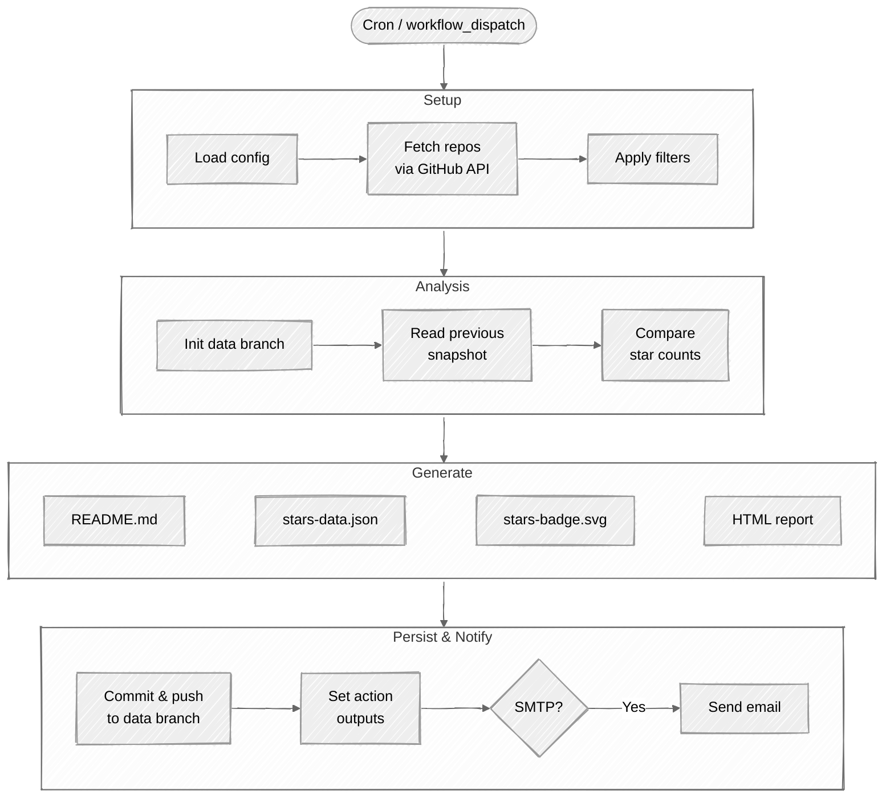
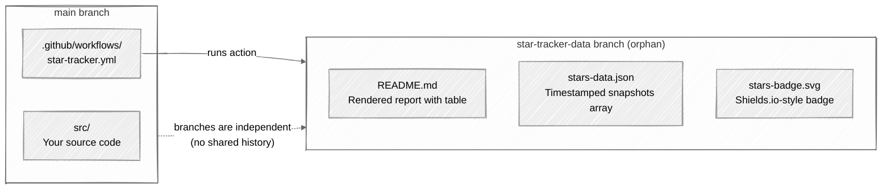

<div align="center">

# :star: GitHub Star Tracker

**Track star count changes across your repositories — automatically.**

[](https://github.com/fbuireu/github-star-tracker/actions/workflows/test.yml)
[](https://www.gnu.org/licenses/agpl-3.0)

</div>

---

## How It Works



1. On each scheduled run, the action fetches star counts for your repos via the GitHub API
2. It reads the previous snapshot from `stars-data.json` on the **data branch**
3. Compares current vs. previous counts — computing per-repo deltas, new repos, and removed repos
4. Generates a **Markdown report** (committed as `README.md` on the data branch), an **SVG badge**, and an **HTML report** (available as an action output or sent via email)
5. Appends a new snapshot to the history and pushes everything to the data branch
6. Your `main` branch is never touched

---

## Usage

### 1. Add the workflow

Create `.github/workflows/star-tracker.yml` in your repository:

```yaml
name: Track Stars

on:
  schedule:
    - cron: '0 8 * * 1' # Every Monday at 08:00 UTC
  workflow_dispatch: # Allow manual runs

permissions:
  contents: write # Required to push to the data branch

jobs:
  track:
    runs-on: ubuntu-latest
    steps:
      - uses: actions/checkout@v4

      - name: Track star changes
        uses: fbuireu/github-star-tracker@v1
        with:
          github-token: ${{ secrets.GITHUB_TOKEN }}
```

### 2. (Optional) Create a config file

For advanced filtering, create `star-tracker.yml` at your repo root:

```yaml
visibility: 'public' # "public" | "private" | "all"
include_archived: false
include_forks: false
min_stars: 0
exclude_repos:
  - 'some-old-repo'
only_repos: [] # If set, ONLY these repos are tracked
data_branch: 'star-tracker-data'
max_history: 52
```

You don't need this file for basic usage — the action works with sensible defaults out of the box.

### 3. Run it

- **Manually:** Go to `Actions` > `Track Stars` > `Run workflow`
- **Automatically:** It runs on the cron schedule you defined

### 4. Check results

After the first run, a new branch `star-tracker-data` appears in your repo with the report.

---

## Where Is the Data Stored?

Everything lives on a **separate orphan branch** (default: `star-tracker-data`). This branch has no relation to your source code — it only contains tracking data.



### `README.md` — The Report

Navigate to the data branch on GitHub to see a rendered table like:

| Repository           | Stars | Change |       Trend        |
| :------------------- | ----: | -----: | :----------------: |
| user/popular-lib     |   342 |    +12 |     :arrow_up:     |
| user/side-project    |    18 |     -1 |    :arrow_down:    |
| user/new-thing `NEW` |     3 |      0 | :heavy_minus_sign: |

### `stars-data.json` — The History

An array of timestamped snapshots. Each snapshot records every tracked repo and its star count at that point in time. Old snapshots are automatically trimmed to `max-history` (default 52 — one year of weekly snapshots).

### `stars-badge.svg` — The Badge

A shields.io-style badge you can embed anywhere:

```markdown

```

You can also link directly to the report:

```markdown
[View star report](https://github.com/YOUR_USER/YOUR_REPO/tree/star-tracker-data)
```

---

## Email Notifications

Two ways to get email reports. Use whichever fits your setup.

### Option A: Chain with `dawidd6/action-send-mail@v9`

The action exposes `report-html` as an output, so you can pipe it into any email action:

```yaml
steps:
  - uses: actions/checkout@v4

  - name: Track star changes
    id: tracker
    uses: fbuireu/github-star-tracker@v1
    with:
      github-token: ${{ secrets.GITHUB_TOKEN }}

  - name: Send email report
    if: steps.tracker.outputs.stars-changed == 'true'
    uses: dawidd6/action-send-mail@v9
    with:
      server_address: smtp.gmail.com
      server_port: 465
      username: ${{ secrets.EMAIL_USERNAME }}
      password: ${{ secrets.EMAIL_PASSWORD }}
      subject: 'Star Tracker: ${{ steps.tracker.outputs.total-stars }} total stars'
      html_body: ${{ steps.tracker.outputs.report-html }}
      to: ${{ secrets.EMAIL_TO }}
      from: GitHub Star Tracker
```

### Option B: Built-in email (no extra step)

Just provide SMTP credentials as inputs:

```yaml
- uses: fbuireu/github-star-tracker@v1
  with:
    github-token: ${{ secrets.GITHUB_TOKEN }}
    smtp-host: smtp.gmail.com
    smtp-port: '465'
    smtp-username: ${{ secrets.EMAIL_USERNAME }}
    smtp-password: ${{ secrets.EMAIL_PASSWORD }}
    email-to: ${{ secrets.EMAIL_TO }}
    email-from: 'Star Tracker <noreply@example.com>'
```

> [!NOTE]  
> **Gmail users:** Use an [App Password](https://myaccount.google.com/apppasswords), not your regular password (requires 2-Step Verification).

---

## Inputs

All inputs are passed via `with:` in your workflow file. Only `github-token` is required.

| Input                | Description                                                                       | Default               |
| :------------------- | :-------------------------------------------------------------------------------- | :-------------------- |
| **`github-token`**   | GitHub token with repo access. **Required.**                                      | —                     |
| `config-path`        | Path to the YAML configuration file                                               | `star-tracker.yml`    |
| `visibility`         | Which repos to track: `public`, `private`, or `all`                               | `public`              |
| `include-archived`   | Include archived repositories                                                     | `false`               |
| `include-forks`      | Include forked repositories                                                       | `false`               |
| `exclude-repos`      | Comma-separated repo names to exclude                                             | `''`                  |
| `only-repos`         | Comma-separated repo names to **exclusively** track (overrides all other filters) | `''`                  |
| `min-stars`          | Only include repos with at least this many stars                                  | `0`                   |
| `data-branch`        | Branch name where tracking data is stored                                         | `star-tracker-data`   |
| `max-history`        | Maximum number of historical snapshots to retain                                  | `52`                  |
| `smtp-host`          | SMTP server host. **Providing this enables built-in email.**                      | `''`                  |
| `smtp-port`          | SMTP server port                                                                  | `587`                 |
| `smtp-username`      | SMTP authentication username                                                      | `''`                  |
| `smtp-password`      | SMTP authentication password                                                      | `''`                  |
| `email-to`           | Email recipient address                                                           | `''`                  |
| `email-from`         | Email sender name or address                                                      | `GitHub Star Tracker` |
| `send-on-no-changes` | Send email even when no star changes are detected                                 | `false`               |

> [!NOTE]
> Inputs override values from the config file. If both are set, the input wins.

---

## Outputs

Use these in subsequent workflow steps via `${{ steps.<id>.outputs.<name> }}`.

| Output          | Description                               | Example              |
| :-------------- | :---------------------------------------- | :------------------- |
| `report`        | Full Markdown report                      | _(multiline string)_ |
| `report-html`   | Full HTML report (for email)              | _(multiline string)_ |
| `total-stars`   | Total stars across all tracked repos      | `363`                |
| `stars-changed` | Whether any counts changed since last run | `true` / `false`     |
| `new-stars`     | Total stars **gained** since last run     | `15`                 |
| `lost-stars`    | Total stars **lost** since last run       | `3`                  |

---

## Examples

### Minimal — just track, no email

```yaml
- uses: fbuireu/github-star-tracker@v1
  with:
    github-token: ${{ secrets.GITHUB_TOKEN }}
```

### Track all repos (including private)

```yaml
- uses: fbuireu/github-star-tracker@v1
  with:
    github-token: ${{ secrets.GITHUB_TOKEN }}
    visibility: 'all'
```

### Track only specific repos

```yaml
- uses: fbuireu/github-star-tracker@v1
  with:
    github-token: ${{ secrets.GITHUB_TOKEN }}
    only-repos: 'my-awesome-lib, another-project'
```

### Daily snapshots, weekly email digest

```yaml
on:
  schedule:
    - cron: '0 8 * * *' # Snapshot every day at 08:00 UTC
  workflow_dispatch:

jobs:
  track:
    runs-on: ubuntu-latest
    steps:
      - uses: actions/checkout@v4

      - name: Track stars
        id: tracker
        uses: fbuireu/github-star-tracker@v1
        with:
          github-token: ${{ secrets.GITHUB_TOKEN }}
          visibility: 'all'
          min-stars: '1'

      - name: Send weekly digest (Mondays only)
        if: >
          steps.tracker.outputs.stars-changed == 'true' &&
          github.event.schedule == '0 8 * * 1'
        uses: dawidd6/action-send-mail@v9
        with:
          server_address: smtp.gmail.com
          server_port: 465
          username: ${{ secrets.EMAIL_USERNAME }}
          password: ${{ secrets.EMAIL_PASSWORD }}
          subject: 'Weekly Star Report: ${{ steps.tracker.outputs.total-stars }} stars'
          html_body: ${{ steps.tracker.outputs.report-html }}
          to: ${{ secrets.EMAIL_TO }}
          from: GitHub Star Tracker
```

---

## Contributing

Contributions are welcome! Please:

1. Fork the repository
2. Create a feature branch (`git checkout -b feature/my-feature`)
3. Install dependencies: `pnpm install`
4. Make your changes
5. Run tests: `pnpm test`
6. Build: `pnpm run build`
7. Commit both `src/` and `dist/` changes
8. Open a Pull Request

## License

[AGPL-3.0](LICENSE) &copy; [Ferran Buireu](https://github.com/fbuireu)
