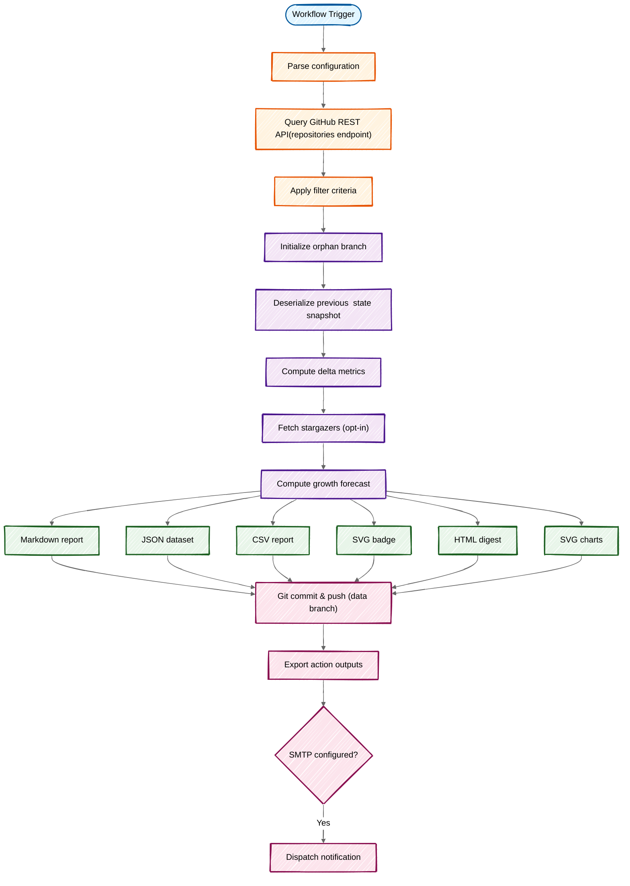

<div align="center">

# :star: GitHub Star Tracker

**Track star count changes across your repositories — automatically and get notified!**

[](https://github.com/fbuireu/github-star-tracker/actions/workflows/ci.yml)
[](https://codecov.io/gh/fbuireu/github-star-tracker)
[](https://www.gnu.org/licenses/agpl-3.0)

**[Documentation](../../wiki)** · **[Getting Started](../../wiki/Getting-Started)** · **[Configuration](../../wiki/Configuration)** · **[Examples](../../wiki/Examples)** · **[Troubleshooting](../../wiki/Troubleshooting)**

</div>

---

## Features

- **Automated tracking** — Daily, weekly, or on-demand star count monitoring
- **Historical data** — Snapshots with configurable retention (default: 52)
- **Animated SVG charts** — Star history, per-repo trends, comparisons, and growth forecasts
- **Smart filtering** — By visibility, min stars, exclude/only repos (with regex), archived, forks
- **Stargazer tracking** — See who starred your repos with avatars and dates (opt-in)
- **Email notifications** — Built-in SMTP or external action, with fixed or adaptive thresholds
- **GitHub Enterprise** — Works with GHES instances (auto-detected or explicit API URL)
- **Multi-language** — English, Spanish, Catalan, Italian
- **CSV export** — Machine-readable CSV output for data pipelines and spreadsheets
- **Action outputs** — Use `total-stars`, `new-stars`, `should-notify`, etc. in subsequent steps
- **Zero runtime deps** — Bundled TypeScript action, 95%+ test coverage, 300+ tests

---

## Quick Start

### 1. Create a Personal Access Token

1. Go to **[GitHub Settings > Tokens](https://github.com/settings/tokens)**
2. Generate a **classic token** with `repo` or `public_repo` scope
3. Add it as a **repository secret** named `GITHUB_STAR_TRACKER_TOKEN`

> [!NOTE]
> The default `GITHUB_TOKEN` is not sufficient. See the **[PAT guide](<../../wiki/Personal-Access-Token-(PAT)>)** for details.

### 2. Add the Workflow

Create `.github/workflows/star-tracker.yml`:

```yaml
name: Track Stars

on:
  schedule:
    - cron: '0 0 * * *' # Daily at midnight
  workflow_dispatch:

permissions:
  contents: write

jobs:
  track:
    runs-on: ubuntu-latest
    steps:
      - uses: fbuireu/github-star-tracker@v1
        with:
          github-token: ${{ secrets.GITHUB_STAR_TRACKER_TOKEN }}
```

### 3. Run and View

- **Manual run:** Actions > Track Stars > Run workflow
- **View report:** Check the `star-tracker-data` branch in your repository

---

## Configuration

Set options directly in the workflow or via a YAML config file. See the **[Configuration guide](../../wiki/Configuration)** for full details.

```yaml
- uses: fbuireu/github-star-tracker@v1
  with:
    github-token: ${{ secrets.GITHUB_STAR_TRACKER_TOKEN }}
    visibility: 'public'       # public | private | all | owned
    locale: 'es'               # en | es | ca | it
    include-charts: true
    track-stargazers: true
    min-stars: '5'
    exclude-repos: 'test-repo,/^demo-.*/'
    notification-threshold: '0' # 0 | N | auto
```

### All Inputs

| Input | Default | Description |
|---|---|---|
| `github-token` | — | **Required.** PAT with `repo` or `public_repo` scope |
| `github-api-url` | — | GitHub API base URL (for GHES). Auto-detected on GHES runners |
| `config-path` | `star-tracker.yml` | Path to YAML config file |
| `visibility` | `all` | `public`, `private`, `all`, or `owned` |
| `locale` | `en` | `en`, `es`, `ca`, or `it` |
| `include-charts` | `true` | Generate star trend charts |
| `data-branch` | `star-tracker-data` | Branch for tracking data |
| `max-history` | `52` | Max snapshots to keep |
| `top-repos` | `10` | Top repos in charts/forecasts |
| `track-stargazers` | `false` | Track individual stargazers |
| `include-archived` | `false` | Include archived repos |
| `include-forks` | `false` | Include forked repos |
| `exclude-repos` | — | Names or regex to exclude |
| `only-repos` | — | Only track these repos |
| `min-stars` | `0` | Min stars to track |
| `smtp-host` | — | SMTP hostname (enables email) |
| `smtp-port` | `587` | SMTP port |
| `smtp-username` | — | SMTP username |
| `smtp-password` | — | SMTP password |
| `email-to` | — | Recipient address |
| `email-from` | `GitHub Star Tracker` | Sender name |
| `send-on-no-changes` | `false` | Email even with no changes |
| `notification-threshold` | `0` | `0` (every run), N (threshold), or `auto` (adaptive) |

### Outputs

| Output | Description |
|---|---|
| `total-stars` | Total star count |
| `stars-changed` | `true` / `false` |
| `new-stars` | Stars gained |
| `lost-stars` | Stars lost |
| `should-notify` | Threshold reached: `true` / `false` |
| `new-stargazers` | New stargazers count |
| `report` | Full Markdown report |
| `report-html` | HTML report (for email) |
| `report-csv` | CSV report (for data pipelines) |

**[API Reference](../../wiki/API-Reference)** — Complete inputs, outputs, and data formats

---

## How It Works



**[How It Works](../../wiki/How-It-Works)** — Full architecture and execution pipeline

---

## Embedding in Your README

### Star Badge

```markdown

```

### Star History Chart

```markdown

```

**[Viewing Reports](../../wiki/Viewing-Reports)** — All access methods (data branch, badges, outputs, email)

---

## Documentation

| Guide | Description |
|---|---|
| **[Getting Started](../../wiki/Getting-Started)** | Setup from token to first run |
| **[How It Works](../../wiki/How-It-Works)** | Execution flow and architecture |
| **[Configuration](../../wiki/Configuration)** | All options and settings |
| **[API Reference](../../wiki/API-Reference)** | Inputs, outputs, and data formats |
| **[Examples](../../wiki/Examples)** | Real-world workflow configurations |
| **[Star Trend Charts](../../wiki/Star-Trend-Charts)** | Chart types, embedding, and customization |
| **[Email Notifications](../../wiki/Email-Notifications)** | Built-in SMTP and external action setup |
| **[Viewing Reports](../../wiki/Viewing-Reports)** | Data branch, badges, outputs, raw data |
| **[Data Management](../../wiki/Data-Management)** | Storage, rotation, and manual management |
| **[Internationalization](<../../wiki/Internationalization-(i18n)>)** | Multi-language support |
| **[Personal Access Token](<../../wiki/Personal-Access-Token-(PAT)>)** | Classic and fine-grained token setup |
| **[Technical Stack](../../wiki/Technical-Stack)** | Technologies and design decisions |
| **[Known Limitations](../../wiki/Known-Limitations)** | Constraints and workarounds |
| **[Troubleshooting](../../wiki/Troubleshooting)** | Common issues and solutions |

---

## Support & Contributing

- **[Report bugs](../../issues/new?template=bug_report.yml)**
- **[Request features](../../issues/new?template=feature_request.yml)**
- **[Contributing guidelines](CONTRIBUTING.md)**
- **[Security policy](../../security/policy)**

---

## Use of AI

This project uses AI assistance primarily for documentation. AI tools (GitHub Copilot, Claude) helped write and improve documentation, generate boilerplate, and assist with code reviews.
Core logic, architecture decisions, and implementation were developed by the maintainer.
All AI-generated content has been reviewed and validated.

---

## License

[AGPL-3.0](LICENSE) © Made with 🤘🏼 by [Ferran Buireu](https://github.com/fbuireu)
