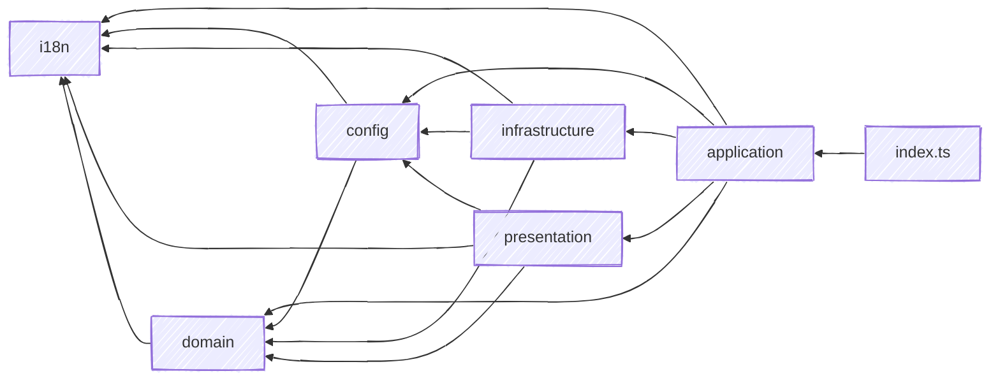

# Architecture

The action follows a **Domain-Driven Design(ish)** layering with a **Functional Core, Imperative Shell** pattern: the domain is pure, one ubiquitous language spans the whole tree, and each layer documents its own rules in a colocated `CLAUDE.md`. The dependency direction is strict and enumerated rather than conventional: the core knows nothing about GitHub, git, the filesystem or SMTP, and everything points inward toward it.

Every arrow above is an import some layer really makes; anything not drawn is forbidden.

Each layer documents its own rules in a colocated `CLAUDE.md`.

---

## Layers

| Layer | Role | Side effect |
|---|---|---|
| **`index.ts`** | Calls `trackStars()` at module load | Starts the run |
| **domain** | Pure business core: comparison, snapshots, the Tracked Set, forecast, velocity, stargazer diffing, star-history reconstruction, formatting | None |
| **presentation** | Pure rendering: data in, markdown / HTML / SVG / CSV / badge string out | None |
| **i18n** | Locale bundles and interpolation. A true leaf: it imports no other layer, only its own JSON | None |
| **config** | Action inputs plus `star-tracker.yml` resolved into one typed `Config` | Reads the inputs and one YAML file |
| **infrastructure** | Everything outbound: the GitHub REST API, the `git` CLI, the Data Branch worktree, SMTP | Network, `child_process`, filesystem |
| **application** | Sequences the single use case, `trackStars()` | Writes the Action log and the action outputs |
| **shared** | Cross-cutting test fixtures, used from `*.test.ts` only | None |

`assets/` sits beside them and is not a layer: it holds the brand files the README embeds, imports nothing and is imported by nothing.

---

## What the `(ish)` means

DDD applied where it pays, not by the book. The method splits in two, and only one half is negotiable.

The **strategic** half is load-bearing and is taken whole. The **tactical** half, the catalogue of value objects, aggregates, repositories and events, asks for an abstraction before the code has earned it; taken on faith it adds boilerplate that ends up hiding the very rules it was meant to protect. It is adopted here only where a concrete force calls for it.

The two strategic ideas the design leans on:

**One ubiquitous language.** [`CONTEXT.md`](https://github.com/fbuireu/github-star-tracker/blob/main/CONTEXT.md) defines every domain word (Snapshot, Baseline Snapshot, Delta, Tracked Set, Covered Stars, Delivery) and, for each, lists the synonyms it displaces, so a near-miss word cannot drift in. A term means the same thing in the star mathematics, in a chart title, in an email and on this page.

**A domain that performs no I/O.** `domain`, `presentation` and `i18n` reach no network, no filesystem and no clock beyond an injectable `now`, which is what lets the arithmetic and every rendered artefact be exercised on plain values with no GitHub API, git or SMTP anywhere near the test.

The rest of the tactical catalogue is taken only where it fits. There are no bounded contexts, because there is one language and one use case. There are no aggregates, because no value here has a lifecycle to guard: each is built once per run and never updated in place. The Repository pattern is present in shape, as the single data-branch facade, without the vocabulary or the interface-with-one-implementer that usually travels with it. Value objects are decided per concept rather than by default.

Neither half of that is a matter of taste. The boundaries are asserted by a test that reads the layer table as data, and the vocabulary is what the glossary and the per-layer guides are for. [ADR 0004](https://github.com/fbuireu/github-star-tracker/blob/main/docs/adr/0004-layered-source-structure.md) records the reasoning pattern by pattern, and [ADR 0022](https://github.com/fbuireu/github-star-tracker/blob/main/docs/adr/0022-a-concept-earns-a-type-when-it-crosses-a-boundary.md) the one question it cannot answer once for the whole tree, when a bare `string` or `number` earns a type of its own.

---

## Where the detail lives

This page is the shape, not the rules. The normative statement of which layer may import which is the layer table in [`ARCHITECTURE.md`](https://github.com/fbuireu/github-star-tracker/blob/main/ARCHITECTURE.md), and a test reads that table as data and asserts it against every import in `src`, so the arrows above cannot quietly stop being true. Restating the import rules here would be a second copy that nothing checks.

| Question | Where |
|---|---|
| What does this domain word mean, and what does it displace? | [`CONTEXT.md`](https://github.com/fbuireu/github-star-tracker/blob/main/CONTEXT.md) |
| Which layer may import which, and what runs in what order? | [`ARCHITECTURE.md`](https://github.com/fbuireu/github-star-tracker/blob/main/ARCHITECTURE.md) |
| Why is the tree layered at all, and what did the `(ish)` drop? | [ADR 0004](https://github.com/fbuireu/github-star-tracker/blob/main/docs/adr/0004-layered-source-structure.md) |
| When does a bare `string` or `number` earn a type of its own? | [ADR 0022](https://github.com/fbuireu/github-star-tracker/blob/main/docs/adr/0022-a-concept-earns-a-type-when-it-crosses-a-boundary.md) |
| What does one layer actually guarantee? | The `CLAUDE.md` inside that layer's folder |
| What happens, step by step, on a run? | **[How It Works](How-It-Works)** |
| Why these tools and these five dependencies? | **[Technical Stack](Technical-Stack)** |
