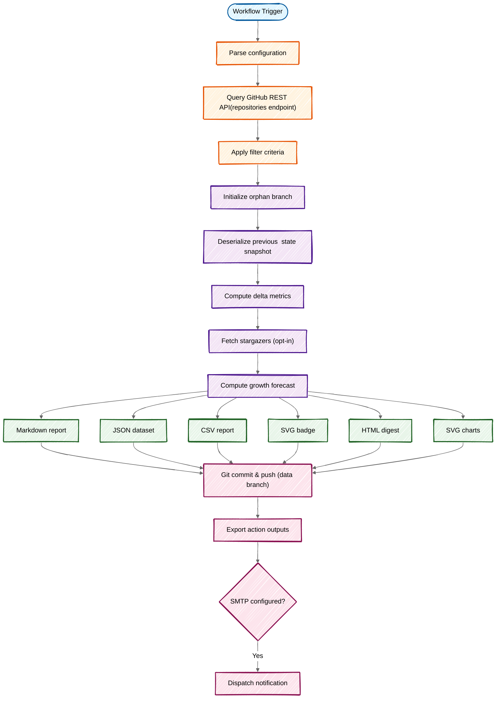

A deep dive into the execution pipeline, architecture, and data flow of GitHub Star Tracker.

---

## Execution Flow



---

## Phase 1: Bootstrap & Configuration

### Entry Point

**File:** `src/index.ts`

A two-line bootstrap delegating to the application orchestrator:

```typescript
import { trackStars } from '@application/tracker';
trackStars();
```

### Orchestrator

**File:** `src/application/tracker.ts` > `trackStars()`

Coordinates all bounded contexts in a single `try`/`finally` flow: PAT extraction, Octokit instantiation, configuration loading, i18n bootstrap, and the full data pipeline.

### Configuration Resolution

**File:** `src/config/loader.ts` > `loadConfig()`

Configuration follows a **layered precedence model**:

```
Action Inputs > Config File (YAML) > Built-in Defaults
```

**Steps:**

1. File discovery: reads YAML from `config-path` input (default: `star-tracker.yml`)
2. YAML parsing via `js-yaml`
3. Action input extraction via `@actions/core`
4. Type-safe conversion using parsers (`parseBool`, `parseNumber`, `parseList`, `parseNotificationThreshold`)
5. Merge: inputs override file values; missing values fall through to defaults
6. Validation of `visibility` enum and `locale`

**Config file keys use `snake_case`:**

```yaml
# star-tracker.yml
visibility: public
include_archived: false
include_forks: false
exclude_repos: [test-repo, /^demo-.*/]
min_stars: 5
data_branch: star-tracker-data
max_history: 52
include_charts: true
locale: en
notification_threshold: auto
track_stargazers: false
top_repos: 10
```

---

## Phase 2: Data Fetching

### Repository Enumeration

**File:** `src/infrastructure/github/client.ts` > `fetchRepos()`

Queries `GET /user/repos` with pagination (`100` per page). The `visibility` config maps to API params:

| Config Value | API Params |
|---|---|
| `public` | `visibility=public` |
| `private` | `visibility=private` |
| `all` | `visibility=all` |
| `owned` | `visibility=all, affiliation=owner` |

### Repository Filtering

**File:** `src/infrastructure/github/filters.ts` > `filterRepos()`

Client-side filtering pipeline:

1. **Whitelist** (`onlyRepos`) — short-circuits all other filters
2. **Archived** — removes archived repos unless `includeArchived` is `true`
3. **Forks** — removes forks unless `includeForks` is `true`
4. **Blacklist** (`excludeRepos`) — removes by exact name or regex (e.g. `/^test-.*/`)
5. **Star threshold** (`minStars`) — removes repos below minimum

### Data Transformation

**File:** `src/infrastructure/github/filters.ts` > `mapRepos()`

Transforms GitHub API objects into the domain `RepoInfo` schema, flattening `owner.login`, normalizing `stargazers_count` to `stars`, etc.

---

## Phase 3: Git Worktree Management

### Data Branch Initialization

**File:** `src/infrastructure/git/worktree.ts` > `initializeDataBranch()`

Creates or accesses a Git worktree for the data branch, isolating persistence from the source code checkout.

**Directory derivation:** `.${dataBranch}` — e.g. `data-branch: my-stars` produces `.my-stars/`.

**Workflow:**

1. Configure Git identity (`github-actions[bot]`)
2. Check if data branch exists on remote (`git ls-remote`)
3. Remove stale worktree if present
4. If branch exists: `git fetch` + `git worktree add`
5. If new: create orphan branch with `git checkout --orphan` + empty initial commit

### Cleanup

**File:** `src/infrastructure/git/worktree.ts` > `cleanup()`

Runs in a `finally` block, removing the worktree with `--force` regardless of success or failure.

---

## Phase 4: State Comparison

### Delta Computation

**File:** `src/domain/comparison.ts` > `compareStars()`

Pure function computing the diff between current repos and the previous snapshot:

1. Index previous state into a hash map
2. Compute per-repo deltas (current - previous)
3. Detect new repos (`isNew`) and removed repos (`isRemoved`)
4. Aggregate summary: `totalStars`, `totalDelta`, `newStars`, `lostStars`, `changed`

**Edge cases:**

- First run: all repos get `delta: 0`, `isNew: false`
- Repo renamed: appears as removed + new
- Repo deleted: marked `isRemoved: true`, `current: 0`

### Snapshot Management

**File:** `src/domain/snapshot.ts`

- `getLastSnapshot(history)` — retrieves the most recent snapshot
- `addSnapshot({ history, snapshot, maxHistory })` — returns a new `History` with the snapshot appended and old entries pruned beyond `maxHistory`

Both are pure functions returning new objects (no mutation).

---

## Phase 5: Stargazer Tracking (Opt-in)

**Files:** `src/infrastructure/github/stargazers.ts`, `src/domain/stargazers.ts`

When `track-stargazers: true`:

1. **Fetch:** queries `GET /repos/{owner}/{repo}/stargazers` with the `star+json` media type to get `starred_at` timestamps. Paginated at 100 per page, sequential per repo.
2. **Diff:** compares current stargazer logins against the previously stored `stargazers.json` map to identify new stargazers.
3. **Persist:** writes updated `stargazers.json` (repo > login array) to the data branch.

New stargazers appear in reports with avatar, profile link, and starred date.

---

## Phase 6: Growth Forecast

**File:** `src/domain/forecast.ts` > `computeForecast()`

Requires at least **3 snapshots** (`MIN_SNAPSHOTS`). Projects **4 weeks ahead** (`FORECAST_WEEKS`).

Two methods are computed in parallel:

| Method | Description | Strength |
|---|---|---|
| **Linear Regression** | Least-squares fit through all data points | Resilient to noise, captures long-term trends |
| **Weighted Moving Average** | Recent deltas weighted higher | Responsive to acceleration/deceleration |

Both methods clamp predictions to `Math.max(0, Math.round(value))`.

Forecasts are computed for:

- **Aggregate** (total stars across all repos)
- **Per top repo** (top N by star count, configurable via `top-repos`)

---

## Phase 7: Report Generation

### Shared Data Preparation

**File:** `src/presentation/shared.ts` > `prepareReportData()`

Pre-processes data for both Markdown and HTML reports: filters active/new/removed repos, sorts by stars, formats dates.

### Markdown Report

**File:** `src/presentation/markdown.ts` > `generateMarkdownReport()`

Produces GitHub Flavored Markdown with:

1. Header (total stars, delta, date)
2. Comparison note to previous snapshot
3. Chart sections (SVG references: `./charts/star-history.svg`, etc.)
4. Repository table (sorted, linked, with `NEW` badges)
5. New / removed repository sections
6. Summary metrics
7. Stargazer section (collapsible `<details>` per repo)
8. Forecast tables (collapsible per repo)
9. Footer

**Output:** committed as `README.md` on the data branch.

### HTML Report

**File:** `src/presentation/html.ts` > `generateHtmlReport()`

Self-contained HTML with inline CSS for email compatibility. Uses QuickChart.io URLs for chart images (since SVGs with CSS animations aren't supported in email clients). No `<details>` elements (not supported in email).

### CSV Report

**File:** `src/presentation/csv.ts` > `generateCsvReport()`

Machine-readable CSV with one row per tracked repository. Columns: `repository`, `owner`, `name`, `stars`, `previous`, `delta`, `status`. Fields containing commas or double quotes are escaped per RFC 4180.

- `status` is `active`, `new` (first time seen), or `removed` (no longer matched by filters)
- `previous` is empty for new repos

Available as both a file on the data branch (`stars-data.csv`) and an action output (`report-csv`).

### SVG Charts

**File:** `src/presentation/svg-chart.ts`

Generates self-contained animated SVG charts committed to `charts/` on the data branch:

| Chart | File | Description |
|---|---|---|
| Star History | `charts/star-history.svg` | Total stars over time with milestone markers |
| Per-Repo | `charts/{owner}-{repo}.svg` | Individual repo history |
| Comparison | `charts/comparison.svg` | Top N repos overlaid |
| Forecast | `charts/forecast.svg` | Historical + projected trends (dashed lines) |

Features: smooth Catmull-Rom curves, CSS draw-line animation, fade-in data points, nice Y-axis steps, locale-aware date labels, legend (for multi-series).

Requires at least **2 snapshots** (`MIN_SNAPSHOTS_FOR_CHART`).

### QuickChart URLs (HTML reports)

**File:** `src/presentation/chart.ts`

Generates Chart.js configuration encoded as QuickChart.io URLs for embedding in HTML emails. Same chart types but rendered as static PNG images.

### SVG Badge

**File:** `src/presentation/badge.ts` > `generateBadge()`

Creates a Shields.io-style SVG badge with the localized "Total Stars" label and a compact-formatted count (e.g. `1.5K`). Committed as `stars-badge.svg`.

---

## Phase 8: Persistence & Commit

**File:** `src/infrastructure/persistence/storage.ts`

| Function | File Written |
|---|---|
| `writeHistory()` | `stars-data.json` |
| `writeReport()` | `README.md` |
| `writeBadge()` | `stars-badge.svg` |
| `writeCsv()` | `stars-data.csv` |
| `writeChart()` | `charts/{filename}` |
| `writeStargazers()` | `stargazers.json` |

### Git Commit

**File:** `src/infrastructure/persistence/storage.ts` > `commitAndPush()`

1. `git add -A`
2. `git diff --cached --quiet` (skip if no changes)
3. `git commit -m "Update star data — 1,523 total (+15)"`
4. `git push origin HEAD:{dataBranch}`

Idempotent: no empty commits if data hasn't changed.

---

## Phase 9: Outputs & Notifications

### Action Outputs

**File:** `src/application/tracker.ts` > `setOutputs()`

| Output | Description |
|---|---|
| `report` | Full Markdown report |
| `report-html` | HTML report (for email) |
| `report-csv` | CSV report (for data pipelines) |
| `total-stars` | Total star count |
| `stars-changed` | Whether any counts changed (`true`/`false`) |
| `new-stars` | Stars gained since last run |
| `lost-stars` | Stars lost since last run |
| `should-notify` | Whether the notification threshold was reached |
| `new-stargazers` | New stargazers detected (0 if tracking disabled) |

### Notification Threshold

**File:** `src/domain/notification.ts` > `shouldNotify()`

Controls when notifications fire:

| Threshold Value | Behavior |
|---|---|
| `0` | Notify on every run with changes |
| `N` (number) | Notify when accumulated delta since last notification >= N |
| `auto` | Adaptive: 1 (< 50 stars), 5 (< 200), 10 (< 500), 20 (500+) |

The `starsAtLastNotification` is persisted in `stars-data.json` and updated only when a notification is sent.

### Email

**File:** `src/infrastructure/notification/email.ts`

- `getEmailConfig()` reads SMTP inputs; returns `null` if `smtp-host` is not set
- `sendEmail()` uses `nodemailer` with auto-detected `secure` mode (port 465 = SSL, else STARTTLS)
- Email failures are non-fatal (logged as warning, action continues)

---

## Module Dependency Map

```
src/
├── index.ts                          # Entry point
├── application/
│   └── tracker.ts                    # Orchestrator
├── config/
│   ├── types.ts                      # Config, Visibility types
│   ├── defaults.ts                   # DEFAULTS, LOCALES, VISIBILITY_CONFIG
│   ├── parsers.ts                    # parseBool, parseNumber, parseList, parseNotificationThreshold
│   └── loader.ts                     # loadConfig(), loadConfigFile()
├── domain/
│   ├── types.ts                      # RepoInfo, Snapshot, History, Summary, ComparisonResults
│   ├── comparison.ts                 # compareStars(), createSnapshot()
│   ├── snapshot.ts                   # getLastSnapshot(), addSnapshot()
│   ├── formatting.ts                 # formatCount(), deltaIndicator(), trendIcon(), formatDate()
│   ├── notification.ts               # shouldNotify(), getAdaptiveThreshold()
│   ├── forecast.ts                   # computeForecast(), linearRegression(), weightedMovingAverage()
│   └── stargazers.ts                 # diffStargazers(), buildStargazerMap()
├── i18n/
│   ├── index.ts                      # getTranslations(), interpolate(), isValidLocale()
│   ├── types.ts                      # Translations interface
│   └── {en,es,ca,it}.json            # Translation files
├── infrastructure/
│   ├── git/
│   │   ├── commands.ts               # execute() — execSync wrapper
│   │   └── worktree.ts               # initializeDataBranch(), cleanup()
│   ├── github/
│   │   ├── types.ts                  # Octokit, GitHubRepo types
│   │   ├── client.ts                 # fetchRepos()
│   │   ├── filters.ts                # filterRepos(), mapRepos(), getRepos()
│   │   └── stargazers.ts             # fetchAllStargazers()
│   ├── notification/
│   │   └── email.ts                  # getEmailConfig(), sendEmail()
│   └── persistence/
│       └── storage.ts                # read/write History, Report, Badge, CSV, Chart, Stargazers; commitAndPush()
└── presentation/
    ├── constants.ts                  # COLORS, CHART, BADGE, SVG_CHART, THRESHOLDS
    ├── shared.ts                     # prepareReportData()
    ├── markdown.ts                   # generateMarkdownReport()
    ├── html.ts                       # generateHtmlReport()
    ├── csv.ts                        # generateCsvReport()
    ├── chart.ts                      # generateChartUrl() (QuickChart for HTML emails)
    ├── svg-chart.ts                  # generateSvgChart() (animated SVGs for data branch)
    ├── badge.ts                      # generateBadge()
    └── index.ts                      # Re-exports
```

---

## Error Handling

- **Top-level `try`/`catch`:** all errors caught and reported via `core.setFailed()`
- **Non-fatal email errors:** logged as warnings, action completes successfully
- **Per-repo stargazer errors:** logged as warnings, continue with remaining repos
- **Worktree cleanup:** runs in `finally`, non-fatal if removal fails
