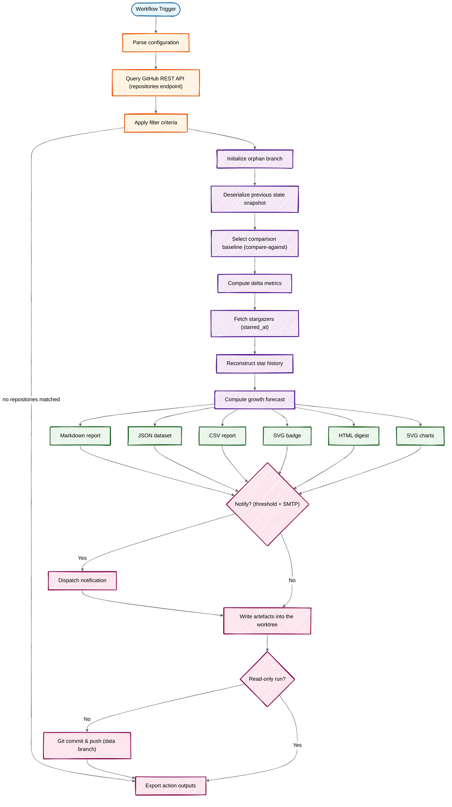

A deep dive into the execution pipeline and data flow of GitHub Star Tracker, phase by phase. For the layering the phases run inside, and what the DDD<sub>(ish)</sub> in it does and does not mean, read **[Architecture](Architecture)**.

---

## Execution Flow


```mermaid
---
config:
  look: handDrawn
  theme: neutral
---
flowchart TD
    trigger(["Workflow Trigger"])
    config["Parse configuration"]
    fetch["Query GitHub REST API (repositories endpoint)"]
    filter["Apply filter criteria"]
    init["Initialize orphan branch"]
    read["Deserialize previous state snapshot"]
    baseline["Select comparison baseline (compare-against)"]
    compare["Compute delta metrics"]
    stargazers["Fetch stargazers (starred_at)"]
    history["Reconstruct star history"]
    forecast["Compute growth forecast"]
    md["Markdown report"]
    json["JSON dataset"]
    csv["CSV report"]
    svg["SVG badge"]
    html["HTML digest"]
    charts["SVG charts"]
    write["Write artefacts into the worktree"]
    readonly{"Read-only run?"}
    commit["Git commit & push (data branch)"]
    setout["Export action outputs"]
    email{"Notify? (threshold + SMTP)"}
    send["Dispatch notification"]

    trigger --> config --> fetch --> filter
    filter -->|no repositories matched| setout
    filter --> init --> read --> baseline --> compare
    compare --> stargazers --> history --> forecast
    forecast --> md & json & csv & svg & html & charts
    md & json & csv & svg & html & charts --> email
    email -->|Yes| send --> write
    email -->|No| write
    write --> readonly
    readonly -->|No| commit --> setout
    readonly -->|Yes| setout

    style trigger fill:#e1f5ff,stroke:#01579b,stroke-width:2px
    style config fill:#fff3e0,stroke:#e65100,stroke-width:2px
    style fetch fill:#fff3e0,stroke:#e65100,stroke-width:2px
    style filter fill:#fff3e0,stroke:#e65100,stroke-width:2px
    style init fill:#f3e5f5,stroke:#4a148c,stroke-width:2px
    style read fill:#f3e5f5,stroke:#4a148c,stroke-width:2px
    style baseline fill:#f3e5f5,stroke:#4a148c,stroke-width:2px
    style compare fill:#f3e5f5,stroke:#4a148c,stroke-width:2px
    style stargazers fill:#f3e5f5,stroke:#4a148c,stroke-width:2px
    style history fill:#f3e5f5,stroke:#4a148c,stroke-width:2px
    style forecast fill:#f3e5f5,stroke:#4a148c,stroke-width:2px
    style md fill:#e8f5e9,stroke:#1b5e20,stroke-width:2px
    style json fill:#e8f5e9,stroke:#1b5e20,stroke-width:2px
    style csv fill:#e8f5e9,stroke:#1b5e20,stroke-width:2px
    style svg fill:#e8f5e9,stroke:#1b5e20,stroke-width:2px
    style html fill:#e8f5e9,stroke:#1b5e20,stroke-width:2px
    style charts fill:#e8f5e9,stroke:#1b5e20,stroke-width:2px
    style write fill:#fce4ec,stroke:#880e4f,stroke-width:2px
    style readonly fill:#fce4ec,stroke:#880e4f,stroke-width:2px
    style commit fill:#fce4ec,stroke:#880e4f,stroke-width:2px
    style setout fill:#fce4ec,stroke:#880e4f,stroke-width:2px
    style email fill:#fce4ec,stroke:#880e4f,stroke-width:2px
    style send fill:#fce4ec,stroke:#880e4f,stroke-width:2px
```

Two edges in that diagram are easy to miss, and both matter:

- **No repositories matched.** When every filter combined leaves nothing, the run warns
  `No repositories matched the configured filters`, renders an empty report, writes the HTML report, sets all
  eleven outputs to their zeroed values and returns. It never opens the data branch, so nothing is committed
  and no email is attempted. The run still succeeds.
- **Read-only run.** With `read-only: true` everything happens except the push: the run reads the branch,
  computes, renders, writes every artefact into the worktree, sends the email and sets every output, then
  logs `Read-only run: leaving <branch> untouched` and discards the worktree unpushed. See
  [Read-only runs](#read-only-runs) below.

---

## Phase 1: Bootstrap & Configuration

### Entry Point

**File:** [`src/index.ts`](https://github.com/fbuireu/github-star-tracker/blob/main/src/index.ts)

A two-line bootstrap delegating to the application orchestrator:

```typescript
import { trackStars } from '@application/tracker';
trackStars();
```

### Orchestrator

**File:** [`src/application/tracker.ts`](https://github.com/fbuireu/github-star-tracker/blob/main/src/application/tracker.ts) > `trackStars()`

Coordinates all layers inside one `try`/`catch` that ends in `core.setFailed`: PAT extraction, Octokit instantiation, configuration loading, i18n bootstrap, and the full data pipeline.

### Configuration Resolution

**File:** [`src/config/loader.ts`](https://github.com/fbuireu/github-star-tracker/blob/main/src/config/loader.ts) > `loadConfig()`

Configuration follows a **layered precedence model**:

```
Action Inputs > Config File (YAML) > Built-in Defaults
```

**Steps:**

1. File discovery: reads YAML from `config-path` input (default: `star-tracker.yml`)
2. YAML parsing via `js-yaml`. An empty or whitespace-only file yields the defaults; a malformed one is
   logged as a warning and also falls back to the defaults, so neither fails the run
3. Action input extraction via `@actions/core`
4. Type-safe conversion using parsers (`parseBool`, `parseList`, `parseHexColor`,
   `parseNotificationThreshold`, and the three number parsers `parsePositiveNumber`,
   `parseNonNegativeNumber` and `parsePositiveDecimal`). Which number parser a key uses is deliberate,
   not interchangeable
5. Merge: inputs override file values; missing values fall through to defaults
6. Validation of `visibility` enum and `locale`

**Config file keys may be written with either underscores or dashes (`include_charts` and `include-charts` both work):**

```yaml
# star-tracker.yml
visibility: public
include_archived: false
include_forks: false
exclude_repos: [test-repo, /^demo-.*/]
only_repos: []
only_orgs: []
exclude_orgs: []
min_stars: 5
data_branch: star-tracker-data
read_only: false
max_history: 52
include_charts: true
locale: en
notification_threshold: 0
notification_mode: net
compare_against: last-run
track_stargazers: false
top_repos: 10
smart_sampling: false
smart_sampling_threshold: 1500
smart_sampling_pages: 30
chart_line_color: "#dfb317"
chart_line_width: 2.5
chart_max_points: 30
chart_y_axis_side: left
chart_smoothing: true
chart_curve: monotone
chart_show_points: true
chart_animation: true
chart_milestones: true
chart_begin_at_zero: false
chart_theme: auto
email_theme: auto # 'auto' inherits chart_theme
chart_custom_milestones: [] # e.g. [250, 750, 2500] to override the default milestones
chart_range: all
chart_trend_line: false
velocity_metrics: false
```

---

## Phase 2: Data Fetching

### Repository Enumeration

**File:** [`src/infrastructure/github/client.ts`](https://github.com/fbuireu/github-star-tracker/blob/main/src/infrastructure/github/client.ts) > `fetchRepos()`

Queries `GET /user/repos` with pagination (`100` per page). The `visibility` config maps to API params:

| Config Value | API Params |
|---|---|
| `public` | `visibility=public` |
| `private` | `visibility=private` |
| `all` | `visibility=all` |
| `owned` | `visibility=all, affiliation=owner` |

### Data Transformation

**File:** [`src/infrastructure/github/filters.ts`](https://github.com/fbuireu/github-star-tracker/blob/main/src/infrastructure/github/filters.ts) > `mapRepos()`

Transforms GitHub API objects into the domain `RepoInfo` schema, flattening `owner.login`, normalizing `stargazers_count` to `stars`, etc. This happens **before** filtering, so every filter below is expressed over the domain shape rather than GitHub's.

### Repository Filtering

**File:** [`src/domain/tracked-set.ts`](https://github.com/fbuireu/github-star-tracker/blob/main/src/domain/tracked-set.ts) > `resolveTrackedSet()`

Client-side filtering pipeline, in this order:

1. **Org whitelist** (`onlyOrgs`) - restricts to owners whose name matches a listed name or `/regex/`
2. **Whitelist** (`onlyRepos`) - short-circuits everything below it, on the set step 1 already narrowed
3. **Archived** - removes archived repos unless `includeArchived` is `true`
4. **Forks** - removes forks unless `includeForks` is `true`
5. **Blacklist** (`excludeRepos`) - removes by exact name or regex (e.g. `/^test-.*/`)
6. **Org blacklist** (`excludeOrgs`) - removes repos whose owner matches a listed name or `/regex/`
7. **Star threshold** (`minStars`) - removes repos below minimum

The order matters in one direction: `only-repos` can never bring back a repository `only-orgs` excluded, because it runs on the already-narrowed set. Separately, `smart-sampling` (with `smart-sampling-threshold`/`smart-sampling-pages`) and the `chart-*` options also exist as inputs.

What survives is the **Tracked Set**. The rules are pure and return counts rather than logging them; `getRepos` writes those counts to the Action log.

---

## Phase 3: Git Worktree Management

### Data Branch Initialization

**File:** [`src/infrastructure/git/worktree.ts`](https://github.com/fbuireu/github-star-tracker/blob/main/src/infrastructure/git/worktree.ts) > `initializeDataBranch()`

Creates or accesses a Git worktree for the data branch, isolating persistence from the source code checkout.

**Directory derivation:** a dot followed by the branch name - e.g. `data-branch: my-stars` produces `.my-stars/`.

**Workflow:**

1. Confirm the process is inside a checked-out repository (`git rev-parse --is-inside-work-tree`)
2. Configure Git identity (`github-actions[bot]`)
3. Check if the data branch exists on the remote (`git ls-remote`)
4. Remove a stale worktree if one is present
5. Refuse a read-only run when the branch does not exist
6. If the branch exists: `git fetch` + `git worktree add`
7. If it is new: create an orphan branch with `git checkout --orphan` + an empty initial commit

**Two failures start here**, and both fail the run:

- No repository is checked out. The action needs the worktree machinery, so it converts git's own message
  into `This action must run inside a checked-out repository. Add an "actions/checkout" step before this
  action in your workflow.`
- The branch does not exist **and** the run is read-only. A read-only run may never bring the data branch
  into existence, so it stops rather than creating one and leaving it unpushed. Point `data-branch` at the
  branch your tracking workflow maintains, or drop `read-only` for one run so it can be created.

### Cleanup

**File:** `src/infrastructure/git/worktree.ts` > `cleanup()`

Runs in a `finally` block, removing the worktree with `--force` regardless of success or failure.

---

## Phase 4: State Comparison

The run does not call the steps below one by one. `measureRun()`
([`src/domain/measurement.ts`](https://github.com/fbuireu/github-star-tracker/blob/main/src/domain/measurement.ts)) composes baseline selection, diffing, snapshotting and the threshold check in
the one order that is correct, and returns the whole measurement in a single value. The reasoning is
[ADR 0013](https://github.com/fbuireu/github-star-tracker/blob/main/docs/adr/0013-a-run-is-measured-in-one-place.md).
The sections that follow describe what it does inside.

### Baseline Selection

**File:** [`src/domain/snapshot.ts`](https://github.com/fbuireu/github-star-tracker/blob/main/src/domain/snapshot.ts) > `getBaselineSnapshot()`

Before any diffing happens, the Stored History is deserialized from `stars-data.json` and one snapshot is picked as the **baseline snapshot**. The `compare-against` input (config key `compare_against`) decides which one:

| Value | Baseline Snapshot |
|---|---|
| `last-run` (default) | The most recent stored snapshot |
| `24h` | The most recent snapshot that is at least 24 hours old |
| `7d` | The most recent snapshot that is at least 7 days old |
| `30d` | The most recent snapshot that is at least 30 days old |

The current star counts are then diffed against that snapshot, so the baseline defines the `new-stars`, `lost-stars` and `stars-changed` outputs, the total delta, and the "Compared to snapshot from ..." line in the report.

**Edge cases:**

- **History shorter than the window:** falls back to the oldest snapshot available. The reported period is then *shorter* than the one requested, and the report's "Compared to" date shows exactly how far back it really goes
- **First run:** there is no history, therefore no baseline (see the `compareStars()` edge cases below)

The time windows make a genuine daily, weekly or monthly digest possible even when the tracker runs more frequently than that.

**The baseline choice only changes what the current run is compared against; it never changes what gets stored.** Every run still appends its own snapshot to the Stored History, and neither the charts, the forecast nor the velocity section is windowed by `compare-against`.

Those three do not share one series, though, and the difference is worth knowing:

| Section | Series it reads |
|---|---|
| Charts | the Reconstructed History, falling back to the Stored History when the reconstruction has fewer than 2 points |
| Forecast | the same aggregate Reconstructed History the charts use |
| Velocity | the **Stored History**, always |

`renderRun` passes the two under separate names for that reason. Velocity is a rate over real elapsed time
between two runs, so it needs snapshots the tracker actually took; feeding it the reconstruction would make
it an average over a chart bucket whose width follows `chart-max-points`.

### Delta Computation

**File:** [`src/domain/comparison.ts`](https://github.com/fbuireu/github-star-tracker/blob/main/src/domain/comparison.ts) > `compareStars()`

Pure function computing the diff between current repos and the selected baseline snapshot:

1. Index the baseline state into a hash map
2. Compute per-repo deltas (current - baseline)
3. Detect new repos (`isNew`) and removed repos (`isRemoved`)
4. Aggregate summary: `totalStars`, `totalDelta`, `newStars`, `lostStars`, `changed`

**Edge cases:**

- First run: there is no baseline, so every repo is `isNew: true` with `previous: null` and `delta: 0`. New
  repos never inflate `newStars`, but they do make `summary.changed` true
- Repo renamed: appears as removed + new
- Repo deleted: marked `isRemoved: true`, `current: 0`

### Snapshot Management

**File:** `src/domain/snapshot.ts`

- The `compare-against: last-run` baseline is the most recent snapshot that parses, resolved inside
  `getBaselineSnapshot` (the walk-back is module-private)
- `addSnapshot({ history, snapshot, maxHistory })` returns a new `History` with the snapshot appended and old entries pruned beyond `maxHistory`

Both are pure functions returning new objects (no mutation). `addSnapshot()` runs on every execution regardless of `compare-against`, so the Stored History is always complete.

**Lowering `max-history` discards snapshots, and the run says so.** When the stored count exceeds the new
limit, the run logs a warning naming how many it is about to drop and inviting you to raise `max-history`
*before* this run if you want to keep them. Once the run pushes, they are gone.

---

## Phase 5: Stargazer Tracking

**Files:** [`src/infrastructure/github/stargazers.ts`](https://github.com/fbuireu/github-star-tracker/blob/main/src/infrastructure/github/stargazers.ts), [`src/domain/stargazers.ts`](https://github.com/fbuireu/github-star-tracker/blob/main/src/domain/stargazers.ts)

Stargazers are fetched whenever charts are enabled (`include-charts: true`, the default) **OR** `track-stargazers: true`, because the Reconstructed History behind the charts needs each star's `starred_at` date.

1. **Fetch:** queries `GET /repos/{owner}/{repo}/stargazers` with the `star+json` media type to get `starred_at` timestamps. Paginated at 100 per page, sequential per repo.
2. **Diff (only when `track-stargazers: true`):** compares current stargazer logins against the previously stored `stargazers.json` map to identify new stargazers.
3. **Persist (only when `track-stargazers: true`):** writes updated `stargazers.json` (repo > login array) to the data branch.

New stargazers appear in reports with avatar, profile link, and starred date.

Two kinds of repository are skipped by the diff, and only one of them says so. A **sampled** repository is
excluded deliberately (absence from a sample is not evidence) and is named in a note in the report. A
repository whose list came back `incomplete` is skipped **silently**. Either way its stars still count, so
`new-stargazers` can read `0` on a run where the totals clearly moved.

---

## Phase 5b: Reconstructed History

**File:** [`src/domain/star-history.ts`](https://github.com/fbuireu/github-star-tracker/blob/main/src/domain/star-history.ts) > `buildStarHistory()`

When charts are enabled, `buildStarHistory()` turns the fetched stargazers' `starred_at` dates into a **Reconstructed History**: a cumulative `History` over real time, used by the charts and by the forecast. Each star is placed on the date it was actually given and the cumulative total is rebuilt from the repo's first star up to now, so a multi-point curve is available on the **first run**. It is rebuilt from scratch every run and never stored.

GitHub caps stargazer listing at roughly **40,000 per repo**, oldest first. Above that cap it is therefore the **recent** stars that are unreachable, not the early ones.

`scaleCappedToTrueTotal()` draws the reachable stretch accurately and bridges the missing tail with a straight ramp up to the true current total, so the final point always equals the true count. The reasoning is [ADR 0007](https://github.com/fbuireu/github-star-tracker/blob/main/docs/adr/0007-bridge-unreachable-history-with-a-ramp.md); the user-facing consequences are in [Known Limitations](Known-Limitations#-stargazer-listing-cap-40000).

Pair high-star repos with `smart-sampling` to keep within rate limits.

---

## Phase 6: Growth Forecast

**File:** [`src/domain/forecast.ts`](https://github.com/fbuireu/github-star-tracker/blob/main/src/domain/forecast.ts) > `computeForecast()`

Requires at least **3 points** (`MIN_SNAPSHOTS_FOR_FORECAST`). Projects **4 calendar weeks ahead** (`FORECAST_WEEKS`): "Week 1" means 7 real days after the latest point, "Week 4" means 28 days after it. When charts are enabled, the History passed to forecast generation is the aggregate **Reconstructed History**, not the Stored History, so the 3-point minimum refers to points in that reconstruction.

Both methods are **time-aware**: they use each point's real timestamp to derive a stars-per-day rate, so predictions do not depend on how far apart the points happen to be. That matters because the two possible series are spaced very differently: a Reconstructed History spreads its points across the repository's entire lifetime, while a Stored History follows your workflow schedule.

Two methods are computed in parallel:

| Method | Description | Strength |
|---|---|---|
| **Linear Regression** | Least-squares fit of stars over elapsed days, across the whole series | Resilient to noise, captures long-term trends |
| **Weighted Moving Average** | Per-day growth rates between consecutive points, recent intervals weighted higher | Responsive to acceleration/deceleration |

Both methods anchor their projection on the latest observed total (they answer "starting from today's count, where does this trend land in N weeks?") and clamp predictions to `Math.max(0, Math.round(value))`.

Forecasts are computed for:

- **Aggregate** (total stars across all repos)
- **Per top repo** (top N by star count, configurable via `top-repos`)

---

## Phase 6b: Growth Velocity

**File:** [`src/domain/velocity.ts`](https://github.com/fbuireu/github-star-tracker/blob/main/src/domain/velocity.ts) > `computeVelocity()`

Opt-in via `velocity-metrics` (config key `velocity_metrics`), off by default. Where the forecast looks
forward, velocity describes how fast the tracked set is moving **right now**, and it is the one section
computed from the **Stored History** rather than the reconstruction.

It reads the newest snapshot and the newest earlier snapshot at least **0.25 days** back
(`MIN_RATE_INTERVAL_DAYS`), skipping anything closer so a manual re-run minutes after a scheduled one cannot
inflate the rate. It is a recent-period rate, never an all-time average.

| Figure | How it is derived |
|---|---|
| Stars per day | stars gained over that pair, divided by the elapsed days, rounded to 2 decimals |
| Growth percent | the same gain as a percentage of the earlier total, rounded to 1 decimal. `null` when that earlier total is `0`, since there is nothing to be a percentage of |
| Days to next milestone | `ceil((next milestone - current total) / stars per day)`, using the already-rounded rate. `null` when the rate is not positive, and `null` at or above the largest milestone |

The section returns nothing at all when there are fewer than two snapshots, when the newest timestamp does
not parse, or when no pair is far enough apart. **It is not windowed like the forecast:** velocity needs a
true duration between two real observations, which is why it never reads the Reconstructed History
([ADR 0017](https://github.com/fbuireu/github-star-tracker/blob/main/docs/adr/0017-velocity-and-forecast-read-unparseable-timestamps-differently.md)).

Where it appears in the report depends on the forecast: with a forecast it nests as a subsection under the
forecast heading, without one it is a top-level section of its own.

---

## Phase 7: Report Generation

**File:** [`src/presentation/run.ts`](https://github.com/fbuireu/github-star-tracker/blob/main/src/presentation/run.ts) > `renderRun()`

The presentation layer's single entry point. It builds one `ReportModel` and hands the same one to both report dialects, then returns the Markdown, HTML, CSV, badge and chart files together. One model means both reports carry the same date and the same Top Repositories.

### Shared Data Preparation

**File:** [`src/presentation/report-model.ts`](https://github.com/fbuireu/github-star-tracker/blob/main/src/presentation/report-model.ts) > `buildReportModel()`, over [`shared.ts`](https://github.com/fbuireu/github-star-tracker/blob/main/src/presentation/shared.ts) > `prepareReportData()`

Decides which sections a report has and what is in them: filters active/new/removed repos, sorts by stars, formats dates, and resolves the chart history, Velocity figures and Stargazer outcome once.

### Markdown Report

**File:** [`src/presentation/markdown.ts`](https://github.com/fbuireu/github-star-tracker/blob/main/src/presentation/markdown.ts) > `generateMarkdownReport()`

Produces GitHub Flavored Markdown with:

1. Header (total stars, delta, date)
2. Comparison note to the baseline snapshot ("Compared to snapshot from ...", dated per `compare-against`)
3. Chart sections (SVG references: `./charts/star-history.svg`, etc.)
4. Repository table (sorted, linked, with `NEW` badges)
5. New / removed repository sections
6. Summary metrics
7. Stargazer section (collapsible `<details>` per repo)
8. Forecast section (growth velocity first, then aggregate table and collapsible per-repo tables)
9. Footer

**Output:** committed as [`README.md`](https://github.com/fbuireu/github-star-tracker/blob/main/README.md) on the data branch.

### HTML Report

**File:** [`src/presentation/html.ts`](https://github.com/fbuireu/github-star-tracker/blob/main/src/presentation/html.ts) > `generateHtmlReport()`

Self-contained HTML with inline CSS for email compatibility. Uses QuickChart.io URLs for chart images (since SVGs with CSS animations aren't supported in email clients). No `<details>` elements (not supported in email).

### CSV Report

**File:** [`src/presentation/csv.ts`](https://github.com/fbuireu/github-star-tracker/blob/main/src/presentation/csv.ts) > `generateCsvReport()`

Machine-readable CSV with one row per tracked repository. Columns: `repository`, `owner`, `name`, `stars`, `previous`, `delta`, `status`. Fields containing commas or double quotes are escaped per RFC 4180.

- `status` is `active`, `new` (first time seen), or `removed` (no longer matched by filters)
- `previous` is empty for new repos

Available as both a file on the data branch (`stars-data.csv`) and an action output (`report-csv`).

### SVG Charts

**File:** [`src/presentation/svg-chart.ts`](https://github.com/fbuireu/github-star-tracker/blob/main/src/presentation/svg-chart.ts)

Generates self-contained animated SVG charts committed to `charts/` on the data branch:

| Chart | File | Description |
|---|---|---|
| Star History | `charts/star-history.svg` | Total stars over time with milestone markers |
| Per-Repo | `charts/{owner}-{repo}.svg` | Individual repo history |
| Comparison | `charts/comparison.svg` | Top N repos overlaid |
| Forecast | `charts/forecast.svg` | Historical + projected trends (dashed lines) |

Features: smooth curves (`monotone` by default, four shapes available), CSS draw-line animation, fade-in point markers, nice Y-axis steps, locale-aware date labels, legend (for multi-series).

When charts are enabled, the History passed to chart generation is the **Reconstructed History**, not the Stored History. At least **2 points** (`MIN_SNAPSHOTS_FOR_CHART`) are needed; below that the Stored History is used as the fallback, so a chart is still drawn, just over the tracker's own runs rather than the repository's life.

### QuickChart URLs (HTML reports)

**File:** [`src/presentation/chart.ts`](https://github.com/fbuireu/github-star-tracker/blob/main/src/presentation/chart.ts)

Generates Chart.js configuration encoded as QuickChart.io URLs for embedding in HTML emails. Same chart types but rendered as static PNG images.

### SVG Badge

**File:** [`src/presentation/badge.ts`](https://github.com/fbuireu/github-star-tracker/blob/main/src/presentation/badge.ts) > `generateBadge()`

Creates a Shields.io-style SVG badge with the localized "Total Stars" label and a compact-formatted count (e.g. `1.5K`). Committed as [`stars-badge.svg`](https://github.com/fbuireu/github-star-tracker/blob/main/examples/stars-badge.svg).

---

## Phase 8: Persistence & Commit

**File:** [`src/infrastructure/persistence/storage.ts`](https://github.com/fbuireu/github-star-tracker/blob/main/src/infrastructure/persistence/storage.ts)

| Function | File Written |
|---|---|
| `writeHistory()` | `stars-data.json` |
| `writeArtefact()` (`REPORT`) | `README.md` |
| `writeArtefact()` (`BADGE`) | `stars-badge.svg` |
| `writeArtefact()` (`CSV`) | `stars-data.csv` |
| `writeChart()` | `charts/{filename}` |
| `writeStargazers()` | `stargazers.json` |

All of those writes happen in one `publish()` call, in that order, followed by chart pruning and then the
commit. Anything written after the commit would not be staged.

### Reading `stars-data.json`

Three guards run before the stored file is trusted, and each of them **fails the run** rather than
continuing on a guess, because silently reading a populated data branch as empty would append a snapshot
over the top of a discarded record:

| Situation | What happens |
|---|---|
| The file is not valid JSON | The run stops and names the parse error, asking you to fix or delete the file on the data branch |
| The file is valid JSON but not an object (`null`, an array, a number, a string) | The run stops rather than reading it as an empty history |
| The file declares a `version` higher than this action writes | The run stops and asks you to upgrade the action, or to point `data-branch` at a branch this version wrote |

`version` is stamped as the first key of the file by the writer and stripped again on read, so it never
reaches the report. An **absent** `version` means version 1 and is accepted, because every data branch that
predates the field has none. A `snapshots` key that is not an array is the one tolerated case: it normalizes
to an empty list while `starsAtLastNotification` survives.

### Chart Pruning

**File:** `src/infrastructure/persistence/storage.ts` > `pruneCharts()`

After the charts are written, every `charts/*.svg` this run did **not** produce is deleted and the count is
logged. That is what stops a repository dropping out of `top-repos` from stranding its chart on the branch
forever. Only `.svg` files inside `charts/` are considered; nothing outside that directory is ever removed.

### Git Commit

**File:** `src/infrastructure/persistence/storage.ts` > `commitAndPush()`

On a read-only run this step is skipped entirely: everything above has already been written into the
worktree, the run logs `Read-only run: leaving <branch> untouched`, and the worktree is discarded unpushed.

Otherwise:

1. `git add -A`
2. `git diff --cached --quiet` (skip if no changes)
3. `git commit -m "Update star data: 1523 total (+15)"`
4. `git push origin HEAD:{dataBranch}`

Idempotent: no empty commits if data hasn't changed.

**A rejected push is the one git failure that gets its own message.** The worktree is pinned to
`origin/<data-branch>` when the run starts and never re-fetched, so two overlapping *writing* runs branch
from the same commit and the second push is refused as non-fast-forward. The run then fails with an
explanation naming `concurrency` and `read-only` as the two fixes. Its report and any email have already
gone out at that point, which is why a run can email you and still end red; re-running records the snapshot.
Every other push failure keeps git's own wording, because that detail is the useful part.

### Read-only runs

`read-only: true` makes a run a pure reader of the data branch. It still fetches, compares, renders every
artefact into the worktree, sets all eleven outputs and sends the email; it just never commits or pushes,
and the worktree is thrown away at the end. That is what lets a second workflow (a weekly digest, say) share
a data branch with the workflow that maintains it without the two racing to write.

Two consequences follow from nothing being written:

- The branch must already exist. A read-only run refuses to create it (see Phase 3).
- `starsAtLastNotification` never advances, so a `notification-threshold` other than `0` cannot work on a
  read-only run: it would either fire every time or never. `loadConfig` warns when both are set.

---

## Phase 9: Outputs & Notifications

### Action Outputs

**File:** `src/application/tracker.ts` > `setOutputs()`

| Output | Description |
|---|---|
| `report` | Full Markdown report |
| `report-html` | HTML report (for email) |
| `report-html-path` | Filesystem path the HTML report was written to, outside the data branch |
| `report-csv` | CSV report (for data pipelines) |
| `total-stars` | Total star count |
| `stars-changed` | Per-run: whether any counts changed against the baseline (`true`/`false`) |
| `new-stars` | Per-run: stars gained since the comparison baseline |
| `lost-stars` | Per-run: stars lost since the comparison baseline |
| `should-notify` | Cumulative: whether the notification threshold was reached since the last notification fired |
| `notification-sent` | Whether an email actually left the runner. Distinct from `should-notify`: a courtesy send under `send-on-no-changes` sets this without the threshold being reached, and a configured send that failed leaves it `false` |
| `new-stargazers` | New stargazers detected by diffing against the stored `stargazers.json`, which every writing run rewrites - not affected by `compare-against` (0 if tracking disabled) |

**Per-run vs cumulative.** `new-stars`, `lost-stars` and `stars-changed` are per-run figures measured against the baseline selected in Phase 4. They are not cumulative across runs and carry no memory of whether an email was ever sent - with a daily cron and `compare-against: last-run` they mean "gains in the last 24 hours". `should-notify` is the cumulative one: it is driven by `notification-threshold` plus `notification-mode` against `starsAtLastNotification`, and its counter only resets when the threshold trips ([the full rule](Configuration#notification-threshold)).

Because of that, "email me every 500 stars" is expressed as `notification-threshold: '500'` plus `notification-mode: 'gains'`, gated on `if: steps.tracker.outputs.should-notify == 'true'`. It is **not** `if: steps.tracker.outputs.new-stars >= 500`, which would require 500 stars inside a single run and would therefore almost never fire on a daily schedule.

### Notification Threshold

**File:** [`src/domain/notification.ts`](https://github.com/fbuireu/github-star-tracker/blob/main/src/domain/notification.ts) > `shouldNotify()`

Controls when notifications fire. A notification always requires that something actually changed:

| Threshold Value | Behavior |
|---|---|
| `0` (default) | Notify on every run with changes |
| `N` (number) | Notify when accumulated change since last notification >= N |
| `auto` | Adaptive: 1 (<= 50 stars), 5 (<= 200), 10 (<= 500), 20 (> 500) |

`starsAtLastNotification` is persisted in `stars-data.json`, and the accumulated change is measured against
that stored value rather than against the previous run: the counter does **not** reset on runs that do not
notify, it keeps accumulating until it trips.

Whether a run advances it depends on the decision *and* on what the transport did. There are three outcomes:

| The run decided to notify, and the send was | Baseline |
|---|---|
| Successful | advances to the current total |
| Never attempted, because no SMTP is configured at all | advances to the current total, because the `should-notify` output *is* the notification here |
| Attempted and failed, including an `smtp-host` with an empty `email-to` | held back, so the accumulated change is not lost |

Only the third case holds it. A run that decides **not** to notify never touches it, whatever the transport
([ADR 0011](https://github.com/fbuireu/github-star-tracker/blob/main/docs/adr/0011-the-notification-baseline-advances-only-on-delivery.md)).

The `notification-mode` input (config key `notification_mode`) decides how that accumulated change is measured:

| Mode | Behavior |
|---|---|
| `net` (default) | The absolute change in total stars since the last notification. Gains and losses across repos cancel out, and a large **drop** also reaches the threshold |
| `gains` | Only upward movement counts. The threshold is reached when the total has risen by at least N since the last notification; a drop never triggers a notification. |

`notification-threshold: '0'` still means "notify on every run with changes", regardless of mode.

On a fresh data branch there is no stored baseline, so the first run fires immediately and then settles; raising the threshold on a branch that has been notifying fires nothing immediately. [`notification-threshold`](Configuration#notification-threshold) explains both cases.

### Email

**File:** [`src/infrastructure/notification/email.ts`](https://github.com/fbuireu/github-star-tracker/blob/main/src/infrastructure/notification/email.ts)

- `getEmailConfig()` reads SMTP inputs; returns `null` if `smtp-host` is not set
- `sendEmail()` uses `nodemailer` with auto-detected `secure` mode (port 465 = SSL, else STARTTLS)
- An `smtp-host` set with an empty `email-to` warns and skips the send, and counts as a failed delivery
- Email failures are non-fatal (logged as warning, action continues)

---

## Module Dependency Map

```
src/
├── index.ts                          # Entry point
├── application/
│   └── tracker.ts                    # Orchestrator
├── config/
│   ├── types.ts                      # Config, Visibility, ChartCurve/Theme/Range types
│   ├── defaults.ts                   # DEFAULTS
│   ├── parsers.ts                    # bool, list, hex-colour and the three number parsers
│   └── loader.ts                     # loadConfig(), loadConfigFile(), resolveEnum()
├── domain/
│   ├── types.ts                      # RepoInfo, Snapshot, History, Summary, CompareAgainst, NotificationMode
│   ├── constants.ts                  # MS_PER_DAY, STAR_MILESTONES, NOTIFICATION_THRESHOLDS
│   ├── time.ts                       # toEpochMs() - the layer's only timestamp entry point
│   ├── measurement.ts                # measureRun() - the layer's front door
│   ├── comparison.ts                 # compareStars(), createSnapshot(), rankByStars(), topRepositories()
│   ├── snapshot.ts                   # getBaselineSnapshot(), addSnapshot(), repoStarSeries()
│   ├── formatting.ts                 # formatCount(), deltaIndicator(), trendIcon(), formatDate(), buildAxisLabels()
│   ├── notification.ts               # shouldNotify(), settleNotification(), recordNotification()
│   ├── tracked-set.ts                # resolveTrackedSet() - which repositories a Run measures
│   ├── sampling.ts                   # shouldSample(), sampledPages(), coveredStars()
│   ├── growth.ts                     # calendarDays(), latestRateInterval(), weightedDailyRate(), fitTrend()
│   ├── forecast.ts                   # computeForecast()
│   ├── velocity.ts                   # computeVelocity()
│   ├── star-history.ts               # buildStarHistory() - the Reconstructed History
│   └── stargazers.ts                 # diffStargazers(), buildStargazerMap()
├── i18n/
│   ├── index.ts                      # LOCALE_MAP, LOCALES, getTranslations(), interpolate()
│   ├── types.ts                      # Translations interface
│   └── {en,es,ca,it}.json            # Translation files
├── infrastructure/
│   ├── git/
│   │   ├── commands.ts               # execute() - execFileSync('git', args), no shell
│   │   └── worktree.ts               # initializeDataBranch(), cleanup()
│   ├── github/
│   │   ├── types.ts                  # Octokit, GitHubRepo types
│   │   ├── client.ts                 # fetchRepos()
│   │   ├── filters.ts                # mapRepos(), getRepos()
│   │   └── stargazers.ts             # fetchAllStargazers()
│   ├── notification/
│   │   └── email.ts                  # getEmailConfig(), sendEmail()
│   └── persistence/
│       ├── data-branch.ts            # withDataBranch() - the folder's only external surface
│       └── storage.ts                # readHistory(), writeArtefact(), writeChart(), pruneCharts(), commitAndPush()
└── presentation/
    ├── constants.ts                  # COLORS, CHART, BADGE, SVG_CHART, CHART_FILES, SECTION_ICON
    ├── run.ts                        # renderRun() - the layer's single entry point
    ├── shared.ts                     # prepareReportData(), resolvePalette(), emailChartStyle()
    ├── report-model.ts               # buildReportModel() - which sections a report has
    ├── escaping.ts                   # escapeFor(dialect) - every escaper in the layer
    ├── markdown.ts                   # generateMarkdownReport()
    ├── html.ts                       # generateHtmlReport()
    ├── csv.ts                        # generateCsvReport()
    ├── chart-spec.ts                 # ChartRequest, buildChartSpec(), selectChartSnapshots() - what a chart contains
    ├── chart.ts                      # chartImageUrl() (QuickChart for HTML emails)
    ├── svg-chart.ts                  # renderSvgChart() (animated SVGs for data branch)
    ├── charts.ts                     # resolveChartHistories(), buildChartFiles() - which charts a run produces
    └── badge.ts                      # generateBadge()
```

---

## Error Handling

- **Top-level `try`/`catch`:** all errors caught and reported via `core.setFailed()`
- **Non-fatal email errors:** logged as warnings, action completes successfully
- **Per-repo stargazer errors:** logged as warnings, continue with remaining repos
- **Worktree cleanup:** runs in `finally`, non-fatal if removal fails
