# Sample Charts

These SVG charts are generated by GitHub Star Tracker. They automatically adapt to dark and light mode via `@media (prefers-color-scheme: dark)`.

Toggle your system or browser theme to see the effect.

---

## Star History

## Repository Comparison

## Growth Forecast

## Badge

