# Sample Charts

These SVG charts are generated by GitHub Star Tracker. By default they adapt to dark and light mode via `@media (prefers-color-scheme: dark)`; you can force a palette with `chart-theme: light|dark`. Toggle your system or browser theme to see the effect.

This page is the visual reference for every chart option. Each comparison below uses the same data so only the option being demonstrated changes. See **[Star Trend Charts](../docs/wiki/Star-Trend-Charts.md)** for the prose docs.

---

## Chart Types

### Star History

The total star count across all tracked repositories.

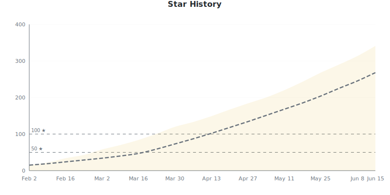

### Per-Repo

One chart per top repository (`top-repos`), each starting at that repo's own first star.

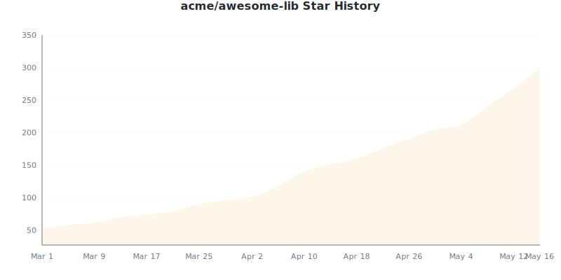

### Repository Comparison

Top N repositories overlaid on a single chart.

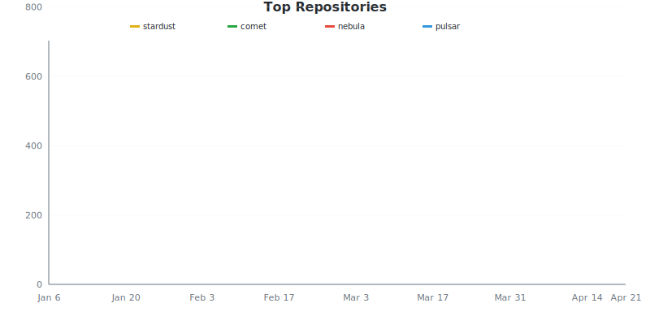

### Growth Forecast

History plus the projected growth for the next weeks.

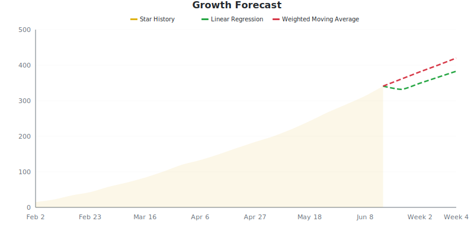

### Badge

---

## Curve Styles (`chart-curve`)

The curve used to connect points when `chart-smoothing` is on. All four use the same stepped data so the differences are clear: `monotone` (default), `cubic-bezier` and `rounded-step` keep the plateaus flat; only `catmull-rom` overshoots at the foot of a step, dipping below the previous value.

| `monotone` (default) | `catmull-rom` |
|---|---|
| 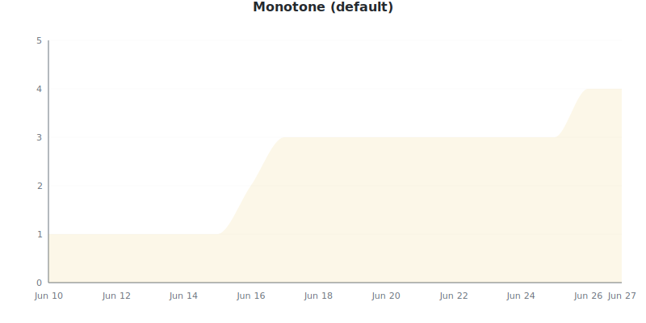 | 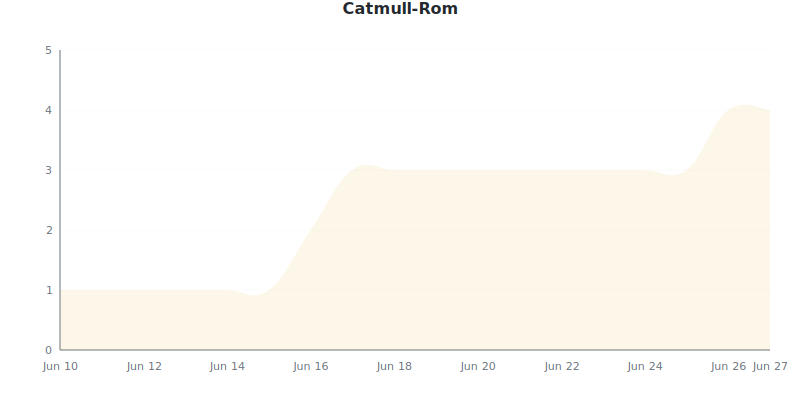 |

| `cubic-bezier` | `rounded-step` |
|---|---|
|  |  |

> Email charts (QuickChart) approximate these: `monotone` is exact, `rounded-step` falls back to `monotone`, and `catmull-rom` and `cubic-bezier` both render as a tensioned spline.

---

## Option Comparisons

Default on the left, the changed option on the right.

### `chart-smoothing`

| `true` (default) | `false` |
|---|---|
| 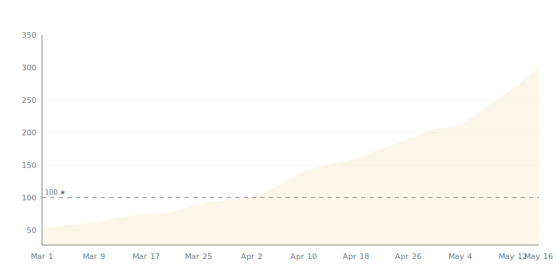 | 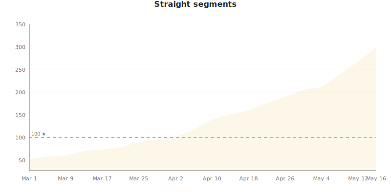 |

### `chart-show-points`

| `true` (default) | `false` |
|---|---|
|  |  |

### `chart-milestones`

| `true` (default) | `false` |
|---|---|
|  | 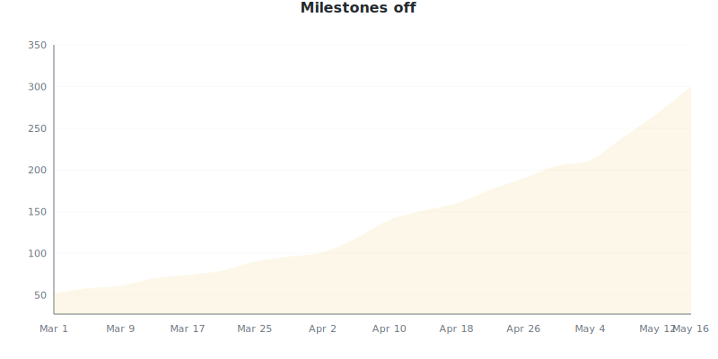 |

### `chart-custom-milestones`

| default thresholds | `100, 200` |
|---|---|
|  | 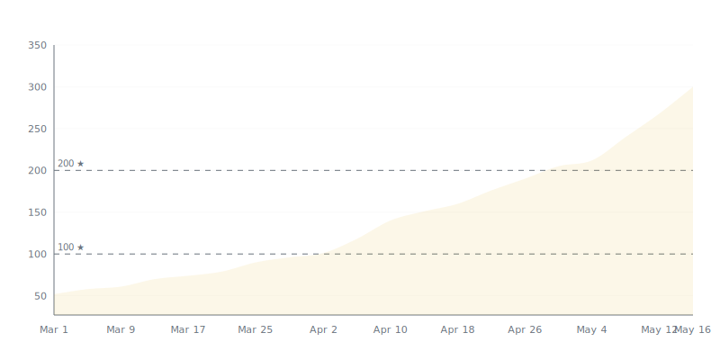 |

### `chart-begin-at-zero`

| `false` (default, zoomed to data) | `true` (anchored at zero) |
|---|---|
|  | 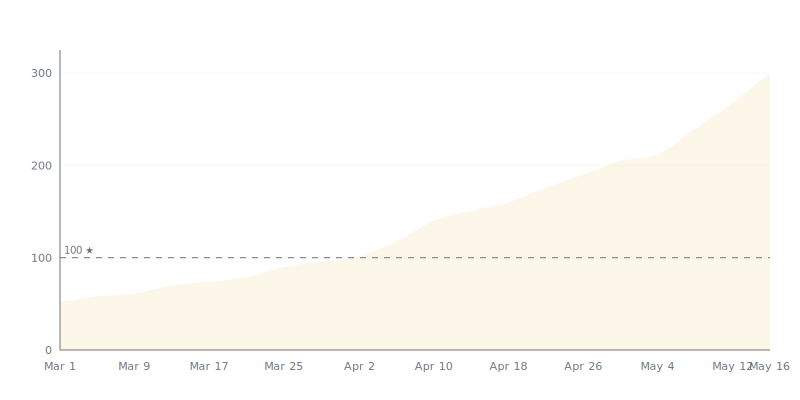 |

### `chart-theme`

| `auto` / `light` (default) | `dark` |
|---|---|
|  | 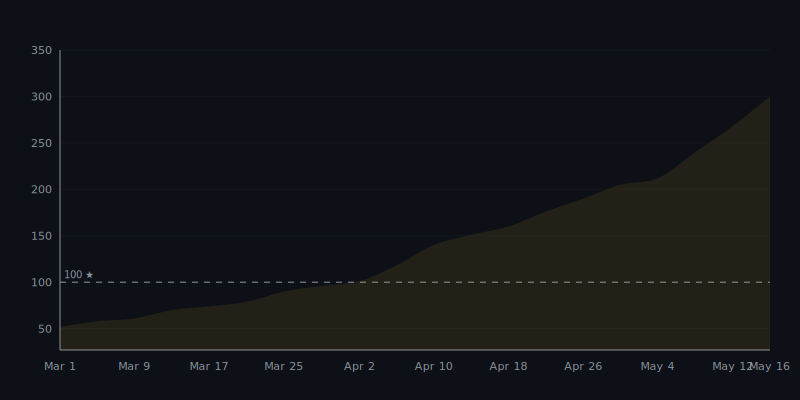 |

### `chart-y-axis-side`

| `left` (default) | `right` |
|---|---|
|  | 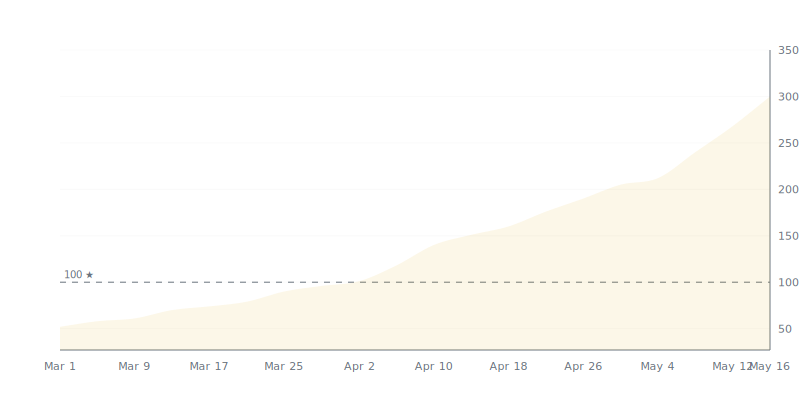 |

### `chart-line-color`

| `#dfb317` (default) | `#6b63ff` |
|---|---|
|  | 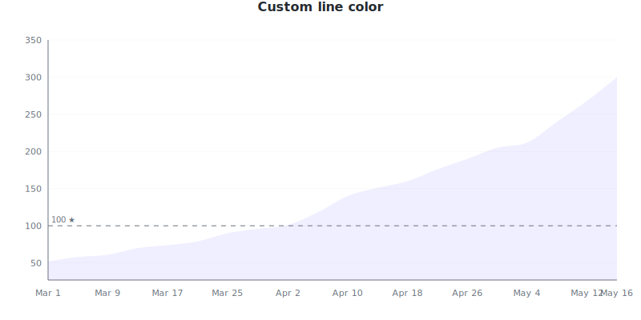 |

### `chart-line-width`

| `2.5` (default) | `5` |
|---|---|
|  | 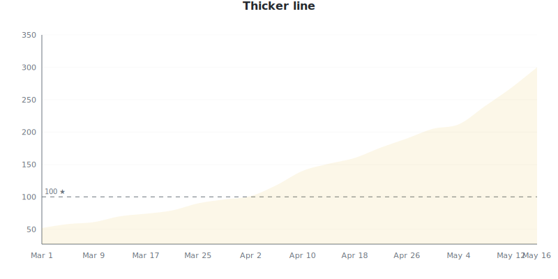 |

### `chart-range`

Narrows the time window, measured back from the latest point.

| `all` (default) | `90d` | `1y` |
|---|---|---|
| 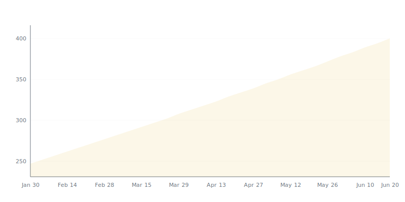 | 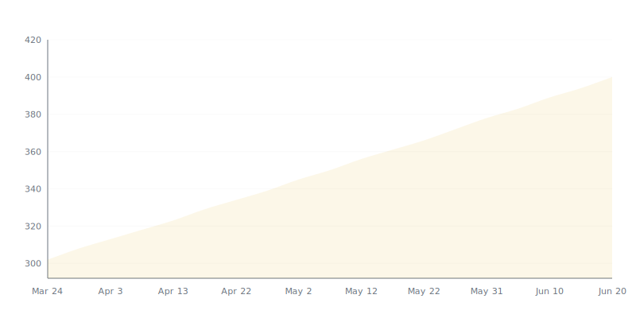 | 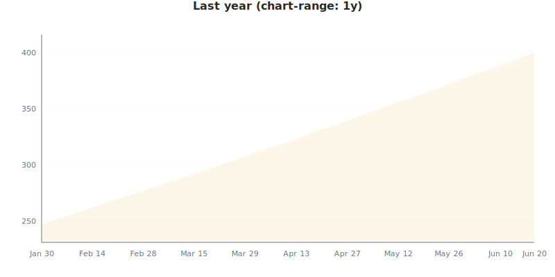 |

### `chart-max-points`

Curve resolution across the span. `0` reconstructs at weekly cadence (point count scales with the repo's age).

| `30` (default) | `0` (weekly) | `10` (coarse) |
|---|---|---|
| 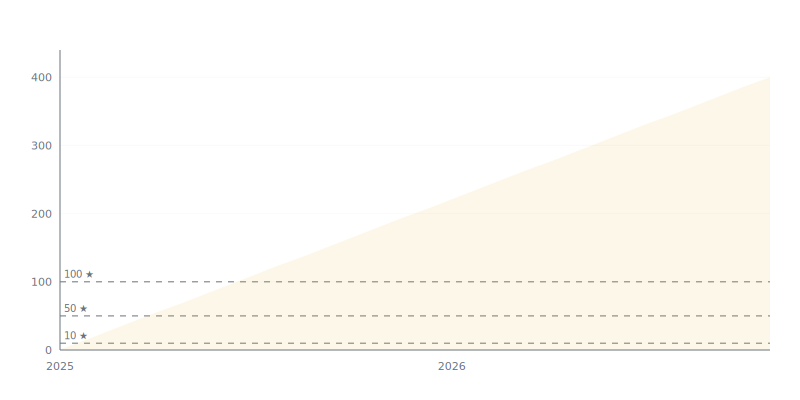 | 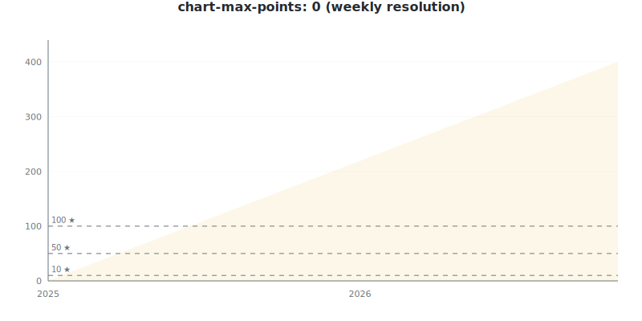 | 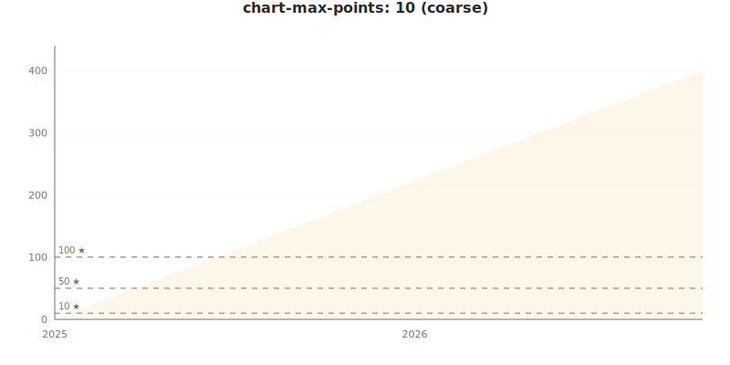 |
