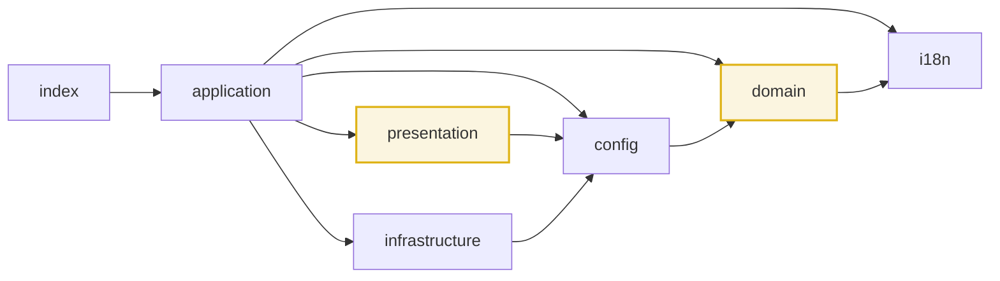

# src — source tree index and the normative layering rules

`src/` holds the whole GitHub Action. It is a mini-DDD tree: one entry point plus six folders, each of
which is a layer with an import alias and an explicit set of things it is allowed to depend on. This file
is the single normative statement of those rules — every other `CLAUDE.md` in the tree assumes them and
does not restate them. It is not an API reference: for what a layer actually exports, read that layer's own
`CLAUDE.md` (linked below).

These files describe *structure*. Two sibling documents cover the other two axes, and they are not
interchangeable with this one:

- [`../CONTEXT.md`](../CONTEXT.md) — the domain glossary: what each term **means**, and which competing
  words to avoid. There is exactly one, because the repo is a single bounded context; the per-folder files
  here are layers, not bounded contexts.
- [`../ARCHITECTURE.md`](../ARCHITECTURE.md) — the big picture: end-to-end run, data branch, build and
  release. Architectural decisions and their rationale live in [`../docs/adr/`](../docs/adr/).

## Files
| File | Responsibility |
| --- | --- |
| `index.ts` | esbuild entry point. Imports `trackStars` from `@application/tracker` and calls it at module load. No exports, no logic. |
| `application/` | Orchestration: the single `trackStars()` run. |
| `config/` | Action inputs + YAML config file -> typed `Config`. |
| `domain/` | Pure business logic and types. |
| `i18n/` | Locale bundles, `getTranslations`, `interpolate`. |
| `infrastructure/` | All I/O: octokit, git CLI, fs, nodemailer. |
| `presentation/` | Pure rendering: data in, markdown/HTML/SVG/CSV string out. |
| `shared/` | Cross-cutting helpers that belong to no layer (currently test factories only). |

## Tree

```
src/
├── index.ts
├── application/
│   └── tracker.ts
├── config/
│   ├── defaults.ts
│   ├── loader.ts
│   ├── parsers.ts
│   └── types.ts
├── domain/
│   ├── comparison.ts
│   ├── constants.ts
│   ├── forecast.ts
│   ├── formatting.ts
│   ├── notification.ts
│   ├── snapshot.ts
│   ├── star-history.ts
│   ├── stargazers.ts
│   ├── time.ts
│   ├── types.ts
│   └── velocity.ts
├── i18n/
│   ├── index.ts
│   ├── types.ts
│   └── {en,es,ca,it}.json
├── infrastructure/
│   ├── git/
│   │   ├── commands.ts
│   │   └── worktree.ts
│   ├── github/
│   │   ├── client.ts
│   │   ├── errors.ts
│   │   ├── filters.ts
│   │   ├── stargazers.ts
│   │   └── types.ts
│   ├── notification/
│   │   └── email.ts
│   └── persistence/
│       └── storage.ts
├── presentation/
│   ├── badge.ts
│   ├── chart.ts
│   ├── charts.ts
│   ├── constants.ts
│   ├── csv.ts
│   ├── html.ts
│   ├── markdown.ts
│   ├── shared.ts
│   ├── svg-chart.ts
│   └── types.ts
└── shared/
    └── testing/
        └── index.ts
```

(`*.test.ts` files are colocated next to the file they cover and are omitted above.)

## Layers

| Layer | Alias | May import | Must not import |
| --- | --- | --- | --- |
| `index.ts` | — | `@application/*` | everything else |
| `application` | `@application/*` | `@config/*`, `@domain/*`, `@i18n`, `@infrastructure/*`, `@presentation/*`, `@actions/core`, `@actions/github`, `@octokit/plugin-retry` | nothing forbidden; it is the top |
| `presentation` | `@presentation/*` | `@config/types`, `@domain/*`, `@i18n`, relative siblings | `@application/*`, `@infrastructure/*`, `@actions/*`, `node:fs`, any network/fs API |
| `infrastructure` | `@infrastructure/*` | `@config/*`, `@domain/*`, `@i18n`, `node:*`, `@actions/*`, `nodemailer`, octokit types | `@application/*`, `@presentation/*` |
| `config` | `@config/*` | `@domain/types`, `@i18n`, `@actions/core`, `js-yaml`, `node:fs`, `node:path` | `@application/*`, `@infrastructure/*`, `@presentation/*` |
| `domain` | `@domain/*` | `@i18n`, relative siblings | `@config/*`, `@infrastructure/*`, `@presentation/*`, `@application/*`, `@actions/*`, `node:*`, any network/fs/process API |
| `i18n` | `@i18n` | its own `./*.json` and `./types` only | every other alias and every runtime dependency |
| `shared/testing` | `@shared/*` | `@config/defaults`, `@config/types`, `@domain/*` (types only) | anything with side effects; imported only from `*.test.ts` |

Allowed direction (arrows are "may import"):



`i18n` is the only leaf: it imports nothing from the tree. `domain` is pure but not a leaf — it depends on
`@i18n` for `Locale` / `LOCALE_MAP` in `@domain/formatting`. `config` types flow downstream: `presentation`
imports `Config` and the chart enums (`ChartCurve`, `ChartRange`, `ChartTheme`, `ChartAxisSide`) from
`@config/types`, and `infrastructure` imports `Config` from `@config/types` plus `VISIBILITY_CONFIG` from
`@config/defaults`. Neither layer imports `@config/loader`.

## Layer documents
- [`application/CLAUDE.md`](./application/CLAUDE.md)
- [`config/CLAUDE.md`](./config/CLAUDE.md)
- [`domain/CLAUDE.md`](./domain/CLAUDE.md)
- [`i18n/CLAUDE.md`](./i18n/CLAUDE.md)
- [`infrastructure/CLAUDE.md`](./infrastructure/CLAUDE.md)
  - [`infrastructure/git/CLAUDE.md`](./infrastructure/git/CLAUDE.md)
  - [`infrastructure/github/CLAUDE.md`](./infrastructure/github/CLAUDE.md)
  - [`infrastructure/notification/CLAUDE.md`](./infrastructure/notification/CLAUDE.md)
  - [`infrastructure/persistence/CLAUDE.md`](./infrastructure/persistence/CLAUDE.md)
- [`presentation/CLAUDE.md`](./presentation/CLAUDE.md)
- [`shared/CLAUDE.md`](./shared/CLAUDE.md)
  - [`shared/testing/CLAUDE.md`](./shared/testing/CLAUDE.md)

## Invariants & rules
- **Cross-layer imports use the alias; same-layer imports stay relative.** `@domain/snapshot` from
  `presentation`, `./snapshot` from inside `domain`. Mixed forms of the same module break Biome's import
  sorting and duplicate the module in the bundle.
- **Named params for 2+ arguments.** Any function taking two or more arguments takes a single destructured
  object typed by an interface: `function foo({ a, b }: FooParams)`. The fixture factories in
  `shared/testing` are the only sanctioned exception — they take positional arguments, up to three of them
  (see [`shared/testing/CLAUDE.md`](./shared/testing/CLAUDE.md)).
- **No explanatory comments in `.ts` files.** These `CLAUDE.md` files carry the explanation instead. Never
  add comments to source. Two blocks are the whole of the existing exception: the `buildAxisLabels` JSDoc in
  `@domain/formatting` and the note above `MAX_REACHABLE_STARGAZERS` in `@domain/constants`.
- **`domain` must stay pure.** No `@actions/*`, no `node:*`, no fetch, no `Date.now()`-driven I/O, no
  mutation of caller-owned arrays. Same for `presentation`: it renders strings and never writes files —
  writing chart files is `application`'s job.
- **Only `src/index.ts` imports `@application/*`.** Nothing else in the tree may.
- **Aliases are declared once**, in `tsconfig.json` `compilerOptions.paths`. `esbuild.config.ts` derives its
  `alias` map from that object at build time and `vitest.config.ts` sets `resolve.tsconfigPaths: true`, so a
  new alias needs exactly one edit — but it needs it in `tsconfig.json`, not in the build or test config.
- **`@i18n` is a file alias, not a glob** (`"@i18n": ["./src/i18n/index.ts"]`). `@i18n/types` does not
  resolve; re-export from `src/i18n/index.ts` instead.
- **`dist/index.js` is committed** and is what `action.yml` (`runs.main`) executes. A source change is not
  shipped until `pnpm run build` has regenerated it.

## Dependencies
Runtime dependencies are `@actions/core`, `@actions/github`, `@octokit/plugin-retry`, `js-yaml` and
`nodemailer`; everything is bundled into a single CJS file by esbuild (`platform: node`, `target: node24`),
so `node_modules` is not shipped. TypeScript runs with `verbatimModuleSyntax` and `isolatedModules`: type-only
imports must be written `import type { … }` or `import { type X }`, or the build breaks.
`resolveJsonModule` is on, which is how `src/i18n/*.json` is imported and type-checked.

## Gotchas
- `src/config/action-inputs.test.ts` reads the repo-root `action.yml` and asserts that every key of
  `DEFAULTS` (except `sendOnNoChanges`) has a kebab-cased input with an **empty** default, and that only
  `config-path`, `send-on-no-changes` and `smtp-port` carry a non-empty default. Adding a config key without
  touching `action.yml` fails the suite.
- One test file covers two modules: `src/infrastructure/github/filters.test.ts` covers
  `client.ts` + `filters.ts`, and `src/config/action-inputs.test.ts` covers the manifest, not a module.
- Coverage thresholds are global and set to 85% for lines/functions/branches/statements. Excluded from
  coverage: `src/index.ts`, `src/**/{types,defaults,constants}.ts`, `src/**/*.test.ts`, `src/shared/testing/**`.

## Testing
Every layer's tests are colocated. Run the whole suite with `pnpm test`, a single layer with
`pnpm vitest run src/domain`, and coverage with `pnpm test:coverage`. `pnpm run check` = lint + typecheck +
coverage; `pnpm run validate` = check + build.
